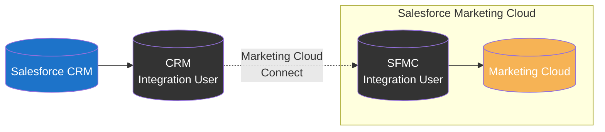
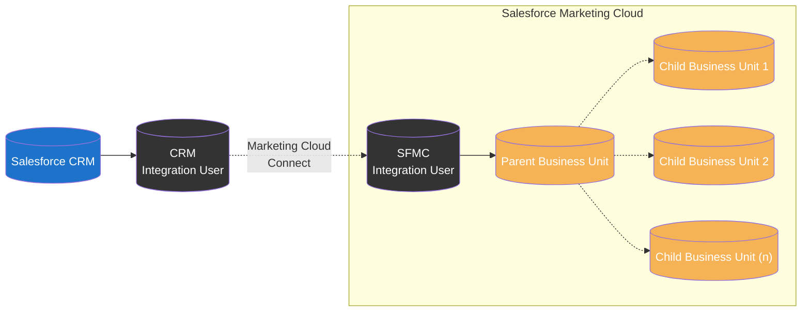
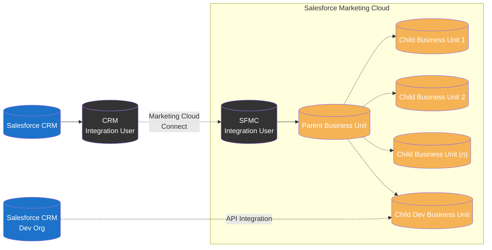
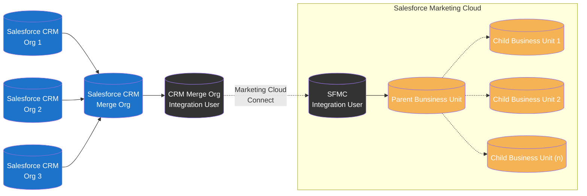
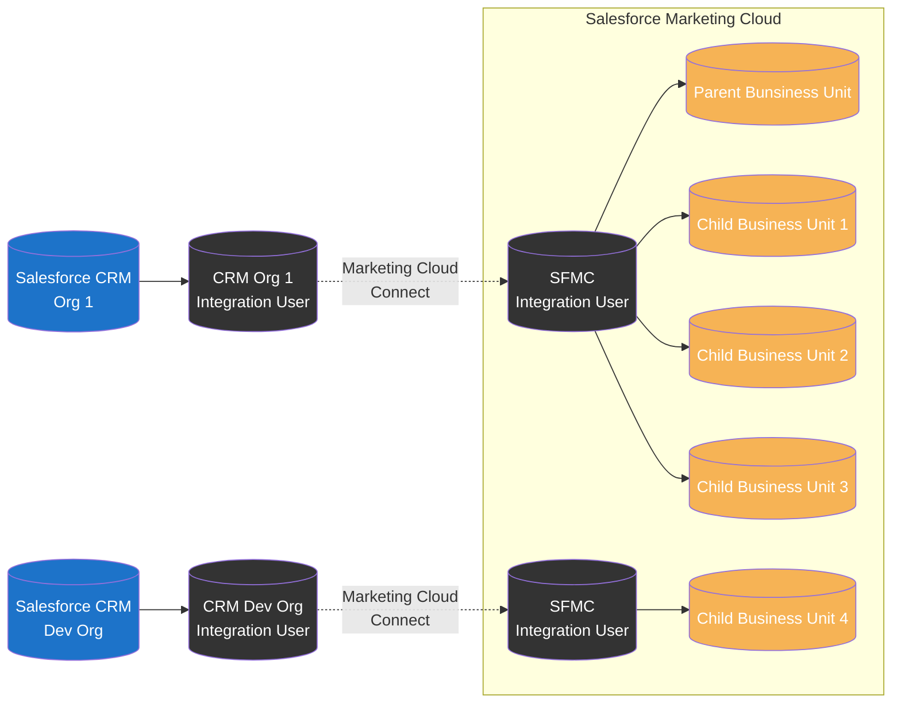
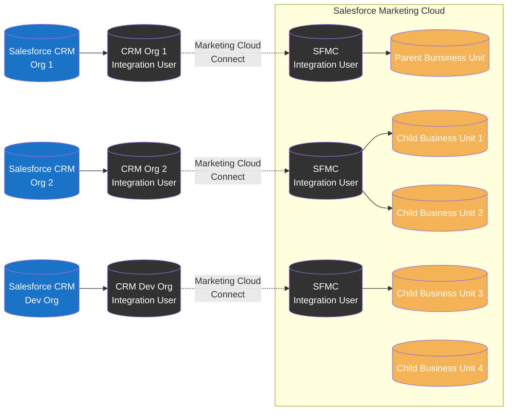
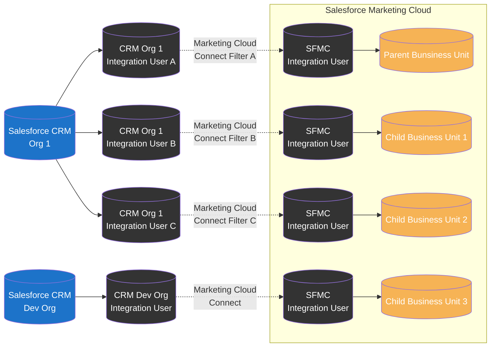

import { LeadText } from '../../src/components/LeadText.js';

<LeadText content="Marketing Cloud Connect Architecture: Single-Org, Multi-Org and everything in between. Integrate Salesforce CRM and Marketing Cloud the right way." />

## Marketing Cloud Connect Basics

So you have Salesforce CRM & Salesforce Marketing Cloud and want to use them together to create data-driven, personalized engagement with your customers. Perfect idea, but prepare for a bit of work.

Unfortunately, Marketing Cloud is not (yet?) on the same Lightning Platform as the Salesforce CRM (be it Sales Cloud, Service Cloud, Health Cloud or what-have-you). It means that the data from one tool is not available out-of-the-box in the other for instant use.

Fortunately, there is out-of-the-box integration suite made by Salesforce, called Marketing Cloud Connect (MCC), that lets you use those tools in tandem. It offers quite a lot of features ranging from simple data sync between the platforms, through dedicated Journey Builder activities and AMPScript functions, up to reporting feedback loop and extended marketing features for the CRM. Using it also means no need for custom API calls eating up the licence limits.

The connector is very flexible and provide wide range of configuration options to meet the needs of your organisations. That's perfect, but it also means that you need to architect how you want the connection to work. It is especially true for the very initial step of deciding on the integration aproach between the CRM(s) and SFMC(s), as configuration won't be (easily or even at all) reversible after the initial choice is made.

In this article I will share quirks and features of possible integration patterns and help you make the right choice from the start. Let's dive in.

### Single-Org vs Multi-Org

Key thing to understand when discussing Marketing Cloud Connect is the difference between Single-Org and Multi-Org SFMC configuration and their limits.

By default, each Marketing Cloud instance is configured as a Single-Org. It means that it can connect to one - and only one - Salesforce CRM Org. Integration is done on SFMC's Parent Business Unit level and benefits are shared across all available Business Units. It's strightforward setup but with two key limitations: only one CRM Org can be integrated and all Business Units have access to the same integration scope (data, permissions, features).

In most cases, when one of those limitations is against the business needs, the solution is to go Multi-Org. However, don't make that decision ligthly - Multi-Org configuration can be enabled only by Salesforce Support and __it is not reversible__. Multi-Org has quite a lot of limitations and quirks and the only way to go back to Single-Org is to get a completly new Salesforce Marketing Cloud Account.

Key differences | Single-Org | Multi-Org
-- | -- | --
Integrated SF CRM Orgs | 1 | 1 or many
Integrated SFMC Business Units | All | Any or All
Connected SF Integration Users | 1 | 1 or many
Integrated SFMC Business Units per single SF Integration User | All | Up to 5
Synchronized Data Extension Configuration and Filtering | Shared | Shared per Integration User
Synchronized Data Extension Visibility | Parent only or All | All integrated
Shared Data Extension | Supported | Supported
Shared Salesforce Data Extension | Supported | Not Supported
Profile/Preference Center | Standard or Custom | Custom only
Web Collect | Supported | Not Supported
Disconnecting MCC Integration | On Parent for whole SFMC | On per Business Unit basis

### Additional MCC Considerations

On top of the differences showcased above, there are few other things that you should keep in mind:

1. You can change Single-Org to Multi-Org at any time (existing integration will stay at Parent BU). You cannot change Multi-Org to Single-Org.
2. With Multi-Org you need to manage the duplicate Subscribers risk (if the same Contact, Lead or User exist in multiple integrated SF Orgs, in each it will have different Contact ID and will be created as a separate Contact in SFMC).
3. With Multi-Org setup Parent Business Unit will have access to Subscribers from all integrations. Best practice is to keep it as administrative BU with business operations happening only on Child Business Units.
4. You cannot connect multiple Salesforce CRM Orgs to a single Marketing Cloud Business Unit (unless you do it partially via the [API](#api-extended-single-org-setup) or using [merge org pattern](#merge-org-setup)).
5. You cannot connect one Salesforce CRM Org to multiple Marketing Cloud Accounts using Marketing Cloud Connect.

## Marketing Cloud Connect Patterns

With high-level overview and key limitations covered, let's discuss various possible integration patterns with their pros, cons and best matched use cases.

### Single-Org Patterns

#### Single Business Unit Single-Org Setup

If you have:

- one Salesforce CRM Org and
- one SFMC Business Unit

this is your choice.

There are zero benefits in going Multi-Org for this use case. Keep it simple and rejoice.

#### Multiple Business Units Single-Org Setup

If you have:

- one Salesforce CRM Org and
- multiple SFMC Business Units

this might be your choice.

It is perfect if only you are ok with all Business Units having the same configuration and filters applied.

However, if you need to have different objects or scope of Contacts/Leads/Users synchronized to each Business Unit, you will have to go with [Filtered Multi-Org Setup](#filtered-multi-org-setup). Keep in mind that by doing it you will:

- need separate Integration Users for each version of configuration/filtering
- loose possibility to hide Synchronized Data Extensions on Child Business Units
- loose Shared Salesforce Data Extensions
- loose Standard Profile Center
- loose Web Collect

And as going Multi-Org is non-reversible, you should be 110% certain that custom configuration/filters are worth it.

#### API Extended Single-Org Setup

If you have:

- one production Salesforce CRM Org and
- one developer Salesforce CRM Org and
- multiple SFMC Business Units

it might be your choice.

To be honest, I wouldn't recommend this approach. In most cases, it is much better to either go with [Basic Multi-Org Setup](#basic-multi-org-setup) or [Multiple BU Single-Org Setup](#multiple-business-units-single-org-setup) and have test data in production CRM.

When this pattern might be the right one for you?

1. You have dozens of SFMC Business Units.
2. You don't want to use multiple Integration Users (each can cover up to 5 Business Units) due to cost.
3. You absolutely don't won't to have dev/test data on production SF CRM.

#### Merge-Org Setup

### Multi-Org Patterns

#### Basic Multi-Org Setup

#### Complex Multi-Org Setup

#### Filtered Multi-Org Setup

## Marketing Cloud Conenct Best Practices

