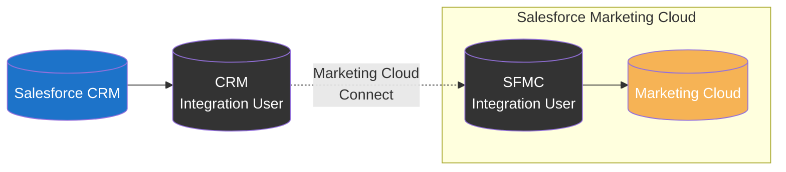
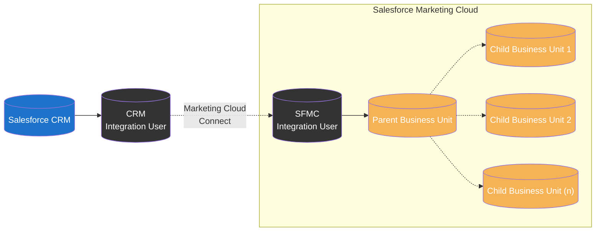
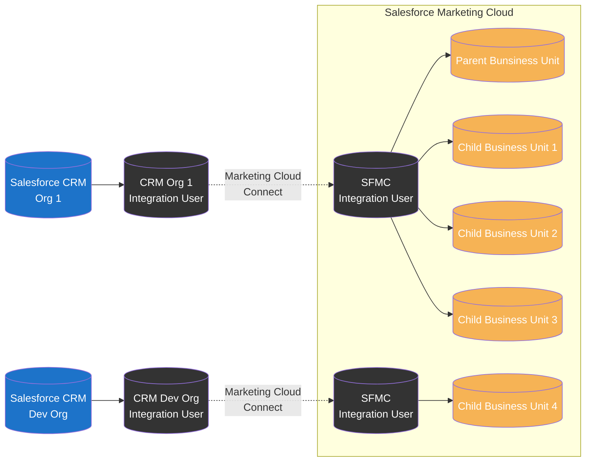
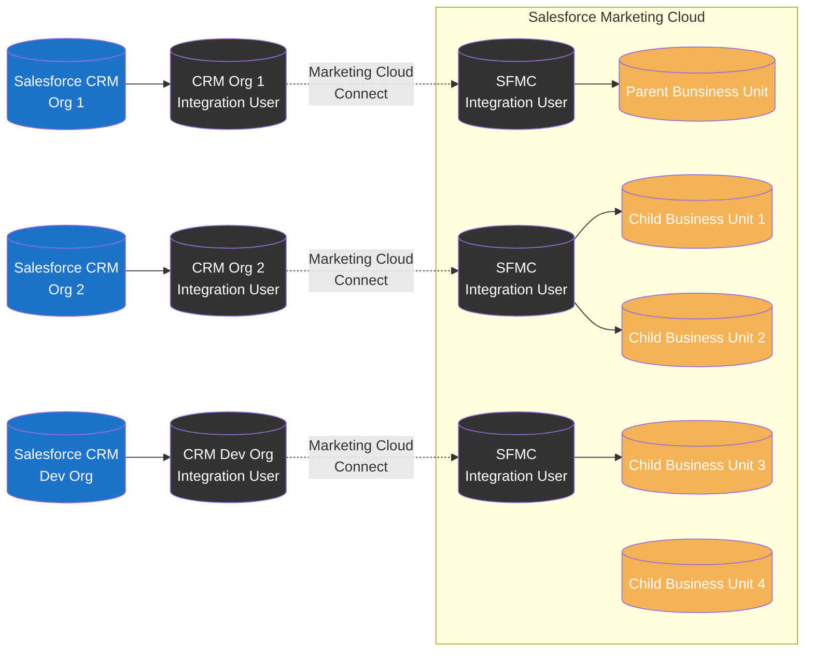

import { LeadText } from '../../src/components/LeadText.js';

<LeadText content="Marketing Cloud Connect Architecture: Single-Org, Multi-Org and everything in between. Integrate Salesforce CRM and Marketing Cloud the right way." />

## Marketing Cloud Connect Basics

## Single-Org vs Multi-Org

## Marketing Cloud Connect Patterns

### Single-Org Patterns

#### Single Business Unit Single-Org Setup

#### Multiple Business Units Single-Org Setup

### Multi-Org Patterns

#### Basic Multi-Org Setup

#### Complex Multi-Org Setup

