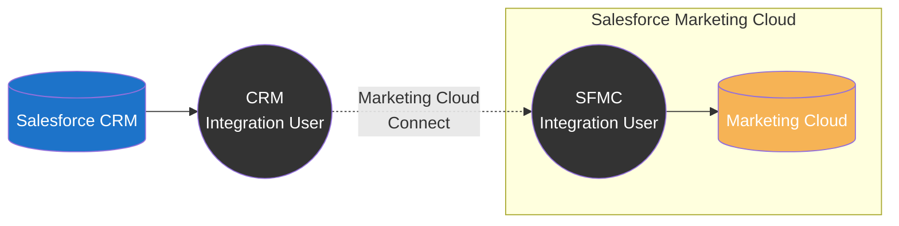
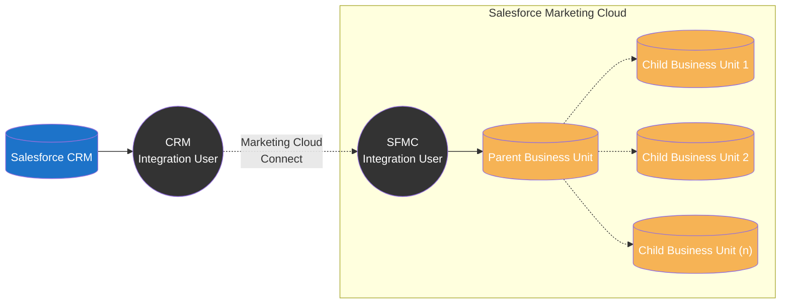
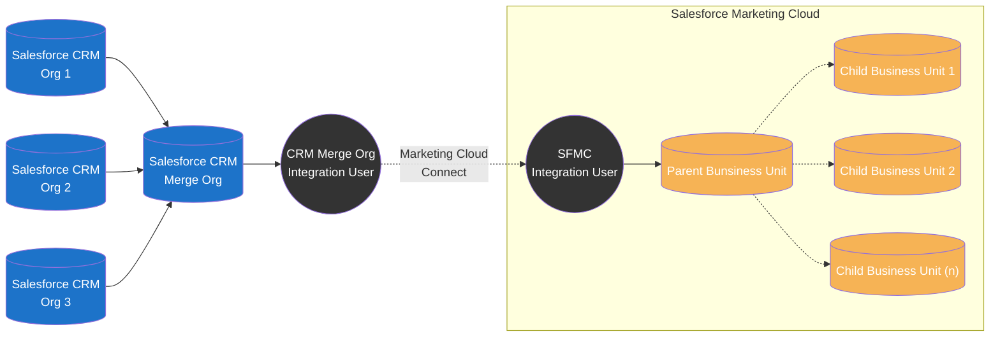
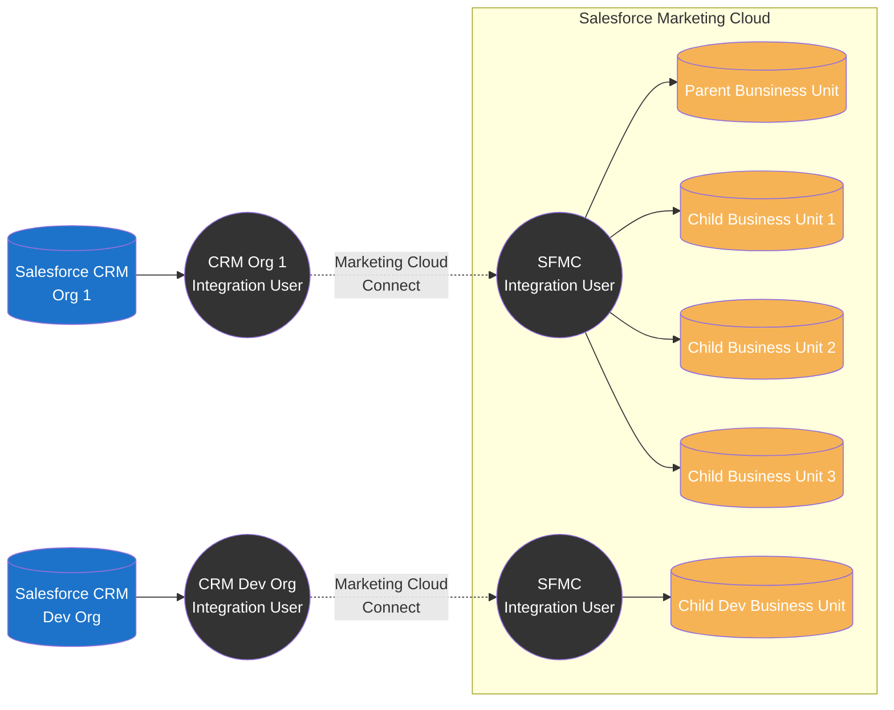
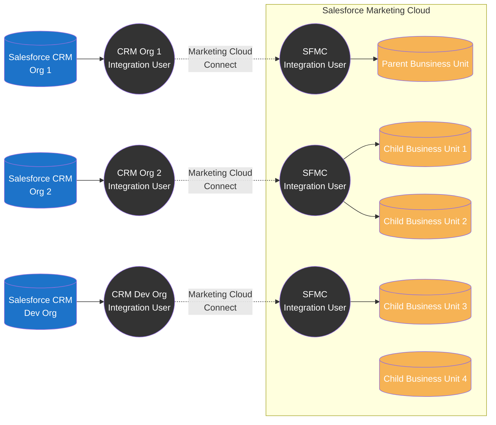
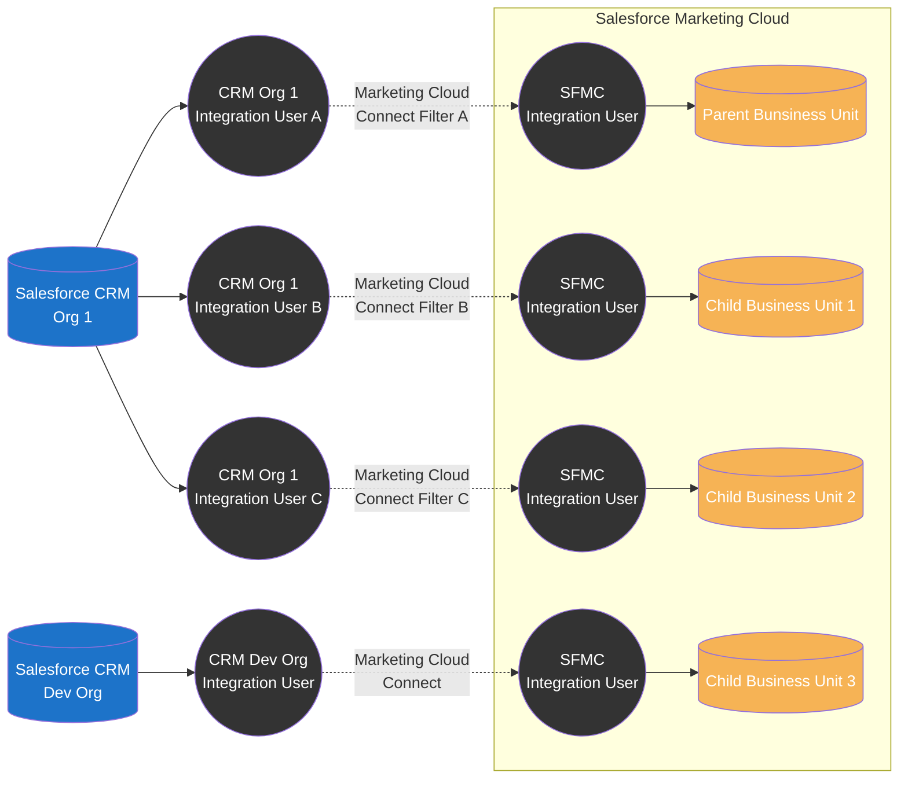

import { LeadText } from '../../src/components/LeadText.js';

<LeadText content="Marketing Cloud Connect Architecture: Single-Org, Multi-Org and everything in between. Integrate Salesforce CRM and Marketing Cloud the right way." />

## Marketing Cloud Connect Basics

So you have Salesforce CRM & Salesforce Marketing Cloud and want to use them together to create data-driven, personalized engagement with your customers. Perfect idea, but prepare for a bit of work.

Unfortunately, Marketing Cloud is not (yet?) on the same Lightning Platform as the Salesforce CRM (be it Sales Cloud, Service Cloud, Health Cloud or what-have-you). It means that the data from one tool is not available out-of-the-box in the other for instant use.

Fortunately, there is out-of-the-box integration suite made by Salesforce, called Marketing Cloud Connect (MCC), that lets you use those tools in tandem. It offers quite a lot of features ranging from simple data sync between the platforms, through dedicated Journey Builder activities and AMPScript functions, up to reporting feedback loop and extended marketing features for the CRM. Using it also means no need for custom API calls eating up the licence limits.

The connector is very flexible and provide wide range of configuration options to meet the needs of your organisations. That's perfect, but it also means that you need to architect how you want the connection to work. It is especially true for the very initial step of deciding on the integration aproach between the CRM(s) and SFMC(s), as configuration won't be (easily or even at all) reversible after the initial choice is made.

In this article I will share quirks and features of possible integration patterns and help you make the right choice from the start. Let's dive in.

### Single-Org vs Multi-Org

Key thing to understand when discussing Marketing Cloud Connect is the difference between Single-Org and Multi-Org SFMC configuration and their limits.

By default, each Marketing Cloud instance is configured as a Single-Org. It means that it can connect to one - and only one - Salesforce CRM Org. Integration is done on SFMC's Parent Business Unit level and benefits are shared across all available Business Units. It's strightforward setup but with two key limitations: only one CRM Org can be integrated and all Business Units have access to the same integration scope (data, permissions, features).

In most cases, when one of those limitations is against the business needs, the solution is to go Multi-Org. However, don't make that decision ligthly - Multi-Org configuration can be enabled only by Salesforce Support and __it is not reversible__. Multi-Org has quite a lot of limitations and quirks and the only way to go back to Single-Org is to get a completly new Salesforce Marketing Cloud Account.

Key differences | Single-Org | Multi-Org
-- | -- | --
Integrated SF CRM Orgs | 1 | 1 or many
Integrated SFMC Business Units | All | Any or All
Connected SF Integration Users | 1 | 1 or many
Integrated SFMC Business Units per single SF Integration User | All | Up to 5
Synchronized Data Extension Configuration and Filtering | Shared | Shared per Integration User
Synchronized Data Extension Visibility | Parent only or All | All integrated
Shared Data Extension | Supported | Supported
Shared Salesforce Data Extension | Supported | Not Supported
Profile/Preference Center | Standard or Custom | Custom only
Web Collect | Supported | Not Supported
Disconnecting MCC Integration | On Parent for whole SFMC | On per Business Unit basis

### Additional MCC Considerations

On top of the differences showcased above, there are few other things that you should keep in mind:

1. You can change Single-Org to Multi-Org at any time (existing integration will stay at Parent BU). You cannot change Multi-Org to Single-Org.
2. All records in Contact, Lead and User Synchronized Data Extensions will be automatically added to All Contacts list and counted against your licence limit.
3. With Multi-Org you need to manage the duplicate Subscribers risk (if the same Contact, Lead or User exist in multiple integrated SF Orgs, in each it will have different Contact ID and will be created as a separate Contact in SFMC).
4. You cannot fully limit access to data between Business Units. There are some options to make it harder to see data belonging to other BUs (like All Subscribers List filters or denied Shared Data Extensions permissions) but in the end the data is accessible for example through AMPScript/SSJS/SQL. The only currently available approach to fully silo the data is to have separate Salesforce Marketing Cloud Accounts.
5. You cannot connect multiple Salesforce CRM Orgs to a single Marketing Cloud Business Unit (unless you do it partially via the [API](#api-extended-single-org-setup) or using [merge org pattern](#merge-org-setup)).
6. You cannot connect one Salesforce CRM Org to multiple Marketing Cloud Accounts (separate SFMCs) using Marketing Cloud Connect.

## Marketing Cloud Connect Patterns

With high-level overview and key limitations covered, let's discuss various possible integration patterns with their pros, cons and best matched use cases.

### Single-Org Patterns

This is the default Saleforce Marketing Cloud configuration that allows you to connect all Business Units to a single Salesforce CRM Org using the official Marketing Cloud Connect integration tool.

#### Single Business Unit Single-Org Setup

It is your choice if you have:

- one Salesforce CRM Org and
- one SFMC Business Unit

Keep it simple and rejoice strightforward architecture with no limtiations.

#### Multiple Business Units Single-Org Setup

It might be your choice if you have:

- one Salesforce CRM Org and
- multiple SFMC Business Units

It is perfect if you are ok with all Business Units having the same configuration and filters applied. It brings simplicity and unlimited Business Unit scaling.

However, if you need to have different objects or scope of Contacts/Leads/Users synchronized to each Business Unit, you will have to go with [Filtered Multi-Org Setup](#filtered-multi-org-setup). Keep in mind that by doing so you will:

- need separate Integration Users for each version of configuration/filtering
- loose possibility to hide Synchronized Data Extensions on Child Business Units
- loose Shared Salesforce Data Extensions
- loose Standard Profile Center
- loose Web Collect

And as going Multi-Org is non-reversible, you should be 110% certain that custom configuration/filters are worth it.

#### API Extended Single-Org Setup

It might (but shouldn't) be your choice if you have:

- one production Salesforce CRM Org and
- one developer Salesforce CRM Org and
- multiple SFMC Business Units

To be honest, I wouldn't recommend this approach. In most cases, it is much better to either go with [Basic Multi-Org Setup](#basic-multi-org-setup) or [Multiple BU Single-Org Setup](#multiple-business-units-single-org-setup) and have test data in production CRM.

When this pattern might be the right one for you?

1. You have dozens of SFMC Business Units.
2. You don't want to use multiple Integration Users (each can cover up to 5 Business Units).
3. You absolutely don't won't to have dev/test data on production SF CRM.

However, be sure to calculate the implementation cost of custom API calls and check the API licence limits as you might find that going with Multi-Org will be not only better, but also cheaper in the end.

Additionally, this approach pushes both test and production data to your Dev & Test Business Unit (as you cannot limit the Single-Org MCC integration scope), which creates a risk of sending test assets to real customers.

#### Merge-Org Setup

It might be your choice if you have:

- multiple Salesforce CRM Orgs and
- single SFMC with one or many Business Units

This approach moves the complexity from Marketing Cloud Connect to Salesforce CRM. By using one SF Org as a Merge Org where the data from multiple other Orgs if being synchronized, we can create simple MCC Single-Org integration that will cover all available Business Units.

Of course, it has (considerable) drawbacks:
1. Cost & Complexity - you need to have (and integrate into data pipeline) yet another Salesforce CRM Org to serve as a Merge Org
2. Real-timeness - as there is additional step in the integration (Merge Org), the data sync loop will be slower.

Due to the above I would only consider this approach when you need data from multiple Salesforce CRMs in a single Business Unit along with full support for Marketing Cloud Connect features (f.e. SF Journey Builder Activities and Entries).

### Multi-Org Patterns

This is the optional Saleforce Marketing Cloud configuration that allows you to connect multiple Salesforce CRM Orgs to various Business Units or differentiate synchronized data filters on each Business Unit. You can enable it with Support request but keep in mind it is not reversible - once it's switched on, there is no going back to Single-Org.

#### Basic Multi-Org Setup

It might be your choice if you have:

- one production Salesforce CRM Org and
- one developer Salesforce CRM Org and
- multiple SFMC Business Units

This pattern covers one of the most popular Multi-Org setups where you have between one and five production Business Units connected to the production Salesforce CRM Org and also want to have a full testing suite with dedicated Dev & Test Business Unit connected to a Dev Org. The closest you can get to CI/CD due to lack of dedicated SFMC sandbox offering.

It is much cleaner approach than the [API Extended Single-Org Setup](#api-extended-single-org-setup) and it doesn't have significant cons other than standard [Multi-Org limitations](#single-org-vs-multi-org).

If you have more than five production Business Units or need different data filters per each production Business Unit you will need to go with [Filtered Multi-Org Setup](#filtered-multi-org-setup).

#### Complex Multi-Org Setup

It might be your choice if you have:

- multiple Salesforce CRM Orgs and
- multiple SFMC Business Units

This pattern is where Multi-Org truly shines. Multiple CRMs (be it production, sandbox or dev), multiple Business Units connected in various configurations. Very popular approach for enterprise where each country can have separate CRM and dedicated SFMC Business Unit.

You can plan 1 CRM to 1 BU integrations, 1 CRM to multiple Business Units integrations and even keep some Business Units not integrated (for example for markets using non-SF CRMs). This amount of flexibility of course results in a complexity as each integration will require separate configuration, connection and data pipeline.

If you want to connect more than five production Business Units to a single CRM within this setup you will need to mix this approach with [Filtered Multi-Org Setup](#filtered-multi-org-setup).

#### Filtered Multi-Org Setup

It might be your choice if you have:

- multiple Salesforce CRM Orgs and
- multiple SFMC Business Units and

This pattern leverages multiple CRM Integration Users per single CRM to get around two limitations of Marketing Cloud Connect:

1. One CRM Integration User in Multi-Org Setup can integrate up to five Business Units before the integration performance and stability are impacted
2. One CRM Integration User share Object synchronization configuration and filters across all integrated Business Units.

As you can see, both those limitations are per one CRM Integration User. And while you can have only one Marketing Cloud Connect in a single Salesforce CRM, you can have multiple Integration Users leveraged to conenct to the same Marketing Cloud. It allows you to go around both those issues - and is easier on your licence than ever now with freshly introduced five free integration user licences.

:::note You Should Known

The workaround for up-to-five-BUs is strightforward - you just create multiple integration users and connect each of them to up to five Business Units.

Same is true for different Object configuration - with each Integration User you can just choose different Objects and fields you will synchronize.

The workaround for unqiue filters adds a bit of complexity. While the filter setup can also be set per integration user just as Object sync configuration, the filters themselves are quite limited - with the most useful field-based filter possible only on booleans. You can leverage it by creating checkbox flags for your filters, for example `IsGermanContact`, `IsUnitedStatesContact` and `IsPolishContact` fields that match the country assignment of a Contact record.

Keep in mind that those checkboxes cannot be calculated using formula. You will need to fill them in using deafult value, Apex Triger or Flow (generally any mean that triggers record update).

:::

## Marketing Cloud Conenct Best Practices

### Plan before you do

Abraham Lincolon once said "Give me six hours to chop down a tree and I will spend the first four sharpening the axe". Will this is great maxim for most Marketing Cloud work, it is especially true for Marketing Cloud Connect configration. Wrong decision here can in the best case add you hours of work and in worse - lock you with a setup that you can change only by purchasing a fresh Marketing Cloud Account. Plan, read up, check and recheck before you commit to the work.

### Document what you do

Marketing Cloud Connect integration is complex and - especially with Multi-Org - there are a lot of configurations, usernames and passwords involved. Document all of that. It will save you hours or more in the future.

### Use dedicated emails

When implementing Marketing Cloud Connect you will need to create (sometimes a lot of) Integration Users. Don't use individual email addresses. Always create a dedicated group email inbox that will be used for those integration users. Employees come and go and the last thing you want is rebuilding whole integration from scratch on production because you cannot access inbox of an employee that left a year ago.

### Manage the data

Marketing Cloud Connect lets you move the data between the clouds. And it is extremly easy to push a lot of data. It can both impact the performance of your platform as well as create a compliance risk. Always try to minimise the amount and visibility of the data to what is truly necessary.

1. Don't synchronize all the Obejcts - pick only those that are truly needed.
2. Even if you have to synchronize useless Object, because it is prerequisite to synchronizing other Objects you need, use synchronization filters to stop the data from flowing (this is especially true for Leads and User Objects that are required but in many cases not needed).
3. Don't synchronize all fields - pick only those that are truly needed.
4. If you go Multi-Org, consider using different filters per Business Unit as suggested in [Filtered Multi-Org Setup](#filtered-multi-org-setup).
5. If you go Multi-Org, make the Parent Business Unit an administrative BU, not a production one. Parent will have visibility over data from all the integrations which can lead to compliance issues in many setups.
6. If you go Multi-Org, be wary of duplicates - if you have the same Contact in two CRMs, those will have different Salesforce IDs and therefore will be created as two separate Contacts in SFMC (and eat up your licence contact count limit appropriately).

### Don't use Synchronized Data Extensions directly

Synchronized Data Extensions are awesome - they get updated up to every 15 minutes with fresh data coming from Salesforce CRM. However, I wouldn't recommend using them directly as a Journey Entries or segmentation/decisioning logic. This is because if there will be an issue with the Marketing Cloud Connect (be it rare backend one or more frequent user error), the Synchronized Data Extensions will disappear along with all the data in them. This will also break all dependent assets.

What is more, if you are using Multi-Org setup, Synchronized Data Extensions from subsequent integrations get numeric suffix in their name. When the integration breaks, their name might change to a different suffix breaking also all your SQL queries.

The solution I recommend is to create Master Data Extensions that will capture all the needed data points from Synchronized Data Extensions and keep them updated with Automation Studio SQL Query. Then, use those Master Data Extensions for all your Journey, segmentation and decisioning needs instead of directly pulling from Synchronized DEs.

This approach will provide two security layers:

1. Master Data Extensions will not disappear even when there is an issue with Marketing Cloud Connect meaning that the dependent assets will no break.
2. Master Data Extensions will keep the last synchronized version of data during the MCC crash letting segmentation and decisioning work correctly on slightly older data while you are fixing sync.

Of course, there is one downside to this approach - as you need to use Automation Studio to copy Synchronized Data Extensions to your Master Data Extensions, it will add 60 minutes (minimum Automation Studio schedule) to the 15 minutes (minimum Marketing Cloud Connect schedule) delay in the data real-timeness. Still, I believe this is small price to pay for security and peace of mind.