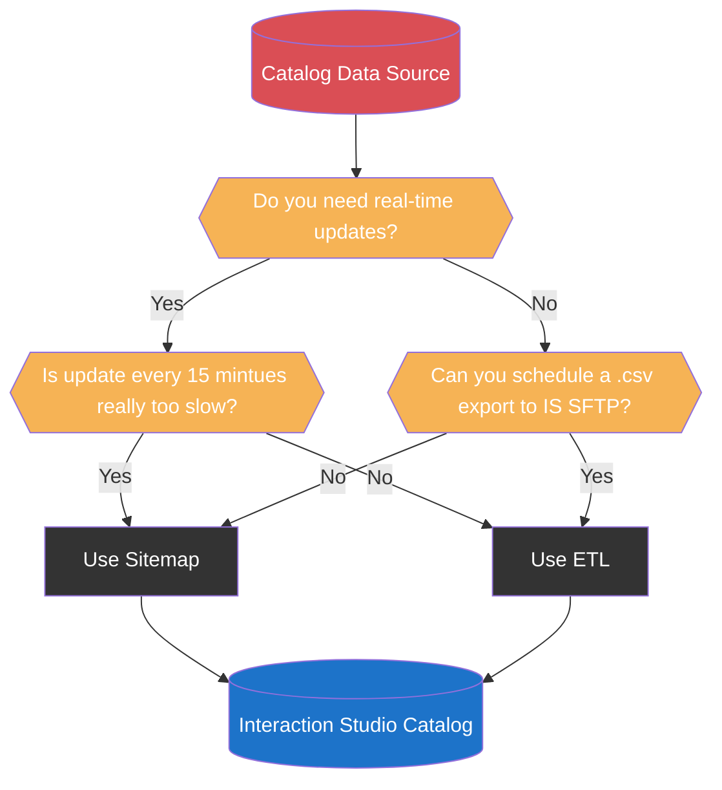

import { LeadText } from '../../src/components/LeadText.js';

<LeadText content="Interaction Studio (SFMC Personalization) Catalog architecture, limitations, tricks and tips. Build right from the start." />

## Catalog Basics & Limitations

The purpose of the Interaction Studio Catalog is to store your data along with relationships for the personalisation and machine learning purposes.

There are five out-of-the-box objects: Products, Articles, Blog Posts, Categories and Promotions. You can also create **up to 25 custom** Catalog Objects.

Each of those Objects contain some built-in attributes (like Name, URL, Description, Promotable) and can be extended with custom attributes to a **total of 35 attributes** on an Object.

All of the above can be interconnected using prebuilt and custom relationships between Catalog Objects (for example, built-in relationship between Product and a Category) - with **up to 15 Categories per Item** and **up to 50 related Catalog Object values per Item**.

With **up to 2 000 000 Items per Catalog** and **up to 10 000 000 Items in total** across all Catalogs, Interaction Studio provides a lot of flexibility to architect a Catalog of your dreams.

However, there are some quirks and features requiring a bit more consideration to make the most out of Marketing Cloud Personalization capabilities. Especially as some bad moves can be really hard to reverse. Let's dive in.

## Catalog Data Sources

There are three key sources of data for the Catalog:

1. **Manual via UI** - great for checking data and performing small fixes, but awful for data ingestion.
2. **Web/Mobile SDK** - leverages Sitemap and is real-time, but performance-heavy and dependent on user behaviour.
3. **ETL Feed** - best performance and can cover whole catalog, but fastest possible cadence is every 15 minutes.

So which one should you use - Sitemap or ETL?

### Why not both?

Mixing both sources is very tempting as it sounds like a best of both worlds. Unfortunately, it is not recommended approach due to Interaction Studio backend limitations. Sending the same Items through both channels not only impacts performance, but it can lead to incorrect and not-so-easy to fix issues with your Catalog.

For example, if you control Exclusion and Eligibility of the Products from Sitemap using `promotable` attribute, the ETL is not able to overwrite it (despite officially having higher priority as a data source). This can quickly lead to huge discrepancies in Product availability for recommendations. Due to the that, I highly recommend enabling Strict Catalog Security setting to protect your Catalog integrity if you are using ETL.

Another issue related to mixing are functional differences between the sources. For example, Sitemap and Category ETL use [different mechanism for building hierarchy](https://issues.salesforce.com/issue/a028c00000gAwJyAAK/interaction-studio-not-correctly-displaying-category-hierarchy) that is not compatible with each other.

To sum up - do not mix Sitemap and ETL. And if you have to - do not mix Sitemap and ETL on the same Object. And if you have to - do not mix Sitemap and ETL for the promotable and archived attributes. But really, do not mix it.

### Sitemap vs ETL

Assuming you want to keep things clean, you are left with two options:

#### 1. Interaction Studio with Sitemap

Pros:
- You need Sitemap either way.
- The updates will happen in near-real-time once user views the Item.
- You can build a [drill-down Category hierarchy](https://issues.salesforce.com/issue/a028c00000gAwJyAAK/interaction-studio-not-correctly-displaying-category-hierarchy) in the UI.

Cons:
- Sitemap will be more complex - depending on how the Catalog detail are stored (dataLayer, JSON LD, HTML) it might get very convoluted and impact the performance of your data capture and Campaigns.
- Changes to the website can break your data capture (for example updates to breadcrump attributes or to how dataLayer is structured).
- Catalog gets updated only when a user views an Item, which creates a risk of incorrect recommendations for less-visited Items.
- Can trigger massive ammounts of concurrent updates for high-traffic Items.
- Cannot overwrite Multi-String Object attributes and relationships (like Category) - Sitemap can only append.
- Catalog can be manipulated from frontend by malicious actors.

#### 2. Interaction Studio with ETL

Pros:
- Full Catalog upsert possible every 15 minutes (delta files recommended).
- Full control over final Catalog values - regardless of Item page vistis.
- Better control over [history of value changes](./snippets/is-catalog-etl-metadata-viewer.mdx) and easier debugging.
- Much better performance, especially for bigger Catalogs.
- More secure with Strict Catalog Security option   **WARNING**: There is currently a bug stopping Add To Cart and Purchase actions from being associated to Categories with this setting enabled.
- Much more lean and performant Sitemap.

Cons:
- Require you to export data in a particulary formatted .csv to IS SFTP.
- Not real-time (but every 15 minutes is pretty damn close, come on!).
- Doesn't support [drill-down Category hierarchy](https://issues.salesforce.com/issue/a028c00000gAwJyAAK/interaction-studio-not-correctly-displaying-category-hierarchy) in the UI.

### Recommended IS Catalog Data Source

Considering the above, ETL seems like an obvious choice. And it nearly is. I see only two scenarios where the Sitemap might be chosen to populate the Catalog (spoiler alert, I believe you should try to overcome those scenarios as much as you can).

1. You need to have Item (especially Product) updates in near-real-time.

For example due to very fast changes in the price based on demand. Or due to having single-stock items that needs to be quickly pulled from the recommendations (unfortunately, Purchase action does not adjust the stock). I would consider this only if it is absolutely crucial for your business. Otherwise, the 15 minutes cadence available with ETL is really close and lets you benefit from all the good things.

2. You cannot schedule correctly prepared .csv file to Interaction Studio SFTP.

In most cases your systems already are using flat files and FTPs for communication and you can extend the architecture to cover Interaction Studio. If not - there are a lot of tools out there that can help you transform your data cleanly into nice .csv and add it to Marketing Cloud Personalization Feed with correct naming convention. Hey, you can even leverage Marketing Cloud's Automation Studio to prepare and deliver the file in the right format! But sometimes data is just not there - and then ETL is a no go.

While you can begin with Sitemap and then migrate to ETL approach, the transitory period might be a bit problematic due to issues described in the [Why not both?](#why-not-both) section above. I would recommend trying to find a workaround and starting already with the better option.

Once you know how you want to populate the Interaction Studio Catalog, it's time to decide what you will be filling in.

## Catalog Recipe Considerations

## Catalog Personalization Considerations

## Catalog Tips & Tricks

### Export full IS Catalog data

### View archived Products in the IS Catalog