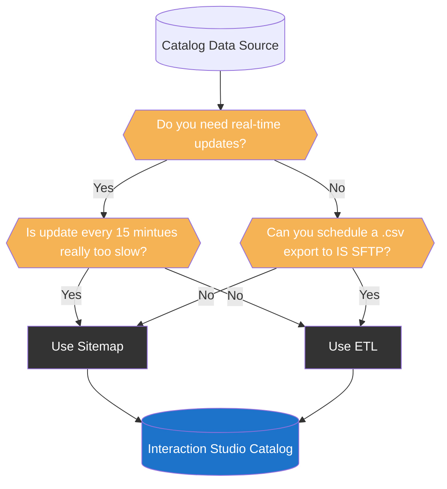
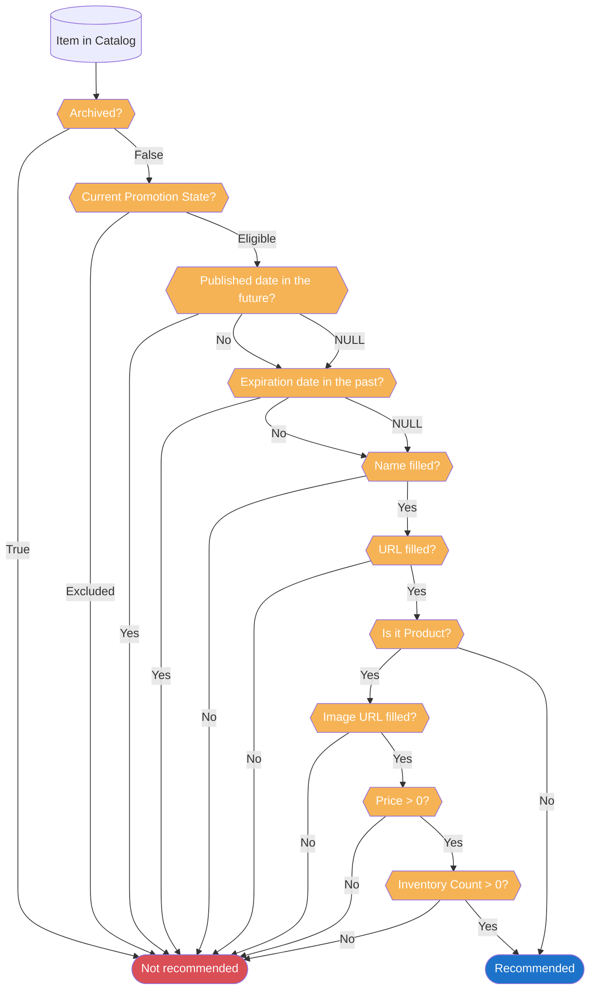

import { LeadText } from '../../src/components/LeadText.js';

<LeadText content="Interaction Studio (SFMC Personalization) Catalog architecture, limitations, tricks and tips. Build right from the start." />

## Catalog Basics & Limitations

The purpose of the Interaction Studio Catalog is to store your data along with relationships for the personalisation and machine learning purposes.

There are five out-of-the-box objects: Products, Articles, Blog Posts, Categories and Promotions. You can also create **up to 25 custom** Catalog Objects.

Each of those Objects contain some built-in attributes (like Name, URL, Description, Promotable) and can be extended with custom attributes to a **total of 35 attributes** on an Object.

All of the above can be interconnected using prebuilt and custom relationships between Catalog Objects (for example, built-in relationship between Product and a Category) - with **up to 15 Categories per Item** and **up to 50 related Catalog Object values per Item**.

With **up to 2 000 000 Items per Catalog** and **up to 10 000 000 Items in total** across all Catalogs, Interaction Studio provides a lot of flexibility to architect a Catalog of your dreams.

However, there are some quirks and features requiring a bit more consideration to make the most out of Marketing Cloud Personalization capabilities. Especially as some bad moves can be really hard to reverse. Let's dive in.

## Catalog Data Sources

There are three key sources of data for the Catalog:

1. **Manual via UI** - great for checking data and performing small fixes, but awful for data ingestion.
2. **Web/Mobile SDK** - leverages Sitemap and is real-time, but performance-heavy and dependent on user behaviour.
3. **ETL Feed** - best performance and can cover whole catalog, but fastest possible cadence is every 15 minutes.

So which one should you use - Sitemap or ETL?

### Why not both?

Mixing both sources is very tempting as it sounds like a best of both worlds. Unfortunately, it is not recommended approach due to Interaction Studio backend limitations. Sending the same Items through both channels not only impacts performance, but it can lead to incorrect and not-so-easy to fix issues with your Catalog.

For example, if you control Exclusion and Eligibility of the Products from Sitemap using `promotable` attribute, the ETL is not able to overwrite it (despite officially having higher priority as a data source). This can quickly lead to huge discrepancies in Product availability for recommendations. Due to the that, I highly recommend enabling Strict Catalog Security setting to protect your Catalog integrity if you are using ETL.

Another issue related to mixing are functional differences between the sources. For example, Sitemap and Category ETL use [different mechanism for building hierarchy](https://issues.salesforce.com/issue/a028c00000gAwJyAAK/interaction-studio-not-correctly-displaying-category-hierarchy) that is not compatible with each other.

To sum up - do not mix Sitemap and ETL. And if you have to - do not mix Sitemap and ETL on the same Object. And if you have to - do not mix Sitemap and ETL for the promotable and archived attributes. But really, do not mix it.

### Sitemap vs ETL

Assuming you want to keep things clean, you are left with two options:

#### 1. Interaction Studio with Sitemap

Pros:
- You need Sitemap either way.
- The updates will happen in near-real-time once user views the Item.
- You can build a [drill-down Category hierarchy](https://issues.salesforce.com/issue/a028c00000gAwJyAAK/interaction-studio-not-correctly-displaying-category-hierarchy) in the UI.

Cons:
- Sitemap will be more complex - depending on how the Catalog detail are stored (dataLayer, JSON LD, HTML) it might get very convoluted and impact the performance of your data capture and Campaigns.
- Changes to the website can break your data capture (for example updates to breadcrump attributes or to how dataLayer is structured).
- Catalog gets updated only when a user views an Item, which creates a risk of incorrect recommendations for less-visited Items.
- Can trigger massive ammounts of concurrent updates for high-traffic Items.
- Cannot overwrite Multi-String Object attributes and relationships (like Category) - Sitemap can only append.
- Catalog can be manipulated from frontend by malicious actors.

#### 2. Interaction Studio with ETL

Pros:
- Full Catalog upsert possible every 15 minutes (delta files recommended).
- Full control over final Catalog values - regardless of Item page vistis.
- Better control over [history of value changes](./snippets/is-catalog-etl-metadata-viewer.mdx) and easier debugging.
- Much better performance, especially for bigger Catalogs.
- More secure with Strict Catalog Security option   **WARNING**: There is currently a bug stopping Add To Cart and Purchase actions from being associated to Categories with this setting enabled.
- Much more lean and performant Sitemap.

Cons:
- Require you to export data in a particulary formatted .csv to IS SFTP.
- Not real-time (but every 15 minutes is pretty damn close, come on!).
- Doesn't support [drill-down Category hierarchy](../../../sites/ideas/interaction-studio-ideas#full-is--mcp-category-hierarchy-support-for-etl) in the UI.

### Recommended IS Catalog Data Source

Considering the above, ETL seems like an obvious choice. And it nearly is. I see only two scenarios where the Sitemap might be chosen to populate the Catalog (spoiler alert, I believe you should try to overcome those scenarios as much as you can).

1. You need to have Item (especially Product) updates in near-real-time.

For example due to very fast changes in the price based on demand. Or due to having single-stock items that needs to be quickly pulled from the recommendations (unfortunately, Purchase action does not adjust the stock). I would consider this only if it is absolutely crucial for your business. Otherwise, the 15 minutes cadence available with ETL is really close and lets you benefit from all the good things.

2. You cannot schedule correctly prepared .csv file to Interaction Studio SFTP.

In most cases your systems already are using flat files and FTPs for communication and you can extend the architecture to cover Interaction Studio. If not - there are a lot of tools out there that can help you transform your data cleanly into nice .csv and add it to Marketing Cloud Personalization Feed with correct naming convention. Hey, you can even leverage Marketing Cloud's Automation Studio to prepare and deliver the file in the right format! But sometimes data is just not there - and then ETL is a no go.

While you can begin with Sitemap and then migrate to ETL approach, the transitory period might be a bit problematic due to issues described in the [Why not both?](#why-not-both) section above. I would recommend trying to find a workaround and starting already with the better option.

Once you know how you want to populate the Interaction Studio Catalog, it's time to decide what you will be filling in.

## Catalog Attributes

Each Catalog provides a set of attributes available on each Item. You can store there metadata about Products, Categories or other Objects - and you can leverage it for recommendations and personalisations. However, there are some quirks and features that needs to be taken into consideration when planning the Catalog Architecture.

### Catalog Built-in Attributes

Let's start with what is available out-of-the-box. There are three groups of available attributes (basic, location-based and promotion-related) plus few special attributes unique to Product and Category Catalogs.

#### Basic Catalog Attributes

Attribute | Data Type | Purpose | Comment
-- | -- | -- | --
ID | String |  Unique identifier for each Item | It must be unique per Object, can be reused in others (for example, you can use the same ID in Product and Category obejcts).
Name  | String | Readable name of an Item | Used to identify an Item across the UI. Does not have to be unique, so you might have multiple Items with the same name. Required to recommend an Item.
URL | String | Link to the Item | Redirect target when User clicks on an Item in a Campaign. Required to recommend an Item.
Image URL | String | Link used to display an Image of an Item | Used to showcase a Product. Required to recommend the Product (not needed for other Item types).
Description | String | Client-friendly description of an Item | Any text beyond 200 characters will be replaced with an ellipsis (`...`).
Average Rating | Decimal | Average score of an Item based on all Ratings | Useful as a filter for Einstein Recipes and Triggered Campaigns.
Number of Ratings | Integer | Number of ratings an Item gathered

Out of the Basic Catalog Attributes the first four are key - ID, Name, URL, Image URL. Average rating is useful for filtering products for Campaigns. The rest might be useful for some personalization purposes, but in most implementations can be skipped.

#### Location Catalog Attributes

Attribute | Data Type
-- | --
City | String
State / Provine Code | String
Postal Code | String
Longitude | Decimal
Latitude | Decimal
Country Code | String

Location-based Attributes are niche but powerful. They are completly useless for most implementations (as in most cases the Item is either available in many locations or its location is irrelevant). However, for businesses that are offering unique, location-based Items (hotels, houses, unique Products), filling in those enables you to leverage location-based recommendations (triggered by either User or currently viewed Item data).

#### Promotion Settings Catalog Attributes

Attribute | Data Type | Purpose | Comment
-- | -- | -- | --
Published | Datetime | Availability start date for an Item | Must be `null` or in the past for Interaction Studio to recommend the Item. If you set it with the future date - Item will not be promoted until then.
Expiration | Datetime | Availability end date for an Item | must be `null` or in the future for Interaction Studio to recommend the Item. Once you hit that date, Item stops being recommended.
Promotable | Picklist | Marks whether Item should be Promoted | Items can be either Eligible or Excluded. Only Eligible ones will be returned in the recommendations, regardless of Published/Expirtation values.
Archived | Boolean | Marks whether Item should be Archived | Archived Items are treated as Excluded (are not returned in the recommendations) and are hidden from the Catalog UI.

:::note You Should Know

Published and Expiration fields are ISO-8601 datetime fields meaning they must be passed formatted as `2022-04-12T10:23:37Z`.

If you want to push a datetime to Interaction Studio using [ETL](#2-interaction-studio-with-etl), you can prepare the data with SQL using clean [FORMAT](../sql/sfmc-sql-date-functions.mdx#format-with-dates): `FORMAT(YourDateField,'yyyy-MM-ddTHH:mm:ssZ')` and output it to a String field type (Text, if we are talking SFMC Data Extension).

:::

Promotion-related attributes are crucial for controlling what is being recommended. They are also the most tricky ones, as they seem to be very simillar to each other. Rule of thumb when selecting what to use:

1. If you are frequently updating the Catalog (thansk to using [ETL](#2-interaction-studio-with-etl)), go with Promotable attribute.
2. If you have less control over when the update will come (due to using [Sitemap](#1-interaction-studio-with-sitemap)), or need the recommendation to start/end at a very specific time that is not perfectly aligned with your sync schedule, go with Published/Expiration attributes.
3. If you are absolutely sure you don't need an Item, archive it. But I would treat it as a solution of last resort for some incorrect data, not as a general tool for managing Catalog content.

:::note You Should Know

Archiving does not delete Items (there is no such option in Interaction Studio). It only hides them from the Catalog UI while preserving all its values. This has two important ramifications:

1. Archived Items are still being used by Interaction Studio personalisation engine - especially, they are still being used as anchors for recommendations. For example, if you have a campaign promoting Similar Items to the Item currently viewed, it will work (and leverage all the metadata of an archived Item). If you don't want it to happen, be sure to clean all attributes and relationships before archiving.
2. You won't be able to easily find archived items to make any changes or unarchive them. You can find partial workarounds in the [Tips & Tricks section](#TODO).

:::

#### Product Catalog Unique Attributes

Attribute | Data Type | Purpose | Comment
-- | -- | -- | --
Units in Stock | Integer | Provides products Inventory Count | If product is available but exact stock in unknown, provide 1, otherwise it will not get recommended.
Alternate ID | Multistring | Pipe-separated SKUs for the Product | As there is no option to provide separate details for each SKU, it's quite useless now.
Price | Decimal | Current price of the product | Used for personalization and Einstein Recipe price-based filtering. Price equal to 0 will block product from recommendations.
List Price | Decimal | Full sticker price of the product | Useful for price drop personalization and Product Price Reduction Triggered Campaigns. Unfortunatelly, there is no Price Reduction Recipe [yet](../../../sites/ideas/interaction-studio-ideas#price-reduction-ingredient-in-einstein-recipes).
Price Description | String | Information about the current Price | You can pass here promotion name that resulted in lower Price for personalization purposes.
Currency | String | ISO-4217 Currency Code | Required when you switch on Product Localization and need to capture Product price in multiple currencies. To pass Currency you need to pass it along with Locale.
Margin | Decimal | Profit margin on the Product | Useless.

As you can see, there are two must-have attributes - Units in Stock and Price - followed by one highly recommended for most implementations - List Price. The rest is either niche or useless.

:::note You Should Know

Price attribute should reflect current global price. Apply site-wide promotions to it, but don't adapt it for Client-specific or voucher-based ones. Product can have only one Price.

Don't worry about the final, unique basket price. Cart and Purchase actions have a separate model for storing the Product price data allowing for per-customer uniqueness without any impact to the global Product Catalog Price.

:::

#### Category Catalog Unique Attributes

Attribute | Data Type | Purpose | Comment
-- | -- | -- | --
ID Path | Multistring | Stores Category hierarchy information | Each Category can have only one Parent Category and root (top-level) Category should have this field empty.
Is Department | Boolean | Marks root (top-level) Category | Used in Einstein Recipes for Department-based configurations.

Dedicated Category Catalog attributes are focusing on the hierarchical relationship between the Categories. This area is a bit of a mess in the Interaction Studio, because it works differently depending on whether you use [ETL](#2-interaction-studio-with-etl) or [Sitemap](#1-interaction-studio-with-sitemap).

1. **Sitemap-based hierarchy** is using the [basic ID attribute](#basic-catalog-attributes). It expects pipe-delimited IDs providing full hierarchy path, so `Electronics` (single ID) for root Category, `Electronics|Computers` (two IDs pipe-delimited) for first-level child Category and so on for further levels (so it can get quite long for deeper structures: `Electronics|Computers|Laptops|Ultrabooks`). This will unlock visual hierarchy with tracking data rollups in the Category Catalog UI.
2. **ETL-based hierarchy** is using the ID Path and Is Department attributes unique to Category Catalog. For it each Category has a single ID, passes a single Parent ID (if it has parent) or Is Department as True (if it doesn't have parent) and based on the above the ID Path will be generated. It's cleaner, but it won't provide the nice visual hierarchy with tracking data rollups in the Category Catalog UI as the Sitemap option offers. I created an[Idea to change that](../../../sites/ideas/interaction-studio-ideas#full-is--mcp-category-hierarchy-support-for-etl).

:::note You Should Know

Officially, there is no option to overcome above limitations. If you try to push pipe-delimited IDs via Product ETL it will be treated as separate values and assign Product to multiple categories.

However, if you dare, there is a workaround to eat a cookie and have a cookie. You can push Sitemap-style IDs via ETL and create the visual hierarchy in Category UI if you replace pipes with their hex code: `&#x7c;`. So instead of `Electronics|Computers|Laptops|Ultrabooks`, you would have to push `Electronics&#x7c;Computers&#x7c;Laptops&#x7c;Ultrabooks`.

Keep in mind that it is not official, not supported, can break at any moment and I would consider implementing it a risky move. But for now it works.

:::

### Catalog Custom Attributes

Outside of the built-in attributes you can go wild with custom ones - till you hit total of 35 attributes of any type on a single Object. Those are great for personalization - crucial especially for Open Time Email campaign where you don't have much wiggle room in terms of manipulating the values.

Unfortunately, there is a feature huge gap related to custom Catalog Attributes, which makes their usefullness heavily limited. In Interaction Studio custom Item attributes cannot be used for Einstein Recipes. You cannot limit recommendations to products that have IsInPromotion checkbox checked. You cannot boost based on product tier.

That's a huge let down, but fear not. There is a workaround - related custom Catalog Objects.

## Custom Catalog Objects

Let's start with the basics. You can create (up to 25) custom Catalog Objects that extend the out-of-the-box set of Products, Articles, Blog Posts, Categories and Promotions Objects. They structure and group Items assigned to them.

Custom Catalog Objects have three super powers:

1. You can create relationships between Items from various Catalogs (for example, between specific Product and specific colors in Color custom Catalog Objects - this doesn't sound awesome now, but the next two points will show you while it is something completely different from custom Attributes).
2. You can capture affinity of each user towards those related Items (for example, how much each user likes specific color).
3. You can leverage them in Einstein Recipes in multiple ways.

This set of features makes custom Catalog Objects a huge deal when you want to have real control over your recommendations. Examples? Sure.

### Promotions Related Catalog Object

You want to only the products that are on a promotion. You can create a custom Catalog Object "Promotions" with an Item "Promoted" and assign it (via [ETL](#2-interaction-studio-with-etl) or [Sitemap](#1-interaction-studio-with-sitemap)) to each deserving Product. Then you can use this information in Einstein Recipe, Exclusion tab, to Include "Promotions" Catalog and select "Promoted" in "from explicit selection".

You can even go a step further and create additional Items in that Catalog like "<10%", "<20%", "<30%", etc to be able to include (or prioritize in the Serverside Code of the template) more significant promotions.

More? Extend that Catalog with a specific promotion names like "BlackFriday", "CyberMonday", "SpeedyTuesday", "FreeDelivery" "PromotionBecauseWeNeedToCloseTheQuarterHigherToGetBonus" and assign those to all eligible products. Now you can create separate Recipes for each promotion and show each customer the best products for their needs that are now with better price.

Still not satisfied? Ask your database mages to calculate standard deviation for each current price drop per each product or category and assign the "coolness factor" of the promotion. 10% on phone case is not the same as 10% on newest flagship smartphone. Use that to focus on the real treats in your recommendations.

Just remember that a single relationship (like this "Promotions") can store maximum of 50 values per Item (per specific Product in this case), so don't go overboard ;)

### Features Related Catalog Objects

Another popular use case it to display products similar to the one currently viewed (especially when product is Out Of Stock).

Sure, there is a Similar Item Ingredient in Einstein Recipes, but with custom Catalog Objects you can bring it to the next level by sharing crucial specification details (like graphic card, storage, color, price bracket) and leveraging it to return recommendation of products that are truly a matching alternative, not just from name.

### Custom Affinity Wheel

Another great use case for custom Catalog Objects is related to the Affinity Wheel that you can see when viewing a User Profile. By default you will see there four values: Category, Product Class, Brand and Color. While those are quite good choices for many brands, those are not always perfect match for your business.

Thankfully, there is a (dirty) way to change it. You won't be able to swap Category (and that's fine, as it is a must-have one in my opinion), but the other three are yours for taking.

To make them whatever you want you need to create a custom Catalog Object with a special ID: Style, Brand or ItemClass. Use one of those and put what you really want in the Name. Once you save it - your Name will be shown in the Affinity Wheel and the Items in that Catalog will be displayed.

Unfortunately, you will have to use those hardcoded IDs for populating data via [ETL](#2-interaction-studio-with-etl) or [Sitemap](#1-interaction-studio-with-sitemap). Not perfect, but still makes your Affinity Wheel nice and useful.

## Catalog Tips & Tricks

### When Interaction Studio recommends an item?

### Export full IS Catalog data

### View archived Products in the IS Catalog

### Item-based Campaign Targetting