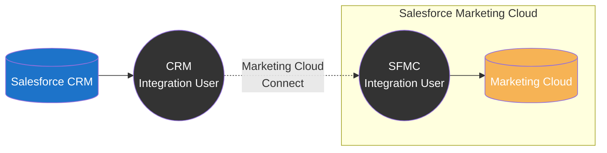
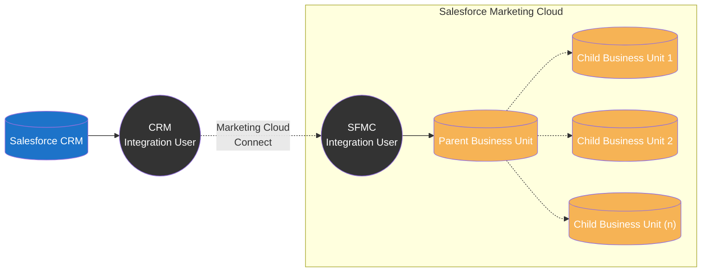
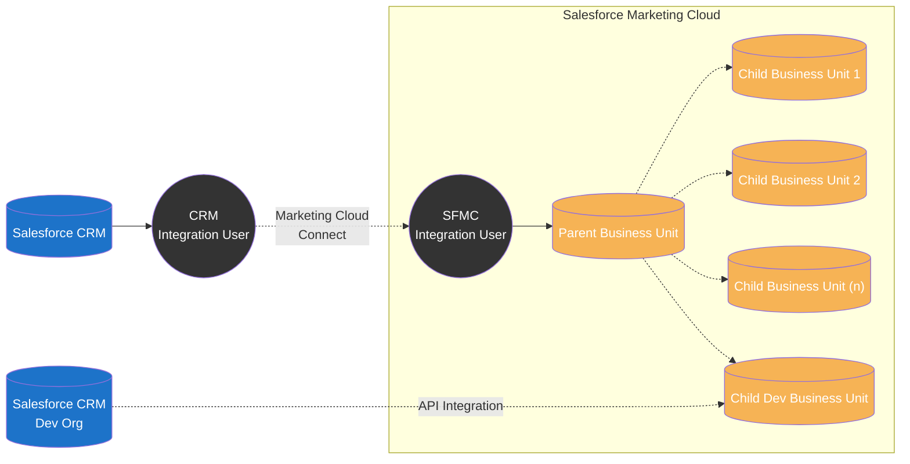
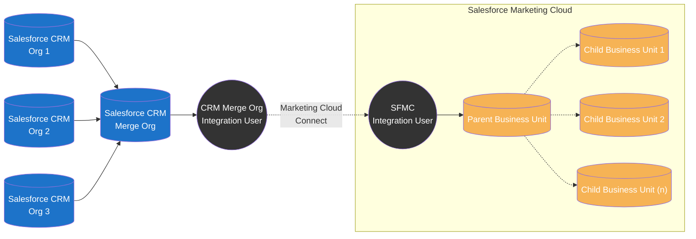
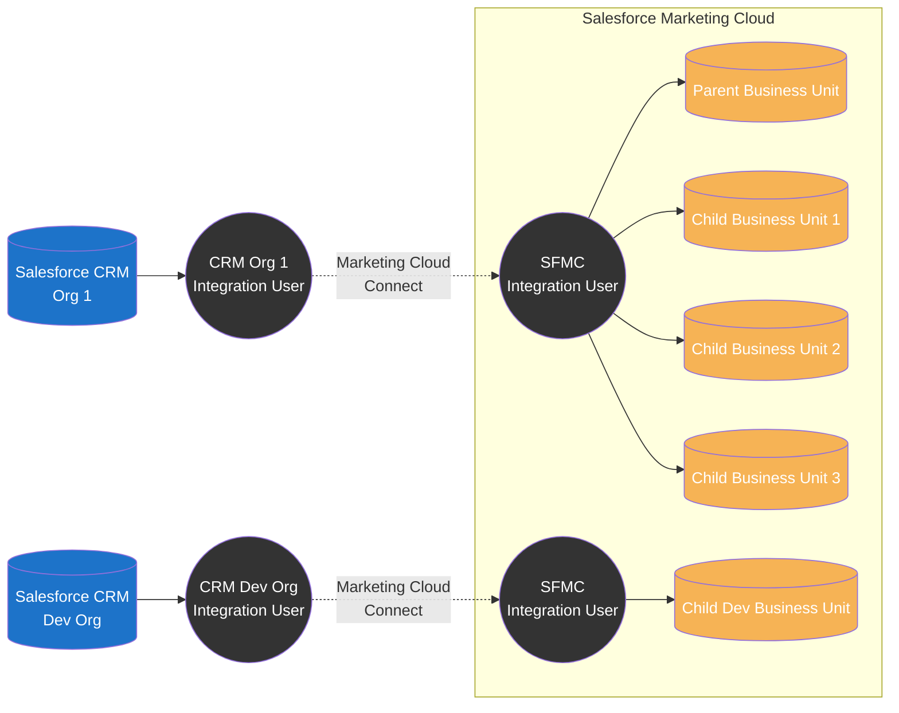
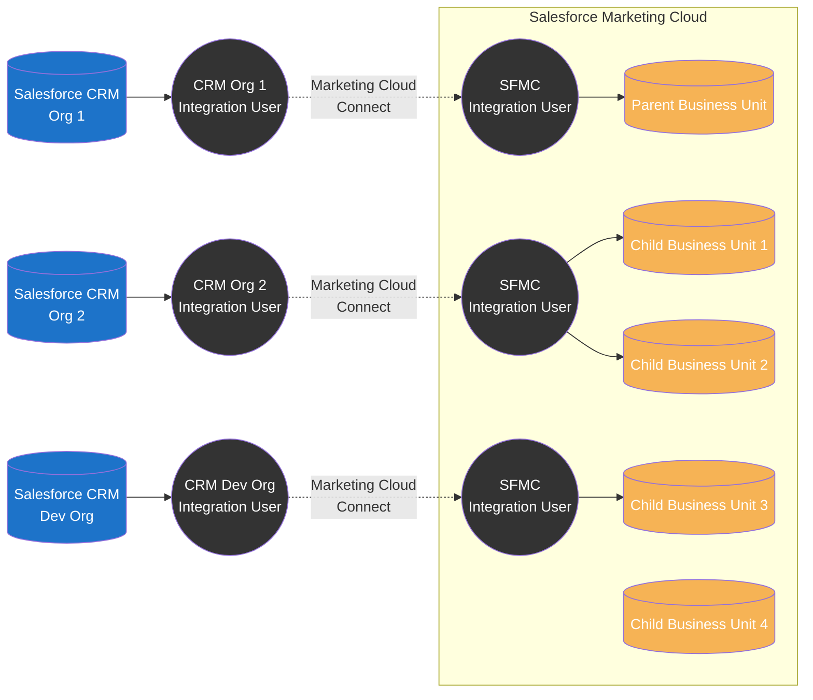
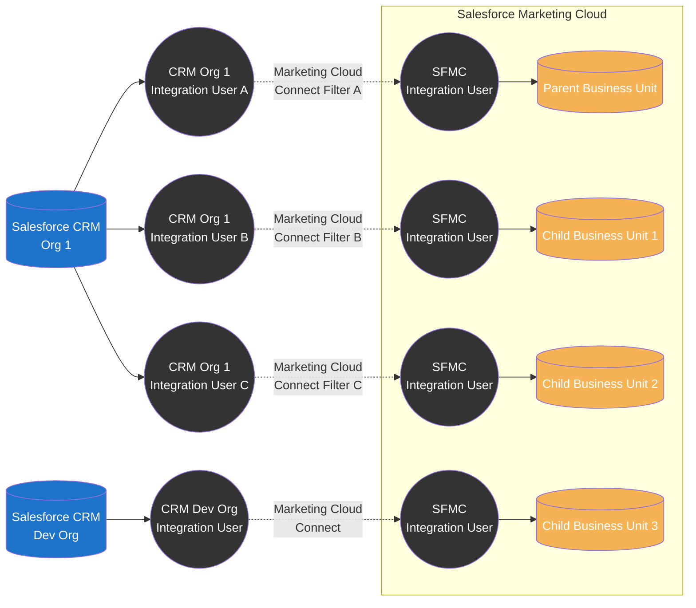

import { LeadText } from '/src/components/LeadText.js';

<LeadText content="Marketing Cloud Connect Architecture: Single-Org, Multi-Org and everything in between. Integrate Salesforce CRM and Marketing Cloud the right way." />

## Marketing Cloud Connect Basics

So you have Salesforce CRM & Marketing Cloud and want to integrate them to create data-driven, personalised customer engagement. Perfect idea, but don't start without thorough planning.

Unfortunately, Marketing Cloud is not (yet?) on the same Lightning Platform as the Salesforce CRM (be it Sales Cloud, Service Cloud, Health Cloud or what-have-you). It means that the data from one tool is not available out-of-the-box in the other for instant use.

Fortunately, an out-of-the-box integration suite made by Salesforce called Marketing Cloud Connect (MCC) lets you use those tools in tandem. It offers many features ranging from simple data sync between the platforms, through dedicated Journey Builder activities and AMPScript functions, to reporting feedback loop and extended marketing features for the CRM. Using it also means no need for custom API calls eating up the licence limits.

The connector is flexible and provides a wide range of configuration options to meet your organisation's needs. That's perfect, but it also means you must architect how you want the connection to work. It is especially true for the very initial step of deciding on the integration approach between the CRM(s) and SFMC(s), as configuration won't be (easily or even at all) reversible after the initial choice is made.

In this article, I will share quirks and features of possible integration patterns and help you make the right choice from the start. Let's dive in.

### Single-Org vs Multi-Org

When discussing Marketing Cloud Connect, the key thing to understand is the difference between Single-Org and Multi-Org SFMC configuration and their limits.

By default, each Marketing Cloud instance is configured as a Single-Org. It means it can connect to only one Salesforce CRM Org. The integration is done on SFMC's Parent Business Unit level, and benefits are shared across all available Business Units. It's a straightforward setup with two fundamental limitations: only one CRM Org can be integrated, and all Business Units have access to the same integration scope (data, permissions, features).

:::note You Should Know

If you don't see some MCC features on Child Business Units on integrated Single-Org - create a Salesforce Support ticket. Some of the inheritance rules need to be enabled on the backend. It should be applied out-of-the-box, but sometimes it needs one more push.

:::

In most cases, when one of those limitations is against the business needs, the solution is to go Multi-Org. However, take that decision seriously - Multi-Org configuration can be enabled only by Salesforce Support, and __it is not reversible__ (it is so important, I will repeat it few times in this article). Multi-Org has some limitations, and the only way to return to Single-Org is to get a completely new Salesforce Marketing Cloud Account.

Key differences | Single-Org | Multi-Org
-- | -- | --
Integrated SF CRM Orgs | 1 | 1 or many
Integrated SFMC Business Units | All | Any or All
Connected SF Integration Users | 1 | 1 or many
Integrated SFMC Business Units per single SF Integration User | All | Up to 5
Synchronised Data Extension Configuration and Filtering | Shared | Shared per Integration User
Synchronised Data Extension Visibility | Parent only or All | All integrated
Shared Data Extension | Supported | Supported
Shared Salesforce Data Extension | Supported | Not Supported
Profile/Preference Center | Standard or Custom | Custom only
Profile Attributes CRM Sync | Automatic | Custom Automation only
Web Collect | Supported | Not Supported
Disconnecting MCC Integration | On Parent for whole SFMC | On per Business Unit basis

### Additional MCC Considerations

On top of the differences showcased above, there are a few other things that you should keep in mind:

1. You can change Single-Org to Multi-Org anytime (existing integration will stay at Parent BU). You cannot change Multi-Org to Single-Org.
2. All Contact, Lead and User Synchronized Data Extensions records will be automatically added to the All Contacts list and counted against your licence limit.
3. With Multi-Org, you need to manage the duplicate Subscribers risk. If the same Contact, Lead or User exists in multiple integrated SF Orgs, it will have a different Contact ID in each of them and thus will be created as a separate Contact in SFMC.
4. You can only partially limit access to data between Business Units. There are some options to make data belonging to other BUs harder to see (like All Subscribers List filters or denied Shared Data Extensions permissions). Still, in the end, someone determined will be able to access the data, for example, through AMPScript/SSJS/SQL. The only currently available approach to fully silo the data is to have separate Salesforce Marketing Cloud Accounts.
5. You cannot connect multiple Salesforce CRM Orgs to a single Marketing Cloud Business Unit (unless you do it partially via the [API](#api-extended-single-org-setup) or using [merge org pattern](#merge-org-setup)).
6. You cannot connect one Salesforce CRM Org to multiple Marketing Cloud Accounts (separate SFMCs) using Marketing Cloud Connect.
7. You cannot use the free API-only Salesforce CRM Integration Users - Marketing Cloud Connect requires full Salesforce System Administrator licences for the Integration Users.

## Marketing Cloud Connect Patterns

With a high-level overview and fundamental limitations covered, let's discuss various possible integration patterns with their pros, cons and best-matched use cases.

### Single-Org Patterns

The default Salesforce Marketing Cloud configuration allows you to connect all Business Units to a single Salesforce CRM Org using the official Marketing Cloud Connect integration tool.

#### Single Business Unit Single-Org Setup

It is your choice if you have:

- one Salesforce CRM Org and
- one SFMC Business Unit

Keep it simple and rejoice in straightforward architecture with no limitations.

#### Multiple Business Units Single-Org Setup

It might be your choice if you have:

- one Salesforce CRM Org and
- multiple SFMC Business Units

It is perfect if you are ok with all Business Units having the same configuration and filters applied. It brings simplicity and unlimited Business Unit scaling.

However, if you need to have different objects or scopes of Contacts/Leads/Users synchronised to each Business Unit, you will have to go with [Filtered Multi-Org Setup](#filtered-multi-org-setup). Keep in mind that by doing so, you will:

- need separate Integration Users for each version of configuration/filtering
- loose possibility to hide Synchronized Data Extensions on Child Business Units
- loose Shared Salesforce Data Extensions
- loose Standard Profile Center
- loose Web Collect

And as going Multi-Org is non-reversible, you should be 110% certain that custom configuration/filters are worth it.

#### API Extended Single-Org Setup

It might (but shouldn't) be your choice if you have:

- one production Salesforce CRM Org and
- one developer Salesforce CRM Org and
- multiple SFMC Business Units

I wouldn't recommend this approach. In most cases, it is much better to either go with [Basic Multi-Org Setup](#basic-multi-org-setup) or [Multiple BU Single-Org Setup](#multiple-business-units-single-org-setup) and have test data in production CRM.

When might this pattern be the right one for you?

1. You have dozens of SFMC Business Units.
2. You want to use only one Integration User.
3. You want to avoid having dev/test data on production SF CRM.

However, calculate the implementation cost of custom API integration and check the API licence limits, as you might find that going with Multi-Org will be better and cheaper in the end.

Additionally, this approach pushes both test and production data to your Dev & Test Business Unit (as you cannot limit the Single-Org MCC integration scope), which creates a risk of sending test assets to actual customers.

#### Merge-Org Setup

It might be your choice if you have:

- multiple Salesforce CRM Orgs and
- single SFMC with one or many Business Units

This approach moves the complexity from Marketing Cloud Connect to Salesforce CRM. Using one SF Org as a Merge Org where the data from multiple other Orgs is synchronised, we can create simple MCC Single-Org integration covering all available Business Units.

Of course, it has (considerable) drawbacks:
1. Cost & Complexity - you need to have (and integrate into the data pipeline) yet another Salesforce CRM Org to serve as a Merge Org.
2. Real-timeness - as there is an additional step in the integration (Merge Org), the data sync loop will be slower.

Due to the above, I would only consider this approach when you need data from multiple Salesforce CRMs in a single Business Unit and full support for Marketing Cloud Connect features (f.e. SF Journey Builder Activities and Entries).

### Multi-Org Patterns

The optional Salesforce Marketing Cloud configuration allows you to connect multiple Salesforce CRM Orgs to various Business Units or differentiate synchronised data filters on each Business Unit. You can enable it with a Support request but keep in mind it is not reversible - once it's switched on, there is no going back to Single-Org.

#### Basic Multi-Org Setup

It might be your choice if you have:

- one production Salesforce CRM Org and
- one developer Salesforce CRM Org and
- multiple SFMC Business Units

This pattern covers one of the most popular Multi-Org setups where you have between one and five production Business Units connected to the production Salesforce CRM Org and want a complete testing suite with dedicated Dev & Test Business Unit connected to a SF CRM Dev Org. It is the closest you can get to CI/CD due to the lack of a true SFMC sandbox offering.

It is a much cleaner approach than the [API Extended Single-Org Setup](#api-extended-single-org-setup), and it doesn't have significant cons other than standard [Multi-Org limitations](#single-org-vs-multi-org).

If you have more than five production Business Units or need different data filters per each production Business Unit, you will need to go with [Filtered Multi-Org Setup](#filtered-multi-org-setup) instead.

#### Complex Multi-Org Setup

It might be your choice if you have:

- multiple Salesforce CRM Orgs and
- multiple SFMC Business Units

This pattern is where Multi-Org truly shines. Multiple CRMs (production, sandbox or dev) and multiple Business Units connected in various configurations - a prevalent approach for enterprises where each country or brand can have a separate CRM and dedicated SFMC Business Unit.

You can plan 1 CRM to 1 BU integrations, 1 CRM to multiple Business Units integrations and even keep some Business Units not integrated (for example, for markets using non-SF CRMs). This flexibility results in complexity, as each integration will require a separate configuration, connection and data pipeline.

If you want to connect more than five production Business Units to a single CRM within this setup, you will need to mix this approach with [Filtered Multi-Org Setup](#filtered-multi-org-setup).

#### Filtered Multi-Org Setup

It might be your choice if you have:

- multiple Salesforce CRM Orgs and
- multiple SFMC Business Units

This pattern leverages multiple CRM Integration Users per single CRM to get around two limitations of Marketing Cloud Connect:

1. One CRM Integration User share Object synchronisation configuration and filters across all integrated Business Units.
2. One CRM Integration User in Multi-Org Setup can integrate up to five Business Units before the integration performance and stability are impacted.

As you can see, both cases are per one CRM Integration User. And while you are limited to only one Marketing Cloud Connect in a single Salesforce CRM, you can have multiple Integration Users connecting to the target Marketing Cloud Account. It allows you to go around both those issues. Unfortunately freshly introduced free CRM integration users [cannot be used for this purpose](https://help.salesforce.com/s/articleView?id=000395036&type=1).

:::note You Should Know

The workaround for up to five BUs limitation is straightforward - you create multiple integration users and connect each of them to up to five Business Units.

The same is true for different Object configurations - for each Integration User you can choose other Objects and fields to synchronise.

The workaround for unique filters adds a bit of complexity. While the filter setup can also be set per integration user just as the Object sync configuration, the filtering options are limited - with the most useful field-based filter available only on booleans.

You can make the most of it by creating checkbox flags for your filters, for example, `IsGermanContact`, `IsUnitedStatesContact` and `IsPolishContact` fields that match the country (or brand, or contact type) assignment of a Contact record.

Keep in mind that those checkboxes cannot be calculated using a formula. You will need to fill them in using the default value, Apex Trigger or Flow (generally any means that triggers record update).

Additionally, you can leverage Integration User permissions for scope limitation so that you can layer different filters. For example - limit permissions to only one RecordType and use boolean to flag records within that RecordType that have consent.

:::

## Marketing Cloud Connect Best Practices

### Plan before you do

Abraham Lincoln once said "give me six hours to chop down a tree, and I will spend the first four sharpening the axe". While this is an excellent maxim for most Marketing Cloud work, it is especially true for Marketing Cloud Connect configuration. In the best case, the wrong decision can add you hours of work. In worst - it locks you with a suboptimal setup you can change only by purchasing a fresh Marketing Cloud Account. Plan, read up, check and recheck before you commit to the work.

### Document what you do

Marketing Cloud Connect integration is complex, and - especially with Multi-Org - many configurations, usernames and passwords are involved. Document all of that. It will save you hours or days in the future.

### Use dedicated emails

When implementing Marketing Cloud Connect, you will need to create (sometimes a lot of) Integration Users. Don't use individual email addresses. Always make a dedicated group email inbox that will be used for those integration users. Employees come and go, and the last thing you want is to rebuild the whole integration from scratch on production because you cannot access the inbox of an employee that left a year ago.

### Manage the data

Marketing Cloud Connect lets you move the data between the clouds. A lot of data. It can impact the performance of your platform and even create compliance risks. Always try to minimise the amount and visibility of the data to what is truly necessary.

1. Don't synchronise all Objects - pick only those truly needed.
2. Even if you have to synchronise useless prerequisite Objects, use synchronisation filters to stop the data from flowing. This is especially true for Leads and User Objects that are required but, in many cases, not needed. The easiest way to do so is to add on those Objects a `IsSynced` checkbox that defaults to false and use it as a synchronisation filter.
3. Don't synchronise all fields - pick only those truly needed.
4. If you go Multi-Org, consider using different filters per Business Unit as suggested in [Filtered Multi-Org Setup](#filtered-multi-org-setup).
5. If you go Multi-Org, make the Parent Business Unit an administrative BU, not a production one. Parent will have visibility over data from all the integrations, which can lead to compliance issues in many setups.
6. If you go Multi-Org, be wary of duplicates - if you have the same Contact in two CRMs, those will have different Salesforce IDs and, therefore, will be created as two separate Contacts in SFMC (and eat up your licence contact count limit appropriately).

### Don't use Synchronized Data Extensions directly

Synchronised Data Extensions are fantastic - they get updated every 15 minutes with fresh data from Salesforce CRM. However, I wouldn't recommend using them directly as Journey Entries or segmentation/decisioning logic. If there is an issue with the Marketing Cloud Connect (be it a rare backend one or a more frequent user error), the Synchronized Data Extensions will disappear along with all the data. It will also break dependent Journeys.

Moreover, if you use a Multi-Org setup, Synchronised Data Extensions from subsequent integrations get a numeric suffix in their name. When the integration breaks, their name might change to a different suffix, breaking all your SQL queries.

I recommend creating Master Data Extensions that will capture all the needed data points from Synchronized Data Extensions and keep them updated with Automation Studio Query Activities. Then, use those Master Data Extensions for all your Journey, segmentation and decisioning needs instead of directly pulling from Synchronized DEs.

This approach will provide two security layers:

1. Master Data Extensions will not disappear even when there is an issue with Marketing Cloud Connect, meaning that the dependent assets will not break.
2. Master Data Extensions will keep the last synchronised version of data during the MCC crash, letting segmentation and decisioning work correctly on slightly older data while you fix the sync.

Of course, there is one downside to this approach. As you need to use Automation Studio to copy Synchronised Data Extensions data to your Master Data Extensions, it will add 60 minutes (minimum Automation Studio schedule) to the 15-minute (minimum Marketing Cloud Connect schedule) delay in the real-timeness. Still, this is a small price for security and peace of mind.