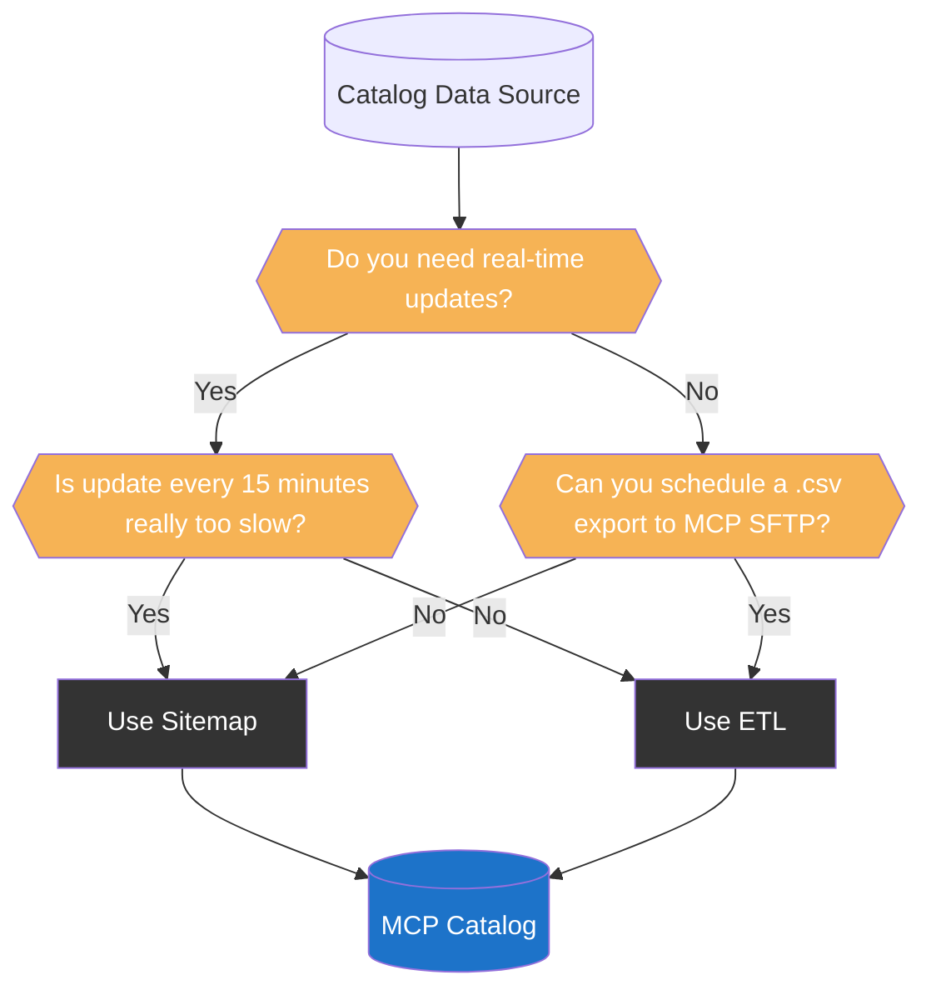
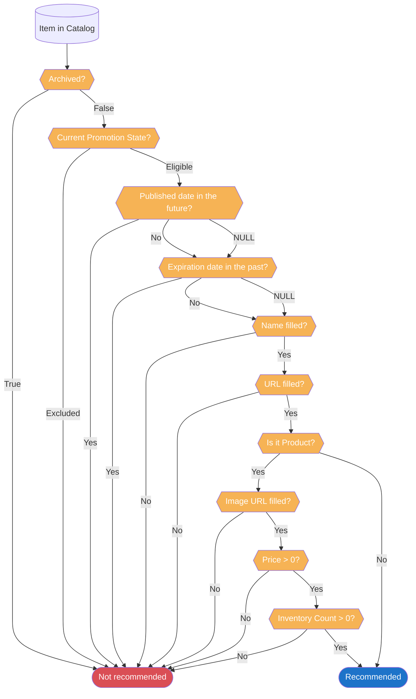

import { LeadText } from '/src/components/LeadText.js';

<LeadText content="Marketing Cloud Personalization (Interaction Studio) Catalog Objects architecture, data ingestion, limitations, tricks and tips. Build right from the start." />

## Catalog Basics & Limitations

The purpose of the Marketing Cloud Personalization (Interaction Studio) Catalog is to store your asset data along with interconnecting relationships for personalisation and machine learning purposes.

There are five out-of-the-box objects: Products, Articles, Blog Posts, Categories and Promotions. You can also create **up to 25 custom** Catalog Objects.

Each Object contains some built-in attributes (like Name, URL, Description, Promotable) and can be extended with custom attributes up to a **total of 35 attributes** on an Object.

All of the above can be stitched together using prebuilt and custom relationships between Catalog Objects (for example, the built-in relationship between a Product and a Category) - allowing for connections of **up to 15 Categories per Item** and **up to 50 related Catalog Object values per Item**.

With **up to 2 000 000 Items per Catalog** and **up to 10 000 000 Items in total** across all Catalogs, MC Personalization provides a lot of flexibility to architect a Catalog of your dreams.

However, some quirks and features require more consideration to make the most out of MCP capabilities. Especially as some wrong moves can be tough to reverse. Let's dive in.

## Catalog Data Sources

There are three key sources of data for the Catalog:

1. **Manual via UI** - Good for checking data and performing minor fixes, but awful for data ingestion.
2. **Web/Mobile SDK** - Real-time, but performance-heavy and dependent on user behaviour.
3. **ETL Feed** - Best performance and can cover the whole Catalog regardless of user behaviour, but can be updated at most every 15 minutes.

So which one should you use - Sitemap or ETL?

### Why not both?

Mixing both sources is very tempting as it sounds like the best of both worlds. Unfortunately, it is not recommended approach due to MCP's backend limitations. Sending the same Items through both channels impacts performance, creates concurrency and can lead to incorrect and not-so-easy-to-fix issues with your Catalog.

For example, if you control the Exclusion and Eligibility of the Products using Sitemap and the `promotable` attribute, the ETL won't be able to overwrite it (despite officially having higher priority as a data source). It can quickly lead to considerable discrepancies in Product availability for recommendations. Due to that, I recommend enabling Strict Catalog Security setting to protect your Catalog integrity if you are using ETL.

Another issue related to mixing is functional differences between the sources. For example, Sitemap and Category ETL use [different mechanisms for building hierarchy](https://issues.salesforce.com/issue/a028c00000gAwJyAAK/interaction-studio-not-correctly-displaying-category-hierarchy) that are not compatible with each other.

To sum up - do not mix Sitemap and ETL. And if you have to - do not mix Sitemap and ETL on the same Object. And if you have to - do not mix Sitemap and ETL for the promotable and archived attributes. But really, do not mix it.

### Sitemap vs ETL

Assuming you want to keep things clean, you have two options:

#### 1. MC Personalization with Sitemap

Pros:
- You need Sitemap either way.
- The updates will happen in real-time once the User views the Item.
- You can build a [drill-down Category hierarchy](https://issues.salesforce.com/issue/a028c00000gAwJyAAK/interaction-studio-not-correctly-displaying-category-hierarchy) in the UI.

Cons:
- Sitemap will be more complex - depending on where the Catalog details are available on the website (dataLayer, JSON LD, HTML), getting them might get convoluted and impact the performance of your data capture and Campaigns.
- Changes to the website can break your data capture (for example, updates to breadcrumb attributes or dataLayer structure).
- Catalog gets updated only when a user views an Item, which creates a risk of incorrect recommendations for less-visited Items.
- Can trigger massive amounts of concurrent updates for high-traffic Items.
- Cannot overwrite Multistring Object attributes and relationships (like Category) - Sitemap can only append.
- Catalog can be manipulated from the front end by malicious actors.

#### 2. MC Personalization with ETL

Pros:
- Full Catalog upsert possible every 15 minutes (delta files recommended).
- Full control over final Catalog values - regardless of Item page visits.
- Better control over [history of value changes](/docs/salesforce/marketing-cloud-personalization/snippets/catalog-etl-metadata-viewer.mdx) and easier debugging.
- Much better performance, especially for bigger Catalogs.
- More secure with Strict Catalog Security option <br/> **WARNING**: A bug currently stops Add To Cart and Purchase actions from being associated with Categories with this setting enabled.
- Much more lean and performant Sitemap.

Cons:
- Require you to export data in a particularly formatted .csv to MCP SFTP.
- Not real-time (but every 15 minutes is pretty damn close, come on!).
- Doesn't support [drill-down Category hierarchy](/sites/ideas/mc-personalization-ideas#full-mcp-category-hierarchy-support-for-etl) in the UI<sup>[*](#category-catalog-unique-attributes)</sup>.

### Recommended MCP Catalog Data Source

Considering the above, ETL seems like an obvious choice. And it nearly is. I see only two scenarios where we should choose Sitemap to populate the Catalog (spoiler alert, you should try to overcome those scenarios as much as possible):

1. You must have Item (especially Product) updates in real-time.

For example, due to swift changes in the price based on demand. Or due to having single-stock items that need to be pulled quickly from the recommendations (unfortunately, Purchase action does not adjust the stock). Consider this only if it is crucial for your business. Otherwise, the 15-minute cadence with ETL is close and lets you benefit from all the good things.

2. You cannot schedule a correctly prepared .csv file to MC Personalization SFTP.

In most cases, your systems already use flat files and FTPs for communication, and you can extend the architecture to cover MCP. If not, many tools can help you transform your data cleanly into a nice .csv and add it to Marketing Cloud Personalization Feed with the correct naming convention. You can even leverage Marketing Cloud's Automation Studio to prepare and deliver the files in the proper format! But sometimes data is just not there - and then, ETL is a no-go.

While you can begin with Sitemap and then migrate to the ETL approach, the transitory period may be problematic due to issues described in the [Why not both?](#why-not-both) section above. I recommend finding a workaround and starting with the better option.



Once you know how to populate the MC Personalization Catalog, it's time to decide what you will be filling in.

## Catalog Attributes

Each Catalog provides a set of attributes available on each Item. You can use them to store the metadata about Products, Categories or other Objects - and you can leverage it for recommendations and personalisations. However, there are some quirks and features that need to be taken into consideration when planning the Catalog Architecture.

### Catalog Built-in Attributes

Let's start with what is available out of the box. There are three groups of available attributes (basic, location-based and promotion-related), plus a few special attributes unique to Product and Category Catalogs.

#### Basic Catalog Attributes

Attribute | Data Type | Purpose | Comment
-- | -- | -- | --
ID | String | Unique identifier for each Item | It must be unique per Object and can be reused in others (for example, you can use the same ID in Product and Category Objects).
Name | String | Readable name of an Item | Used to identify an Item across the UI. It does not have to be unique; you might have multiple Items with the same name. Required to recommend an Item.
URL | String | Link to the Item | Redirect target when User clicks on an Item in a Campaign. Required to recommend an Item.
Image URL | String | Link used to display an Image of an Item | Used to showcase a Product. Required to recommend a Product (not needed for other Item types).
Description | String | Client-friendly description of an Item | Any text beyond 200 characters will be replaced with an ellipsis (`...`).
Average Rating | Decimal | Average score of an Item based on all Ratings | Useful as a filter for Einstein Recipes and Triggered Campaigns.
Number of Ratings | Integer | Number of ratings an Item gathered | Can be used in Serverside Code to conditionally hide Rating personalisation when it is based on a single rating.

Out of the above Basic Catalog Attributes, the first four are the most important: ID, Name, URL, and Image URL. The Average Rating helps filter products for Campaigns. The rest might be helpful for personalization purposes, but can be skipped in most implementations.

#### Location Catalog Attributes

Attribute | Data Type
-- | --
City | String
State / Provine Code | String
Postal Code | String
Longitude | Decimal
Latitude | Decimal
Country Code | String

Location-based Attributes are niche but powerful. They are utterly useless for most implementations (as in most cases, the Item is either available in many locations or its location is irrelevant). However, for businesses offering unique, location-based Items (hotels, houses, unique Products), filling those attributes allows for location-based recommendations (triggered by either User or currently viewed Item geo data).

#### Promotion Settings Catalog Attributes

Attribute | Data Type | Purpose | Comment
-- | -- | -- | --
Published | Datetime | Availability start date for an Item | Must be `null` or in the past for MC Personalization to recommend the Item. If you set a future date - The Item will not be promoted until then.
Expiration | Datetime | Availability end date for an Item | Must be `null` or in the future for MC Personalization to recommend the Item. Once you hit that date, the Item stops being recommended.
Promotable | Picklist | Marks whether Item should be Promoted | Items can be either Eligible or Excluded. Only Eligible ones will be returned in the recommendations, regardless of Published/Expiration values.
Archived | Boolean | Marks whether Item should be Archived | Archived Items are treated as Excluded (won't be recommended) and are hidden from the Catalog UI.

:::note You Should Know

Published and Expiration fields (as all Interacton Studio date type fields) use ISO-8601 datetime formar. You must pass them as `2022-04-12T10:23:37Z`.

If you want to push a datetime to MCP using [ETL](#2-mc-personalization-with-etl), you can prepare the data with SQL using clean [FORMAT](/docs/salesforce/marketing-cloud-engagement/sql/sql-date-functions.mdx#format-with-dates): `FORMAT(YourDateField,'yyyy-MM-ddTHH:mm:ssZ')` and output it to a String field type (Text, if we are talking SFMC Data Extension).

:::

Promotion-related attributes are crucial for controlling what MC Personalization will recommend. They are also the most tricky ones, as they seem to be very similar to each other. Rule of thumb when selecting what to use:

1. If you are frequently updating the Catalog (thanks to using [ETL](#2-mc-personalization-with-etl)), go with the Promotable attribute.
2. If you have less control over when the update will come (due to using [Sitemap](#1-mc-personalization-with-sitemap)), or need the recommendation to start/end at a particular time that is not perfectly aligned with your sync schedule, go with Published/Expiration attributes.
3. If you are sure you don't need an Item, archive it. But it is a last resort solution for incorrect data, not a general tool for managing Catalog content.

:::note You Should Know

Archiving does not delete Items (there is no such option in MC Personalization). It only hides them from the Catalog UI while preserving all its values. It has two significant ramifications:

1. Marketing Cloud Personalization still uses archived Items for the personalisation engine - especially as anchors for recommendations. For example, a campaign promoting Similar Items to the Item currently viewed will work on the archvied Item page (and leverage all its metadata). If you want to avoid it, clean all attributes and relationships before archiving.
2. You can't easily find archived items to make any changes or unarchive them. Find partial workarounds in the [Tips & Tricks section](#view-archived-items-in-the-mcp-catalog).

:::

#### Product Catalog Unique Attributes

Attribute | Data Type | Purpose | Comment
-- | -- | -- | --
Units in Stock | Integer | Provides products Inventory Count | If the Product is available, but the exact stock is unknown, provide 1. Otherwise, it will not get recommended.
Alternate ID | Multistring | Pipe-separated SKUs for the Product | As there is no option to provide separate details for each SKU, it's pretty useless now.
Price | Decimal | Current price of the product | Used for personalization and Einstein Recipe price-based filtering. A price equal to 0 will block the Product from recommendations.
List Price | Decimal | Full sticker price of the product | Useful for price drop personalization and Product Price Reduction Triggered Campaigns. Unfortunately, there is no Price Reduction Recipe [yet](/sites/ideas/mc-personalization-ideas#price-reduction-ingredient-in-einstein-recipes).
Price Description | String | Information about the current Price | You can pass here the promotion name that resulted in a lower Price for personalisation purposes.
Currency | String | ISO-4217 Currency Code | Required when you enable Product Localization and capture Product price in multiple currencies. To pass Currency, you need to pass it along with Locale.
Margin | Decimal | Profit margin on the Product | Useless.

As you can see, there are two must-have attributes - Units in Stock and Price - followed by one highly recommended for most implementations - List Price. The rest is either niche or useless.

:::note You Should Know

The Price attribute should reflect the current global price. Apply site-wide promotions to it, but don't change it to a Client-specific or voucher-based ones. The Product can have only one Price.

Don't worry about the final, unique basket price. Cart and Purchase actions have a separate model for storing the Product price data allowing for per-customer uniqueness without impacting the global Product Catalog Price.

:::

#### Category Catalog Unique Attributes

Attribute | Data Type | Purpose | Comment
-- | -- | -- | --
ID Path | Multistring | Stores Category hierarchy information | Each Category can have only one Parent Category, and the root (top-level) Category should have this field empty.
Is Department | Boolean | Marks root (top-level) Category | Used in Einstein Recipes for Department-based configurations.

Dedicated Category Catalog attributes focus on the hierarchical relationship between the Categories. This area is a bit of a mess in the MC Personalization because it works differently depending on whether you use [ETL](#2-mc-personalization-with-etl) or [Sitemap](#1-mc-personalization-with-sitemap).

1. **Sitemap-based hierarchy** is using the [basic ID attribute](#basic-catalog-attributes). It expects pipe-delimited IDs providing a full hierarchy path, so `Electronics` (single ID) for root Category, `Electronics|Computers` (two IDs pipe-delimited) for first-level child Category and so on for further levels (it can get quite long for deeper structures: `Electronics|Computers|Laptops|Ultrabooks`). It will unlock the visual hierarchy with tracking data rollups in the Category Catalog UI.
2. **ETL-based hierarchy** uses the ID Path and Is Department attributes unique to Category Catalog. Each Category has a single ID, passes a single Parent ID (if it has a parent) or Is Department as True (if it doesn't have a parent) and based on the above, MCP generates the ID Path. It's cleaner, but it won't provide the nice visual hierarchy with tracking data rollups in the Category Catalog UI as the Sitemap option offers. I created an [Idea to fix that](/sites/ideas/mc-personalization-ideas#full-mcp-category-hierarchy-support-for-etl).

:::note You Should Know

Officially, there is no option to overcome the above limitations. If you try to push pipe-delimited IDs via Product ETL, they will be treated as separate values and assign the Product to multiple categories.

However, if you dare, there is a workaround to eat a cookie and have a cookie. You can push Sitemap-style IDs via ETL and create the visual hierarchy in Category UI if you replace pipes with their hex code: `&#x7c;`. So instead of `Electronics|Computers|Laptops|Ultrabooks`, you would have to push `Electronics&#x7c;Computers&#x7c;Laptops&#x7c;Ultrabooks`.

Remember that it is not official or supported and can break anytime. Implementing it is risky. But for now, it works.

:::

### Catalog Custom Attributes

Outside of the built-in attributes, you can go wild with custom ones until you hit 35 attributes of any type on a single Object. Those are great for personalization - crucial for an Open Time Email campaign where you don't have much wiggle room to manipulate the values.

Unfortunately, there is a considerable feature gap related to custom Catalog Attributes, limiting their usefulness. You cannot use them in Einstein Recipes to Include, Exclude, Boost or limit with Variations.

That's a huge letdown, but fear not. There is a workaround - custom Catalog Objects and Object relationships.

## Custom Catalog Objects

Let's start with the basics. You can create (up to 25) custom Catalog Objects that extend the out-of-the-box set of Products, Articles, Blog Posts, Categories and Promotions Objects. Like the built-in ones, custom Objects structure and group Items assigned to them.

:::note You Should Know

Depending on where you look in the Marketing Cloud Personalization, you might still see "Dimensions" - an old name for related Catalog Objects.

:::

Custom Catalog Objects have three superpowers:

1. You can create relationships between Items from various Catalogs (for example, between specific Products and specific colours in custom "Color" Catalog Object - this doesn't sound awesome now, but the following two points will show you that it is something completely different from custom Attributes).
2. You can capture the affinity of each User towards those related Items (for example, how much each User likes specific colour).
3. You can leverage them in Einstein Recipes in multiple ways.

This set of features makes custom Catalog Objects a big deal when you want absolute control over your recommendations. Examples? Sure.

### Promotions Related Catalog Object

You want to recommend only the products that are on promotion. Create a custom Catalog Object "Promotions" with an Item "Promoted" and assign it (via [ETL](#2-mc-personalization-with-etl) or [Sitemap](#1-mc-personalization-with-sitemap)) to each deserving Product. Then you can use this information in Einstein Recipes » Exclusion tab to Include the "Promotions" Catalog and select "Promoted" using "from explicit selection" option.

You can even go a step further and create additional Items in that Catalog like "0-10%", "11-20%", "21-30%", etc., to be able to include (or prioritize in the Serverside Code of the template) more significant promotions.

More? Extend that Catalog with specific promotion names like "BlackFriday", "CyberMonday", "SpeedyTuesday", "FreeDelivery", "AnotherPromotionBecauseWeNeedToCloseTheQuarterHigherToGetBonus" and assign those to all eligible products. Now you can create different Recipes for each promotion and show each customer the best products for their needs that are currently at a better price.

Still not satisfied? Ask your database mages to calculate the standard deviation for each current price drop per Product or Category and use it to assign the "coolness factor" of the promotion. 10% on phone cases differs from 10% on the newest flagship smartphone. Use that to focus on the real treats in your recommendations.

Just remember that a single relationship (like this "Promotions") can store a maximum of 50 values per Item (per specific Product in this case), so don't go overboard ;)

### Features Related Catalog Objects

Another widespread use case is to display products similar to the one currently viewed (especially when the Product is Out Of Stock).

Sure, there is a Similar Items Ingredient in Einstein Recipes. Still, with custom Catalog Objects, you can bring it to the next level by sharing crucial specification details (like graphic card, storage, colour, price bracket) and returning recommendations of products that are genuinely a matching alternative - not just from the name.

### Custom Affinity Wheel

Another excellent use case for custom Catalog Objects is related to the Affinity Wheel you can see when viewing a User Profile. By default, you will see four values: Category, Product Class, Brand and Color. While those are good choices for many brands, they are not always the perfect match for your business.

Thankfully, there is a (dirty) way to change it. You won't be able to swap Category (and that's fine, as it is a must-have one, in my opinion), but the other three are yours to take.

To make them whatever you want, create a custom Catalog Object with a special ID: Style, Brand or ItemClass. Use one of those and put what you want in the Name. Once you save it, MC Personalization will show the Name and selected Items in the Affinity Wheel.

Unfortunately, you will have to use those hardcoded IDs for populating data via [ETL](#2-mc-personalization-with-etl) or [Sitemap](#1-mc-personalization-with-sitemap). Not perfect, but it still makes your Affinity Wheel nice and valuable.

## Catalog Tips & Tricks

There are some gotchas you can encounter when working with MCP Catalog. Here I gathered solutions to frequent problems and some undocumented tricks that can make your life easier.

### When MCP recommends an Item?

Understanding when MC Personalization decides to recommend an Item might not be that easy, as there are quite a lot of rules checked in the backend:

1. Four conditions related to special [Promotion attributes](#promotion-settings-catalog-attributes):
    - Item cannot be Archived
    - Item must be Eligible
    - Item cannot have Published date in the future
    - Item cannot have Expiration date in the past
2. Two conditions related to key [Basic attributes](#basic-catalog-attributes):
    - Item must have Name
    - Item must have URL
3. Three Product-only conditions related to that Object's [Unique attributes](#product-catalog-unique-attributes):
    - Product must have Image
    - Product must have Price
    - Product must have Inventory



### Items missing in MCP Catalog

If you cannot find an Item in the Catalog UI, there are three possible options:

1. **The Item is not in the Catalog** - Check .csv files on the SFTP if you are using [ETL](#2-mc-personalization-with-etl) or use Visual Editor to validate whether the Item is captured by the [Sitemap](#1-mc-personalization-with-sitemap).
2. **The Item does not have any item actions** - The catalog only shows items that have been viewied, added to cart or purchased.
3. **The Item is filtered out with Date Picker** - MC Personalization displays an Item in the Catalog only if there was any Item Action (View, Add to Cart or Purchase) in that time range selected in the Date Picker. You can extend it to up to 5 years to see more Items. Alternatively, use [my viewer script](/docs/salesforce/marketing-cloud-personalization/snippets/catalog-etl-metadata-viewer.mdx) that shows all non-archived Items.
4. **The Item is archived** - Catalog does not display archived Items. Check out possible workarounds [here](#view-archived-items-in-the-mcp-catalog).

### Data is not added to MCP Catalog

If Items are not [missing in the MCP Catalog](#items-missing-in-mcp-catalog), but you don't see the data you expect, there are three options:

1. **You have Strict Catalog Security enabled** - In Personalization » Settings » Catalog and Profile Objects » Catalog Settings » Security section » Strict Catalog Security option. If it is checked and you use Sitemap, only the Item ID will be added to the Catalog. It is a security feature that protects the integrity of your data, but you should use it only if you are using [ETL](#2-mc-personalization-with-etl) to populate the Catalog metadata. You should uncheck if you use [Sitemap](#1-mc-personalization-with-sitemap) to build Catalog.
2. **You send item localization with the Catalog Localization switched off** - In Personalization » Settings » Catalog and Profile Objects » Catalog Settings » Locale section » Localization of Catalog Metadata Based on Page Locale option. If it is unchecked, but you push locale along with Item data, it will be ignored by MCP. Either remove the locale information or enable that option.
3. **You have a bug in the Sitemap** - Use Visual Editor from the Salesforce Interactions browser extension and execute Sitemap in it on the Item page. Check the left pane to see if the data is populated there. If not - you must fix the JavaScript that captures that data from the website.
4. **You have another bug in the Sitemap** - If Visual Editor shows all the data, but you still don't have it on most Items, the most probable reason is an issue with timing. Depending on how you capture Item metadata, some might not be available when the Sitemap executes on page load (but is ready when you launch the browser extension). Add a `console.log` to see whether the data is ready when needed, and leverage JS promises to solve the issue.

### Export full MCP Catalog data

Officially, the only option to export your Catalog data is to open the Catalog listing in the MC Personalization UI and click the Export button in the top right. Sounds easy, but there are three big problems with it:

1. **You have limited control over what it will export** - The export file returns ID, Name, Views, ViewTime, AverageViewSeconds and URL. The Product Catalog will also contain Cart, Purchase, Revenue, Price, Categories, and all related Catalog Objects (each as concatenated IDs without any delimiter...). Och and you cannot Export Categories at all. No way to get any additional details like other attributes (especially the key ones like Inventory Stock, Promotion State, Archived, etc.).
2. **You might not be able to export all Items** - The export file will contain only the Items in the current Catalog view. It means that the Date Picker in the top right impact the scope of returned Items. Date Picker has a limited range possible, so you might need to do multiple exports and deduplicate outcomes in the future. Items that do not yet have any action (view, cart or purchase) will also not be visible.
3. **You cannot export archived Items** - Export contains only visible Items - and archived ones are hidden. So no luck. I discuss partial workarounds [here](#view-archived-items-in-the-mcp-catalog).

Ok, you know all the limitations. What now?

I started this section with "officially" because I found an unofficial way. It's not as clean, but it solves most problems:

1. You need a .csv file with all Item Ids - You can get it using the official export described above or pull it from your website/e-commerce database. Extend that .csv with (empty) columns containing all your attributes and related Catalog Objects and one row with an ID that doesn't exist in your Catalog (ID `fullDataPlease` in the example below). For Product it might look like that:

```csv
id,categories,attribute:name,attribute:url,attribute:imageUrl,attribute:description,attribute:promotable,attribute:price,attribute:listPrice,attribute:priceDescription,attribute:margin,attribute:inventoryCount,attribute:published,attribute:expiration,attribute:currency,attribute:archived,attribute: Rating,attribute:numRatings,attribute:myCustomAttribute1,attribute:myCustomAttribute2,relatedCatalogObject:myRelatedCatalogObject1,relatedCatalogObject:myRelatedCatalogObject2
123,,,,,,,,,,,,,,,,,,,,,
456,,,,,,,,,,,,,,,,,,,,,
(...)
fullDataPlease,,,,,,,,,,,,,,,,,,,,,
```

2. Upload that file to the testing folder on the Marketing Cloud Personalization SFTP
3. In MC Personalization UI, go to Feeds » Feeds Dashboard » Select the right ETL (all custom Catalog Objects are using CatalogObjectETL) and click Validate or Execute button at the top.
4. Click Select File » Double click the Testing folder » Select your .csv file. In the File Data section, you should see all the columns you have passed and all the items with only the ID column filled in.
5. Click Run Test in the bottom left and wait for it to complete. It might take some time for bigger loads. Do **NOT** click the Commit button once it is ready.
6. Click the Export `{Something}` button in the bottom right - the download will start for the stagedObjects file.
7. Open it, and you will see three key row types: labels in the first row and then rows starting with either Original or Change value. You don't need any of the Change ones. Filter them out with the tool of your choice. I like to do it in VSCode with `^Change.*(\n|)` regex replacement to nothing.
8. Here you have it; the full MCP Catalog exported to a .csv file. Two notes: fields you pushed with the `relatedCatalogObject` prefix will return with the `dimensions` prefix, and Multistring fields will return as Arrays instead of being pipe-delimited.

That's dirty, but there is currently no other option for that. I created an [Idea to change that](/sites/ideas/mc-personalization-ideas#full-mcp-catalog-export).

### View archived Items in the MCP Catalog

[Archiving hides Items](#promotion-settings-catalog-attributes), making viewing them hard. They won't be visible in the Catalog UI or exported when you click the Export button. Salesforce Support won't be able to provide .csv with them.

There are, however, two ways to do it:

1. **One-by-One** - Great when you know the ID of the archived Item and need to view/edit only a few of them:
    - Option A: Go to the same Catalog as the Archived Item » Click any Item » Click the Edit button on the right pane » In the URL, find `&itemid=123456` and replace the value after the equal sign with the ID of the archived item » Click Enter. A
    - Option B: Open any Recipe » Simulate it » Find the archived Item in the Anchor Item picklist (because archived items still work as anchors) » Click the Book icon on the right side of the picklist.
2. **All-at-Once** - Great when you know all possible Item IDs and need to find which are archived:
    - Perform [Full MCP Catalog data export](#export-full-mcp-catalog-data) using full list of IDs from your source system. It will return the archived status for each one. Then you can leverage it for mass update with reupload via [ETL](#2-mc-personalization-with-etl).

As you can see, in both cases, you need to know the IDs (either exact or all possible). If you don't know what IDs could have been archived because there is no backup of all possible options - you are out of luck. Currently, there is no option to view such Items. I created an [Idea to change that](/sites/ideas/mc-personalization-ideas#full-mcp-catalog-export).