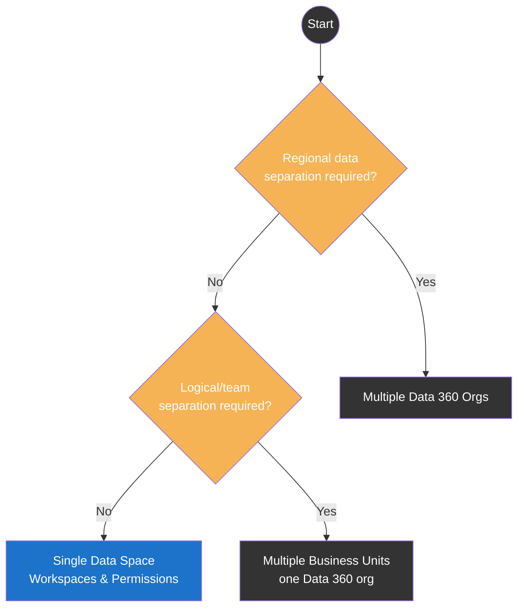
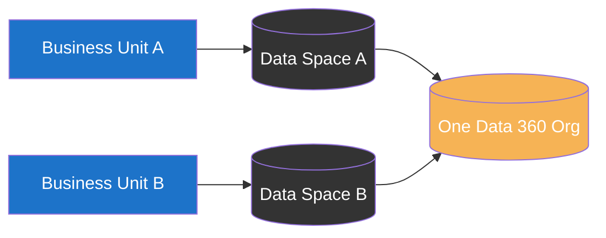
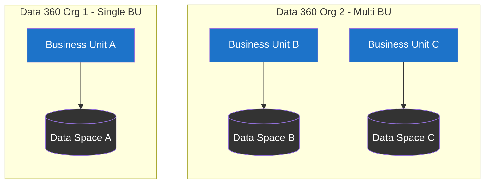

import { LeadText } from '/src/components/LeadText.js';

<LeadText content="Business Units in Marketing Cloud Next share a name with their Marketing Cloud Engagement counterpart, but the architecture underneath is a different beast entirely - and the wrong call here isn't easily undone." />

## Business Units, Rebuilt From Scratch

If you've configured Business Units in Marketing Cloud Engagement (MCE), forget most of it. Marketing Cloud Next (MCN) reuses the name and little else.

One gate before any of this applies: **Business Units require MCN Advanced Edition**. Growth Edition doesn't support them at all - there's no partial or read-only access, the feature simply isn't there ([Salesforce Help reference](https://help.salesforce.com/s/articleView?id=mktg.mktg_bu_create_bus_in_mktg_cloud_next.htm&release=260&type=5)). If you're scoping a Business Unit rollout and you're not already on Advanced, that's the first conversation to have with your Account Executive, before any of the architecture below.

In MCE, Business Units form a mandatory parent/child hierarchy. You log into one, see only its data, and the parent can see down into every child. MCN drops the hierarchy entirely. There's no parent, no child - just a flat list of Business Units that a user can belong to any number of. And instead of logging into a Business Unit, users log into the org and see everything they have access to at once, with a badge on flows, campaigns, and content items telling them which Business Unit that record belongs to.

| Item | Marketing Cloud Engagement | Marketing Cloud Next |
| -- | -- | -- |
| Navigation | Log into a Business Unit, see only its data | Always see everything you have access to, tagged with a Business Unit badge |
| Hierarchy | Mandatory parent/child, parent sees all children | None - flat list, a user can belong to several |
| Number of BUs | Unlimited | 2 included with Advanced Edition, more available as a paid add-on1 |
| Content | One content space per BU, optionally shared from others | Multiple content workspaces per BU, no sharing across BUs |

1 Two included, with the add-on cap recently raised to **150** per org - confirmed directly with Salesforce following a recent release. The publicly indexed [Salesforce Help differences table](https://help.salesforce.com/s/articleView?id=mktg.mke_business_units_differences.htm&release=260&type=5) still shows the older figure of 50 at time of writing. Like most commercial add-on caps, this is the kind of number Salesforce revises between releases without necessarily updating every Help page in lockstep - if your Account Executive or a newer release note quotes a different ceiling, trust that over this article.

__The context switch is gone, and that's the trade-off to internalise before anything else.__ A marketer with access to three Business Units in MCN sees three Business Units' worth of segments, journeys and content in one place, distinguished only by a badge. It's more convenient day-to-day and a lot easier to misclick your way into the wrong Business Unit's send. Plan your permission sets accordingly - the platform won't stop a multi-BU user from picking the wrong one.

The other structural change: a Business Unit in MCN is a thin, marketing-focused layer sitting on top of exactly one [Data 360 Data Space](https://help.salesforce.com/s/articleView?id=data.c360_a_data_spaces.htm&language=en_US). A Data Space is Data 360's own partition primitive - it puts a hard wall around a slice of your data, and by design **you cannot share data, content, campaigns or access controls across that wall**. A Business Unit doesn't add a second wall on top; it just gives marketers a friendlier way to work with the wall that's already there. This is why almost every architecture decision in this article ultimately comes back to a Data Space question, not a Business Unit one.

## The One Decision You Can't Undo

Before touching any trade-off, internalise the constraint that makes this a real architecture decision rather than a config toggle:

1. A Business Unit, once created, **cannot be deleted - only deactivated** ([Salesforce Help reference](https://help.salesforce.com/s/articleView?id=mktg.mktg_bu_deactivate_business_units.htm&type=5)).
2. Its Data Space is 1:1 with it. Deactivate the Business Unit and the Data Space is orphaned - **it cannot be reused for any new Business Unit**.
3. You get a limited number of Business Units included with Advanced Edition, with more purchasable as an add-on up to a per-org ceiling1 - check your current entitlement in Setup rather than assuming a number from documentation, since add-on caps move between releases.

Put together: a botched Business Unit isn't a five-minute cleanup job. It's a permanent line item against your Business Unit budget and a Data Space nobody can ever use again. Compare that to MCE, where Business Units can be deleted outright once users are removed from them - MCN's model is deliberately stickier, in exchange for the flatter, less bureaucratic structure described above.

:::note You Should Know

Don't confuse this with the unrelated "Remove Business Units" flow inside MCE's Distributed Marketing Administration - that's a different, older feature for a different kind of Business Unit record, and it does allow deletion under some conditions. It has nothing to do with the Business Units covered in this article.

:::

This is also why the decision in the next section deserves a proper planning session rather than a Friday-afternoon click-through.

## Choosing Your Data Partition Strategy

Every Business Unit conversation collapses into the same two questions: do you need to separate data by region, and do you need to separate it logically (by brand, team or business line) without a regional driver? The answer routes you to one of three architectures.

**Single Data Space, with Workspaces and record-level permissions for separation** is the default recommendation. Keep everyone in one Data Space and use content Workspaces plus Salesforce Core's record-level security to separate teams logically. You get unified segmentation, shared Flows, global campaigns and out-of-the-box company-wide reporting. The catch: record-level security controls what a user can *see and click on*, not what a system-run process like segmentation or a calculated insight returns - more on that in the [governance section](#governance-and-market-scoped-access) below. This is the architecture most existing single-region deployments already run on (Iterable, BigQuery-fed setups and similar tend to land here too), and it's the one to default to unless you have a concrete reason not to.

**Multiple Business Units on multiple Data Spaces, one Data 360 org** is the right call when you need genuinely separate databases, brands or campaign scopes that must never intermix - a consortium of otherwise-independent brands is the textbook case. You get real walls: separate DMOs, separate identity resolution, separate everything, at the cost of the sharing convenience described throughout this article.

**Multiple Data 360 Orgs** is the answer to one specific problem: a legal obligation to keep data in separate data centres (US vs EU residency requirements, for instance). Nothing short of separate orgs satisfies that - a Business Unit or a Data Space inside the same org is still the same org, running on the same infrastructure footprint.

Don't reach for options two or three by default. Every step down this diagram costs you unified reporting, unified segmentation and easy content reuse - detailed next.

## Trade-offs: One Data Space or Many

Splitting Data Spaces (and therefore Business Units) doesn't just partition your data - it partitions almost every feature built on top of it. Each element below gets the same treatment: what it is, then Single Data Space & Business Unit vs. Multiple Data Spaces & Business Units as pros and cons, then a verdict.

### Data, Content & Reporting Layer

#### Data

What record-level security and governance actually reach - and where they stop.

**Single Data Space & Business Unit**
- Pro: one identity resolution, one set of Data 360 governance policies, no per-Data-Space overhead.
- Con: record-level security and Data 360 policy-based governance control what users can see, but neither covers system-run access (segmentation, calculated insights) - manual filters are still required there.

**Multiple Data Spaces & Business Units**
- Pro: fully separate DMOs with separate identity resolutions per Business Unit - a genuine structural wall, including for system-run access.
- Con: a real work and licence-cost multiplier per Data Space.

*Verdict:* default to single; split only when the manual-filter risk on segments/insights is a genuine blocker, not just a preference (see the [governance section](#governance-and-market-scoped-access) below).

#### Content

Where campaign assets and content items live.

**Single Data Space & Business Unit**
- Pro: unified asset management and high reuse across the org, with Marketing Workspaces still letting you separate assets by team.
- Con: none of real consequence - Workspaces already cover most separation needs here.

**Multiple Data Spaces & Business Units**
- Pro: none specific to content - Workspaces inside a single Data Space already deliver the same separation.
- Con: content and assets are strictly per Data Space/Business Unit, with no out-of-the-box reuse across Business Units. Anything needed in more than one has to be manually duplicated into each workspace.

*Verdict:* Content is one of the weaker reasons to split - Workspaces solve team-level separation without paying the cross-Business-Unit duplication cost.

#### Segments

Who a segment is allowed to return.

**Single Data Space & Business Unit**
- Pro: segments apply globally and are easy to copy between teams.
- Con: regional teams must remember to filter by their own scope (e.g. always adding a region condition) - nothing stops a segment from including everyone by accident.

**Multiple Data Spaces & Business Units**
- Pro: isolated per Data Space by construction, so a segment always returns only that Data Space's data - no filter to forget.
- Con: sharing a segment's configuration across Data Spaces isn't native - expect a manual rebuild or a deployment tool.

*Verdict:* if "a segment can never accidentally include the wrong region" is a hard requirement, this is the row that tips you toward splitting.

#### Flows

Where journeys/flows run and how they're reused.

**Single Data Space & Business Unit**
- Pro: run in a single, unified environment and can be shared between teams as a copy or a joint Flow.
- Con: none of real consequence.

**Multiple Data Spaces & Business Units**
- Pro: isolated per Business Unit, matching the rest of the structural wall.
- Con: sharing across Business Units means Flow Templates re-configured on each target - more setup than a straight copy.

*Verdict:* rarely decisive on its own - Flow Templates keep cross-Business-Unit reuse workable even after a split.

#### Campaigns

How a campaign is scoped once created.

**Single Data Space & Business Unit**
- Pro: global, with visibility manageable through record-level access and easy sharing across teams.
- Con: none - the constraint below applies regardless of architecture.

**Multiple Data Spaces & Business Units**
- Pro: matches the rest of the structural wall - a campaign can't leak into the wrong Business Unit.
- Con: a campaign is assigned to a Business Unit at creation and **can't be moved or shared** afterwards.

*Verdict:* this one's a one-way door in either architecture - get the Business Unit assignment right before you hit create, single Data Space or not.

#### Reporting

How Marketing Performance rolls up across teams.

**Single Data Space & Business Unit**
- Pro: out-of-the-box, company-wide Marketing Performance reporting that respects record-level access automatically - the same report can show region-locked, multi-region or global data depending on who's viewing it.
- Con: none of real consequence.

**Multiple Data Spaces & Business Units**
- Pro: reporting scope matches the structural wall - no risk of a report accidentally spanning Business Units.
- Con: Marketing Performance needs separate configuration per Business Unit, and each view is scoped to that Business Unit only. Unified cross-Business-Unit reporting means reaching for an external BI tool or CRM Analytics.

*Verdict:* if enterprise-wide native reporting matters more than hard walls, this row alone is often reason enough to stay single.

Across all six rows above, the pattern repeats: a single Data Space keeps the platform's native cross-team features intact and pays for it with softer, permission-based separation rather than a structural one. Only split when a specific row above is a genuine blocker, not a nice-to-have.

### Domains, Deliverability, Brand & AI Layer

#### Domains

Which sending domain and Sender Profile a send uses.

**Single Data Space & Business Unit**
- Pro: one shared pool of authenticated domains and Sender Profiles; users pick which to use per send.
- Con: no per-team domain reputation isolation - a compliance issue on one domain sits in the same shared pool as everyone else's.

**Multiple Data Spaces & Business Units**
- Pro: each Business Unit's Unified Messaging email channel authenticates and uses its own domain and Sender Profile - brand reputations and deliverability stay separate.
- Con: more domains to authenticate and maintain (SPF/DKIM per domain).

*Verdict:* domain-level reputation separation is one of the genuine standalone wins of going multi-Business-Unit, worth weighing even without a harder governance requirement forcing your hand.

#### Sending IP

Covered in full in the [next section](#sending-ips-arent-a-business-unit-lever) rather than here, because there's no trade-off to weigh: sending IPs are managed at the org level regardless of how many Data Spaces or Business Units you run. Splitting buys you nothing on this axis.

#### Brand

Visual identity per asset.

**Single Data Space & Business Unit**
- Pro: multiple brands can be configured, and users choose which to apply per asset - lightweight, no Business Unit split required.
- Con: none of real consequence for pure visual branding.

**Multiple Data Spaces & Business Units**
- Pro: none specific to branding alone - the Single Data Space option already covers it.
- Con: each Business Unit has its own brands; changes have to be manually replicated across Business Units to keep them in sync.

*Verdict:* if "multiple brands" only means visual styling, stay single - Brands already solve it. Split only if those brands also need separate data.

#### Agentforce

What an agent can see and act on.

**Single Data Space & Business Unit**
- Pro: agents can query and act on the entire global context, with record-level access still available to scope their work per user.
- Con: relies on record-level access being configured correctly - no structural backstop.

**Multiple Data Spaces & Business Units**
- Pro: agent visibility is structurally restricted to its Data Space's context (via the `Identify Business Unit` agent action) - a real wall, not just a permission.
- Con: any context an agent needs from elsewhere must be explicitly made available in that Business Unit too, adding setup work per agent/topic.

*Verdict:* follows the same logic as the Data row above - split when you need a structural (not just permission-based) limit on what an agent can reach.

#### Einstein (STO, Scoring, Frequency)

Where these Einstein features draw their data from and how they're applied.

**Single Data Space & Business Unit**
- Pro: runs against the whole database - no configuration needed to unify signal.
- Con: none of real consequence, though see the nuance below regardless of architecture.

**Multiple Data Spaces & Business Units**
- Pro: business-unit-scoped by configuration - each Business Unit is evaluated as its own pool for these features.
- Con: more configuration surface, one pool per Business Unit instead of one for the whole org.

*Verdict:* a minor consideration on its own; rarely worth splitting for alone.

:::note You Should Know

Einstein Send Time Optimization doesn't train purely on your own data even in a single Business Unit. Per [Salesforce's model card](https://help.salesforce.com/s/articleView?id=mktg.mktg_einstein_model_card_esto.htm&language=en_US), STO's global model is trained on contributed data that's anonymised and aggregated at the Business Unit and contact level *before* it reaches any customer's org - meaning the model itself already pools signal across tenants and Business Units by design. "Business-unit-scoped" above refers to how the resulting predictions are applied and where consumption is tracked, not to a fully siloed training set per Business Unit. If a hard "our data never touches anyone else's model" requirement is on the table, that's a conversation with Salesforce about opting out of global models, not a Business Unit architecture decision.

:::

#### Mobile SDK (D360/MCN/SFP)

Where SDK event data lands, and what crossing a Business Unit boundary costs.

**Single Data Space & Business Unit**
- Pro: ingests SDK event data straight into the default Data Space; can be region-stamped at ingestion if needed.
- Con: none of real consequence.

**Multiple Data Spaces & Business Units**
- Pro: event data ends up correctly walled per Business Unit once mapped.
- Con: event data has to be mapped/filtered to the right Data Space post-ingestion, typically meaning two DMO targets and two identity resolutions for anything crossing Business Units - a real cost for real-time use cases like [Salesforce Personalization](/docs/salesforce/marketing-cloud-personalization). It can also misfire: a user with no assignable region, or one travelling and appearing to belong to another Data Space, creates split or duplicated event history.

*Verdict:* factor this cost in explicitly if your use case leans on real-time mobile/personalisation signal - it's one of the more expensive rows to get wrong.

## Sending IPs Aren't a Business Unit Lever

Whichever architecture you land on, one thing doesn't change: **sending IPs are managed at the org level in MCN, not per Business Unit**. There's no dedicated-IP-per-BU option to carve out, because Salesforce auto-manages the entire IP pool for the org.

Two independent shared lanes - Transactional and Promotional - each accrue their own send volume and migrate to a dedicated IP automatically once they cross roughly **5,000,000 emails/month** on a rolling basis, with additional dedicated IPs added as volume keeps growing. Below that threshold, you're on the shared pool, full stop - and that's true no matter how many Business Units or Data Spaces you've split the org into. If your total volume sits under that line, don't plan around a dedicated IP; plan around shared-pool deliverability discipline instead (list hygiene, engagement-based suppression, domain authentication).

This also answers the transactional-vs-commercial reputation question directly: Salesforce already separates those into their own shared lanes automatically, so you don't need - and can't build - a hand-carved dedicated pool for transactional mail. What you *can* hand-carve per Business Unit is domain-based reputation: each Business Unit's Unified Messaging channel authenticates its own sending domain (SPF/DKIM handled automatically once authenticated), so a compliance issue on one Business Unit's domain doesn't touch another's domain reputation - even though both still send through the same underlying IP pool.

## Governance and Market-Scoped Access

Every Business Unit conversation with Legal eventually asks the same question: can a user in one region structurally see data from another? The honest answer in a single Business Unit is no - not structurally.

Record-level security (Salesforce Core sharing rules) and Data 360's policy-based governance control which *records* a user can open. Neither one filters the output of a **system-run process** - a segment, a calculated insight, a scheduled query - because that process runs with its own execution context, not the requesting user's. If you need an EMEA marketer to only ever see EMEA customers in a segment, that constraint has to be built into the segment itself (a hard-coded `Region = 'EMEA'` filter, enforced by convention and QA'd on every build), not inherited from the platform.

This distinction matters because it's the whole difference between **operational discipline** and a **structural wall**:

- A single Data Space with manual filters and record-level permissions is operational discipline. It works, it's cheaper, and it's exactly what most single-region or logically-separated orgs should run on. But someone with sufficient permissions and a missed filter *can* technically pull cross-region data.
- Separate Data Spaces (and therefore separate Business Units) are a structural wall. A user simply cannot query data outside their Data Space, full stop, regardless of what filter they did or didn't add.

If Legal's requirement is "we'd prefer regions don't mix," a single Data Space with disciplined filtering satisfies it. If Legal's requirement is "a US marketer must not be *able* to query an EMEA record, mistake or not," a single Business Unit does not satisfy that - full stop - and you need multiple Business Units, or for data-centre-level residency requirements, [multiple Data 360 orgs entirely](#choosing-your-data-partition-strategy). Get this distinction confirmed as a mandate or a preference in writing before you architect around it - it's not a technical question, and guessing wrong here means rebuilding on infrastructure that, per the constraint above, you can't cleanly walk back.

## Separation Inside One Business Unit

Not every separation need justifies a new Business Unit. Brand, business line and channel differences (a B2B and a B2C arm under one company, for example) can usually be handled inside a single Business Unit using four levers:

1. **Marketing Workspaces** - separate content by team or initiative, each with its own access-controlled CMS.
2. **Brands** - separate visual identity per asset, selected at creation time.
3. **Sender domains and Sender Profiles** - separate sending identities (`updates.brand-a.com` vs `sender.brand-b.com`), confirmed achievable on a single Business Unit without any Data Space split.
4. **Roles and record-level access** - separate who can see or touch which records, same mechanism covered in the governance section above.

Reporting scopes can follow the same pattern - Data 360's attribute-based access control and row-level security policies scope Marketing Performance data per team, and CRM Analytics record-level access does the equivalent for any downstream analytics, all without a second Data Space.

What doesn't change: the system-run limitation from the governance section persists here too. If B2B and B2C segments must never cross-pollinate even by accident, that's still a manual filter on the segment definition, not a permission you can set once and forget. Reach for a second Business Unit only when the four levers above genuinely can't express the separation you need - not as a default for "we have two brands."

## Architecture Patterns for Scaling

Once the single-vs-multiple-Data-Space decision is made, a handful of concrete patterns cover almost every real-world Business Unit rollout. These map directly onto Salesforce's own guidance for pairing Business Units to Data Spaces, generalised beyond the migration-from-MCE case it's usually documented for.

A naming note before the patterns: **Single BU / Multi BU** describes Business Unit count *inside one Data 360 org* - that boundary never moves. **Single Org / Multi Org** is reserved strictly for how many Data 360 orgs exist - the only lever for physical, compliance-driven separation (US vs EU data residency, for example). Don't conflate the two - a Multi BU setup can still be a Single Org setup, and often is.

:::note You Should Know

Salesforce's own "[Recommendations for Existing MCE Customers](https://help.salesforce.com/s/articleView?id=mktg.mke_business_units_recommendations.htm&release=260&type=5)" guidance describes what look like shared-Data-Space consolidation and cross-tenant hierarchy patterns. Read it in its actual context before reusing it: that page is about mapping *legacy Marketing Cloud Engagement* Business Units into Data 360 Data Spaces for the MCE-to-Next bridge (the "Next" button inside classic MCE), not about native Business Units in the standalone Marketing Cloud Next Advanced feature this article covers. The native feature's own documentation is unambiguous: **"A business unit can be mapped to only one data space and that data space can't be related to any other business unit"** ([source](https://help.salesforce.com/s/articleView?id=mktg.bu_get_started_with_business_units.htm&release=260&type=5)). There's no shared-Data-Space option, no hierarchy-via-consolidation trick, and no multitenant merge for native Business Units - every additional Business Unit is a brand-new, dedicated Data Space, full stop. An earlier draft of this article generalised the MCE-bridge guidance as if it were native architecture patterns; it wasn't, and those patterns have been removed.

:::

Because of that strict 1:1, there's really only one topology lever inside a single org (how many Business Units you create - each pulling in its own new Data Space) and one lever across orgs (how many Data 360 orgs you have at all). The two levers are independent: a Multi-Org setup doesn't force any particular Business Unit count per org, and vice versa.

### Single Data 360 Org Patterns

Everything in this group runs inside one Data 360 org. What varies is only how many Business Units - and therefore how many dedicated Data Spaces - sit inside it.

#### Single BU

The baseline from the [partition strategy decision tree](#choosing-your-data-partition-strategy): one Business Unit, one Data Space, one org. Separation - if any is needed at all - comes from Marketing Workspaces and record-level permissions, not from splitting Business Units. Default to this until a concrete requirement pushes you further down this list.

#### Multi BU (1:1 Mapping)

The only way to scale Business Units within one org: each new Business Unit gets its own dedicated, never-shared Data Space. This isn't one option among several - it's the platform's sole mechanism, so "1:1 Mapping" is really just what Multi BU *means* in practice. Reach for it once you know you need more than one Business Unit for genuinely separate teams or brands, and budget your Business Unit entitlement accordingly - there's no cheaper multi-BU variant to fall back on.

### Multiple Data 360 Org Patterns

The only group where the org boundary itself multiplies - and the only lever that changes the physical/legal footprint of your data, not just its logical partitioning.

#### Multi-Org Expansion

Separate Business Units in entirely separate Data 360 orgs, not just separate Data Spaces in the same one. This is the only genuine Multi Org pattern, and it's the one that actually satisfies a data-residency mandate (US vs EU, for instance) - a Data Space wall inside a single org is still the same org, running on the same infrastructure footprint, so it doesn't help there. Reserve it for complete infrastructure isolation - a sandbox fully quarantined from production, or that residency requirement.

The diagram above deliberately shows Org 1 running Single BU and Org 2 running Multi BU: **Multi-Org is an additional, independent layer on top of the Single-BU/Multi-BU decision, not a replacement for it.** Splitting into multiple Data 360 orgs doesn't force every org to carry the same Business Unit topology - a US org and an EU org can land on different answers to "how many Business Units do we need here" entirely on their own merits, exactly as covered in the [Single Data 360 Org patterns](#single-data-360-org-patterns) above. Treat it as a last resort relative to staying in one org, and treat the per-org BU decision as a fresh instance of the same question once you're there.

---

## Sum Up

1. MCN Business Units have no MCE-style hierarchy and no per-BU login context - users see everything they have access to at once, tagged with a badge, which shifts risk toward misclicks rather than data leaks.
2. A Business Unit can't be deleted, only deactivated, and its Data Space can never be reused - get the architecture right before you create it, not after.
3. Splitting Data Spaces buys you real, structural data separation at the cost of shared segmentation, shared Flows, shared content and unified reporting - don't split by default.
4. Record-level security and Data 360 governance control what users can click on, not what a segment or calculated insight returns - system-run access always needs a manual filter, in a single Business Unit or several.
5. Sending IPs are managed at the org level regardless of Business Unit architecture - deliverability separation comes from domain authentication and list hygiene, not from splitting Business Units.
