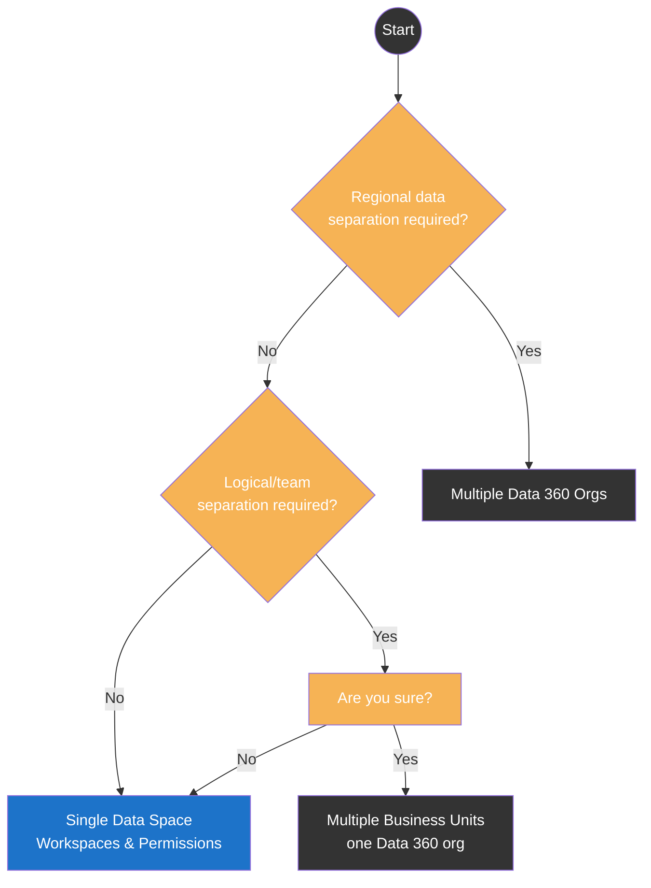
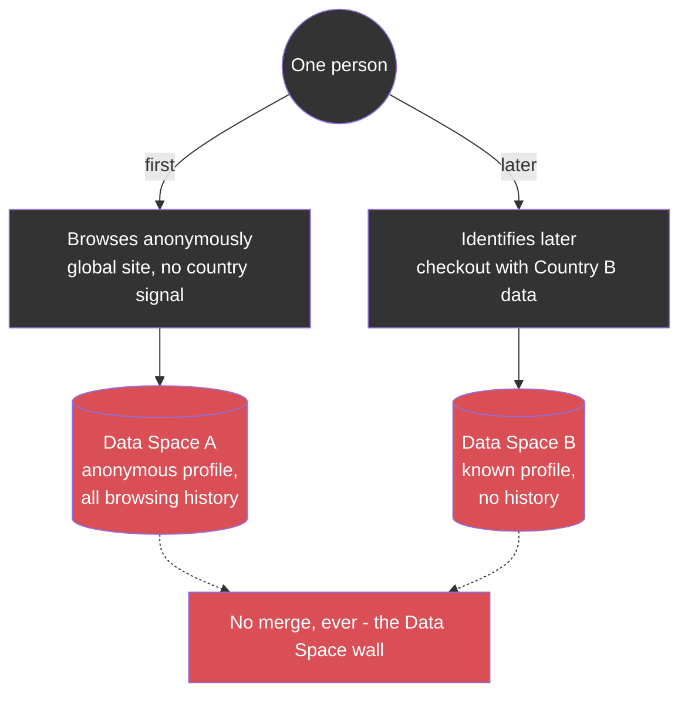
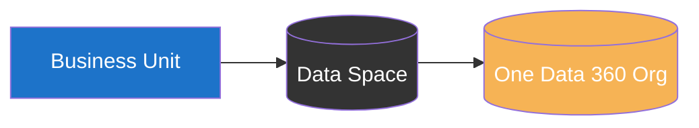
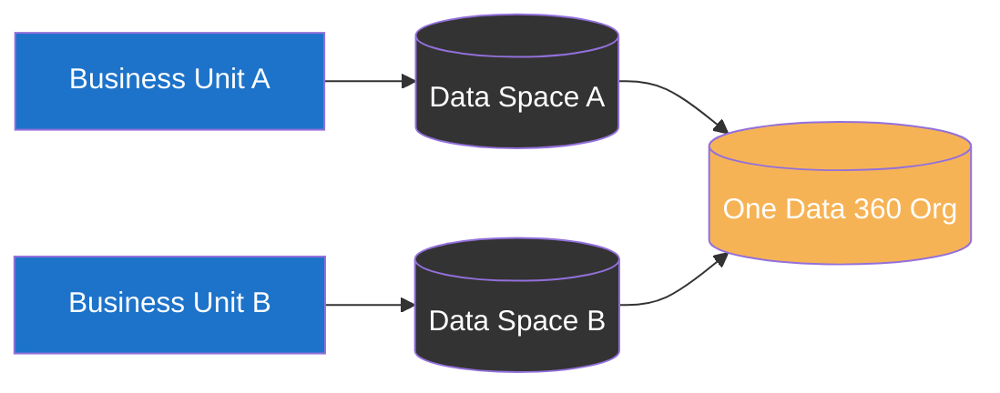
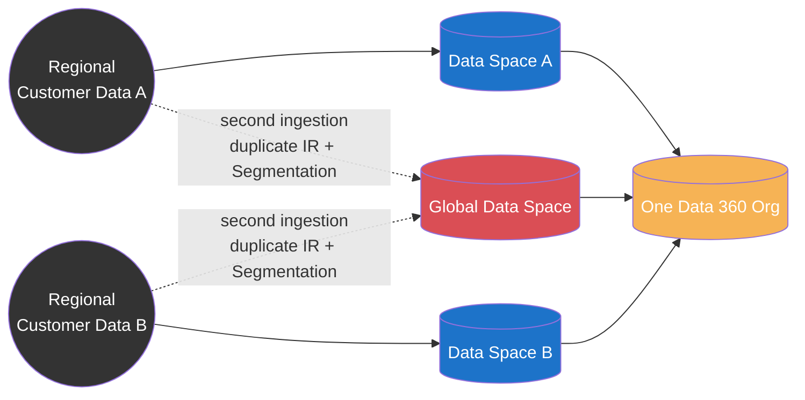
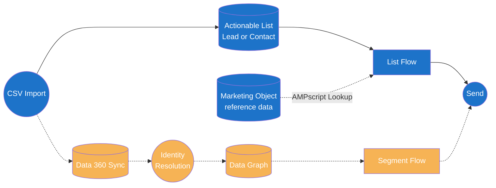
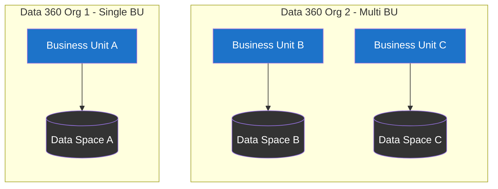
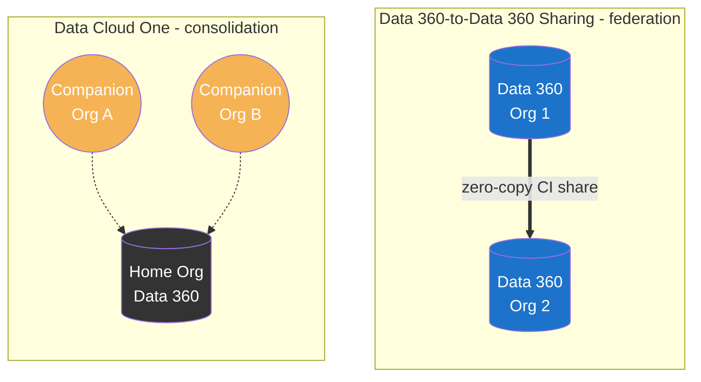

import { LeadText } from '/src/components/LeadText.js';

<LeadText content="Business as unusual. Marketing Cloud Next Business Units reuse an MCE name for a new, different Data Space architecture - with decisions you can't undo." />

## MCN vs MCE Business Units

If you've configured [Business Units in Marketing Cloud Engagement (MCE)](/docs/salesforce/marketing-cloud-engagement/config/mcc-integration-patterns.mdx), forget most of it. Marketing Cloud Next (MCN) reuses the name and little else. Marketing Cloud Next Business Units are a ground-up redesign, not an evolution of the MCE model.

| Area | Marketing Cloud Engagement | Marketing Cloud Next |
| -- | -- | -- |
| Navigation | Each Business Unit is a separate access through a picker | Single org login with data from all Business Units you have access to |
| Hierarchy | Mandatory parent/child, parent has access to data of all children | None - flat list, a user can belong to several |
| Data Sharing | Parent BUs can access data of children plus there are Synchronized and Shared Data Extensions | No sharing - each Business Unit has its own Data Space |
| Content | One content space per BU, plus option to easily share across BUs | Multiple content workspaces per BU, but very limited cross-BU reuse only as copies via Common Assets |
| Number of BUs | Unlimited | 2 included with Advanced Edition, up to 150 total as a paid add-on (raised from 50 in the Summer '26 Release) |

:::note You Should Know

**Business Units require MCN Advanced Edition**. Growth Edition doesn't support them at all. If you're considering a Business Unit rollout and don't have the Advanced license, that's a conversation with your Account Executive you need right now - assuming that after this article you still think that the new BUs are the right way to go.

:::

In MCE, Business Units form a parent/child hierarchy. You open one, see only its data (plus shared data, like Shared Data Extensions), and the parent can see down into every child. MCN drops the hierarchy entirely. There's no parent, no child - just a flat list of Business Units. And instead of opening a Business Unit, users log into the org and see everything they have access to at once (and it can be one or many Business Units), with a badge on flows, campaigns, and content items telling them which BU that record belongs to.

__The context switch is gone, and that's the trade-off to internalise before anything else.__ A marketer with access to three Business Units in MCN sees three Business Units' worth of segments, flows and content in one place, distinguished only by a badge. It's more convenient day-to-day and a lot easier to misclick your way into the wrong Business Unit's send. Plan your permission sets accordingly - the platform won't stop a multi-BU user from picking the wrong one.

The other structural change: a Business Unit in MCN is a thin, marketing-focused layer sitting on top of exactly one [Data 360 Data Space](https://help.salesforce.com/s/articleView?id=data.c360_a_data_spaces.htm). A Data Space is Data 360's own partition primitive - it puts a hard wall around a slice of your data, and by design **you cannot share data, content, campaigns or access controls across that wall**. A Business Unit doesn't add a second wall on top; it just gives marketers a friendlier way to work with the wall that's already there. This is why almost every architecture decision in this article ultimately comes back to a Data Space question, not a Business Unit one.

---

## Decision You Can't Undo

Before touching anything in Salesforce, check the constraint that makes this a real architecture decision rather than a config toggle:

1. Each Business Unit is connected 1:1 to a Data Space.
2. Once Business Unit is created, it **cannot be deleted - only deactivated**
3. Deactivation is permanent and [can't be undone](https://help.salesforce.com/s/articleView?id=mktg.mktg_bu_deactivate_business_units.htm&type=5).
4. Deactivation doesn't free up a related Data Space - **it can't be reused by any other Business Unit, active or new**.
5. There is no clean duplication method for Business Units.

That means undoing a wrong Business Unit decision means rebuilding all marketing assets, and recreating a Data Space with all its Data 360 configuration from scratch. Whether a deactivated Business Unit's slot even returns to your entitlement is undocumented - ask your Account Executive before counting on a replacement. That's a lot of work, and a lot of risk, so plan carefully before creating any Business Units.

:::note You Should Know

Deactivating a Business Unit freezes it rather than erasing it. Members lose access to its Data Space and workspaces unless they hold separate direct permissions, all Agentforce and generative AI capabilities switch off for it, and it drops out of campaign creation and Marketing Performance filtering entirely (dashboards for it become inaccessible). But content and configuration survive: segments stay editable (their flows can't be activated), content can still be copied out to Common Assets, existing DLO filters remain in place, and you can remove (but not add) members and unassign (but not add) channels. Two prerequisites gate the deactivation itself - every flow tied to the Business Unit's campaigns must already be deactivated, and Marketing Performance must be uninstalled for it first - and you can't deactivate the last remaining active Business Unit in an org.

P.S. Don't confuse any of this with the unrelated "Remove Business Units" flow inside MCE's Distributed Marketing Administration - a different, older feature for a different kind of Business Unit record that does allow deletion under some conditions that has nothing to do with the Marketing Cloud Next Business Units covered here.

:::

This is why the decision in the next section deserves a proper planning rather than a Friday-afternoon click-through.

---

## MCN Business Unit Decision

Every Business Unit conversation collapses into the same two questions: do you need to separate data by region, and do you need to separate it logically (by brand, team or business line)? The answer routes you to one of three architectures.

```mermaid
graph TB
    start(("Start")):::process
    q1{"Regional data<br/>separation required?"}:::check
    q2{"Logical/team<br/>separation required?"}:::check
    sure["Are you sure?"]:::check
    single["Single Data Space<br/>Workspaces & Permissions"]:::success
    multi["Multiple Business Units<br/>one Data 360 org"]:::process
    orgs["Multiple Data 360 Orgs"]:::process

    start --> q1
    q1 -- No --> q2
    q1 -- Yes --> orgs
    q2 -- No --> single
    q2 -- Yes --> sure
    sure -- No --> single
    sure -- Yes --> multi

    classDef success fill:#1d73c9,color:#ffffff
    classDef check fill:#f6b355,color:#ffffff
    classDef process fill:#333333,color:#ffffff
```

**Single Business Unit & Data Space, with Workspaces and Data 360 governance for separation** is the default recommendation. Keep everyone in one Data Space and use content Workspaces plus Data 360's RBAC/ABAC policies (and Salesforce Core's record-level security downstream) to separate teams logically. You get unified segmentation, shared Flows, global campaigns and out-of-the-box company-wide reporting. The catch: none of that governance layer reaches what a segment or Calculated Insight computes (yet?) - more on that in the [governance section](#governance-and-market-scoped-access) below. It's not perfect, but it's the one to default to unless you have a concrete reason not to.

**Multiple Business Units & Data Spaces, one Data 360 org** is the right call when you need structurally separate databases, brands or campaign scopes that must never mix - a consortium of otherwise-independent brands is the textbook case. You get real walls: separate DMOs, separate identity resolution, separate everything, at the cost of the sharing convenience described later in this article.

**Multiple Data 360 Orgs** is the answer to one specific problem: a legal obligation to keep data in separate data centres (US vs EU residency requirements, for instance). Nothing short of separate orgs satisfies that - a Business Unit & Data Space inside the same org is still the same org, running on the same infrastructure footprint. Of course, with separate orgs you still have the choice of going single or multi-Business Unit inside each org, to add even more fun to planning.

Don't reach for options two or three by default. There are real limitations and costs related to them that you can't undo, so use default unless you are forced.

---

## MCN Business Unit Trade-offs

Splitting Data Spaces (and therefore Business Units) partitions more than your data - almost every feature of Marketing Cloud Next splits along with it in some way.

The pattern: a single Data Space keeps the platform's native cross-team features intact and pays for it with softer, permission-based separation rather than a structural one, but there are some gotchas to be aware of.

Let's go through the trade-offs one-by-one.

### Data

Default to single BU; split only when the manual-filter risk on segments/insights is a hard blocker, not a preference (see the [governance section](#governance-and-market-scoped-access) below).

Data |  **Single Business Unit**  | **Multiple Business Units**
-- | -- | --
**Pros** | One identity resolution, one set of Data 360 RBAC/ABAC governance policies - real object/field/row-level access control, no per-Data-Space overhead. | Fully separate DMOs with separate identity resolutions per Business Unit - a structural wall, including the system-run access used by segments and Calculated Insights.
**Cons** | Row-level security isn't enforced during segment or Calculated Insight execution as they are run as system - manual filters are still required there to get the right data, and users can perform operations outside their intended scope. | A real work and licence-cost multiplier per Data Space.

### Segments

If "a segment can never accidentally include the wrong group" is a hard requirement, this is the row that tips you toward splitting. Otherwise, a single Data Space with disciplined filtering is cheaper and easier to manage.

Segments |  **Single Business Unit**  | **Multiple Business Units**
-- | -- | --
**Pros** | Segments apply globally and are easy to copy between teams within the same Data Space. | Strictly isolated per Data Space, so a segment always returns only that Data Space's data - no filter to forget.
**Cons** | Regional teams must remember to filter by their own scope (e.g. always adding a region condition) - nothing stops a segment from including everyone by accident. | Reusing a segment definition across Data Spaces means redeploying it, not sharing it live - Salesforce's own **Data Kits** feature does this natively, but it's a re-package, re-deploy and re-configure every time you want to share or even update a segment cross-BU.

### Consent

Consent is recorded against a **Contact Point** - an email address or phone number - which resolves to a Unified Individual via your Identity Resolution ruleset. A Unified Individual, like every other Data 360 object, lives inside exactly one Data Space. That's key, becuase Business Unit setup also lets you mark a Communication Subscription or channel as available to "all" Business Units. It's easy to read that as "consent is shared org-wide once I flip this". It isn't. That setting only controls whether a subscription can be *selected at send* from a given Business Unit, not whether a person's actual consent status is visible there.

Consent |  **Single Business Unit**  | **Multiple Business Units**
-- | -- | --
**Pros** | One consent record per person per contact point - nothing to sync, nothing to drift. | Consent is as walled per Data Space as everything else - a regional Business Unit can never accidentally act on another region's consent state.
**Cons** | None | The same person duplicated across Data Spaces (a [Global Business Unit](#mc-next-global-bu-pattern), or per-brand Business Units with overlapping customers) means duplicated, independent consent records - and nothing syncs them automatically.

__The direction that matters here is opt-out propagation.__ Marketing Cloud Next defaults to implicit opt-out - no consent record found means suppressed - so a missing consent copy is a safe failure, not a compliance risk on its own. But two duplicated copies of the same person's consent record are, by construction, two separate records. An unsubscribe captured against one Business Unit's copy has no documented mechanism that automatically writes the same opt-out into that person's copies in other Data Spaces - and Data 360-to-Data 360 Data Sharing (covered later) is built for sharing between separate *orgs*, not between Data Spaces inside the same org. If your architecture can duplicate people across Business Units, build the consent propagation step yourself - a scheduled sync, a Flow, or routing consent changes through every ingestion pipeline - and don't assume that "available to all Business Units" covers it.

### Content

Content is not a reason to split - Workspaces solve team-level separation, and only very limited Common Assets covers real cross-Business-Unit reuse. If you plan on using content sharing a lot multiple BUs will make it worse for you.

Content |  **Single Business Unit**  | **Multiple Business Units**
-- | -- | --
**Pros** | Unified asset management and high reuse across the org, with Marketing Workspaces still letting you separate assets by team/region/other structure. | Nothing really - Workspaces inside a single Data Space already deliver the same separation.
**Cons** | None | Content and assets are siloed per Data Space/Business Unit by default, and reuse across Business Units is limited. **Common Assets** lets any Business Unit post content to a shared library that any other Business Unit can pull a copy from, but merge fields land as placeholders that need re-resolving before the copy can publish, and access can't be restricted to specific Business Units once enabled.

### Campaigns

The Campaigns are hard-assigned to a Business Unit at creation, and that assignment can't be changed later. If you need to move a campaign between Business Units, you have to rebuild it from scratch in the target Business Unit.

Campaigns |  **Single Business Unit**  | **Multiple Business Units**
-- | -- | --
**Pros** | Global, with visibility manageable through the standard Salesforce Core Campaign sharing model - the campaign owner opens **Sharing** on the record and adds a user, public group, role or territory, same mechanism Sales Cloud campaigns use. | Matches the rest of the structural wall for what a user can *do* with a campaign - building it only exposes segments/content from its own Business Unit.
**Cons** | None | A campaign's **Business Unit assignment** is locked at creation and can't be reassigned, ever.

### Flows

Rarely decisive on its own - rebuilding a flow in each Business Unit is more setup than a straight copy, but it's a one-time cost per flow, not an ongoing one.

Flows |  **Single Business Unit**  | **Multiple Business Units**
-- | -- | --
**Pros** | Run in a single, unified environment. A campaign flow's visibility follows **Campaign Flow Sharing Settings** - private by default, then inherited from its Associated Record (the Campaign) or set explicitly via admin-defined category/subcategory sharing rules or manual per-record sharing, the same Salesforce Core sharing pattern Campaigns use. | Isolated per Business Unit, matching the rest of the structural wall.
**Cons** | None | Flow sharing itself isn't Business-Unit-aware - a flow's record can technically be Core-shared to a user in another Business Unit - but that only grants visibility. The flow still can't be pointed at another Business Unit's segments or content, so meaningful reuse means rebuilding it in the target Business Unit.

### Reporting

Single Business Unit gives you less configuration and more flexibility in controlling who sees what. Going Multi-Business Unit won't provide you any value and might actually complicate things.

Reporting |  **Single Business Unit**  | **Multiple Business Units**
-- | -- | --
**Pros** | Out-of-the-box, company-wide Marketing Performance reporting that respects record-level access automatically - the same report can show region-locked, multi-region or global data depending on who's viewing it. | The dashboard experience stays unified even with many Business Units - a Business Unit picker filters both the Insights and Deliverability tabs, so nothing gets rebuilt per Business Unit.
**Cons** | None | Every Business Unit still needs its own dashboard install, and installation is order-dependent. The picker only switches between Business Units - blending them into one number means aggregated [DLO Filters](#governance-and-market-scoped-access) or an external BI tool.

### Domains

Domain separation is not a Business Unit feature - it's a channel-assignment choice, and a strict one. An authenticated domain is [assigned to all Business Units or to exactly one](https://help.salesforce.com/s/articleView?id=mktg.mktg_bu_set_up_marketing_channels.htm&type=5) - never a subset. Assign a domain to one Business Unit and every other Business Unit's picker locks it away until you unassign it from its current owner. Less flexibility, more domain configuration. But what Multi-BU adds is enforcement - users won't be able to send from a wrong domain.

Domains |  **Single Business Unit**  | **Multiple Business Units**
-- | -- | --
**Pros** | One shared pool of authenticated domains and Sender Profiles. Users pick which to use per send - separate brand domains are possible without any split. | Channel assignment becomes structural: a Business Unit with only its own channel assigned can't send from another brand's domain, no discipline required.
**Cons** | Nothing stops a user from picking the wrong domain for a send - separation is process, not enforcement. | More domains to authenticate and maintain (SPF/DKIM each) - a domain cannot be shared by just some of the Business Units, so if it shouldn't be global, you will need separate subdomain for every single Business Unit. A domain in the all-Business-Units pool still shares its reputation with everyone.

:::note You Should Know

Two ceilings to plan around: the per-Business-Unit domain picker allows up to 10 selectable channels, and only one authenticated domain in the whole org can be used for custom link shortening - one slot, regardless of how many per-BU domains you authenticate.

:::

### Sending IP

Whichever architecture you land on, one thing doesn't change: **sending IPs are managed at the org level in MCN, not per Business Unit**. There's no dedicated-IP-per-BU option to carve out, because Salesforce auto-manages the entire IP pool for the org. Read more about it in [MC Next IP Warming & Deliverability](/docs/salesforce/marketing-cloud/config/ip-warming-deliverability.mdx) article.

### Brand

If "multiple brands" only means visual styling, stay single - Brands already solve it. Split only if those brands also need strictly separate data.

Brand |  **Single Business Unit**  | **Multiple Business Units**
-- | -- | --
**Pros** | Multiple brands can be configured, and users choose which to apply per asset - lightweight, no Business Unit split required. | Each Business Unit can have only the relevant brands
**Cons** | Users need to pick the right brand for content. | No shared Brands. If a few Business Units use the same Brand, changes have to be manually replicated to keep them in sync.

### Einstein

Only with multiple Business Units can you get per-Business-Unit model training and tuning. If you need that, split. Otherwise, stay single for simpler setup.

Einstein |  **Single Business Unit**  | **Multiple Business Units**
-- | -- | --
**Pros** | Single configuration that runs the model against the whole database. | Each Business Unit gets its own independently trained model per feature, tuned to that Business Unit's own data.
**Cons** | One shared configuration means no per-team/region/other structure tuning. | More configuration surface to enable model on each Business Unit.

:::note You Should Know

Einstein Send Time Optimization doesn't train purely on your own data by default, in any Business Unit count. Per [Salesforce's model card](https://help.salesforce.com/s/articleView?id=mktg.mktg_einstein_model_card_esto.htm&language=en_US), enabling STO automatically opts you in to its global model, trained on contributed data that's anonymised and aggregated at the Business Unit and contact level *before* it reaches any customer's org. If a hard "our data never touches anyone else's model" requirement is on the table (and you are ok with losing access to pre-trained data), disable **Global Data Model** toggle.

Engagement Frequency and Engagement Scoring don't need the toggle at all: per their model cards, for those features each customer's model trains on that customer's data alone.

:::

### Agentforce

Follows the same logic as the [Data](#data) area - split when you need a structural (not just permission-based) limit on what an agent can reach.

Agentforce |  **Single Business Unit**  | **Multiple Business Units**
-- | -- | --
**Pros** | Agents can query and act on the entire global context, with record-level access still available to scope their work per user. | Agent visibility is structurally restricted to its Data Space's context (via the `Identify Business Unit` agent action) - a real wall, not just a permission.
**Cons** | Relies on record-level access being configured correctly - no structural backstop. | Any context an agent needs from elsewhere must be explicitly made available in that Business Unit too, adding setup work per agent/topic.

### Web & Mobile SDK

This one might make or break your decision if your use case leans on web or mobile app engagement data - especially real-time personalisation signal.

Web & Mobile SDK |  **Single Business Unit**  | **Multiple Business Units**
-- | -- | --
**Pros** | All web and app event data lands in one Data Space; can still be team/region-stamped for controlled visibility. Simplifies global communication use cases and management of anonymous/travelling users. | Event data ends up correctly walled per Business Unit once routed.
**Cons** | None | Event data has to be routed to the right Data Space, and anonymous or travelling users can end up fragmented across Data Spaces. If you also want globally managed communication (one Global BU), the same event data needs duplicating into two Data Spaces - a real cost for real-time use cases like [Salesforce Personalization](/sites/faq/salesforce/what-is-the-difference-between-sf-marketing-clouds).

Where the event data lands deserves more detail than the other trade-offs, because multi-BU rollouts scoped per country tend to assume a visitor's real location decides which Data Space their activity ends up in. It doesn't. There's no native mechanism in MCN that geolocates a person and routes their activity to the matching country's Data Space.

Routing happens in one of two places, and the difference decides how much plumbing a shared global website or app needs. By default, capture decides: each website connector's embed code and each app connection's **Tenant Specific Endpoint** is bound to one Business Unit, so whichever connection captured the event owns it. The alternative routes after capture: events land in **Data Lake Objects (DLOs)** either way, and Data 360 can [add the same DLO to multiple Data Spaces with attribute filters](https://help.salesforce.com/s/articleView?id=data.c360_a_add_filters_to_a_data_object.htm&type=5) - one snippet, one endpoint, per-country Data Spaces fed by a captured country field.

Routing | **At capture (default)** | **At the DLO layer (filters)**
-- | -- | --
**What decides the Business Unit** | Which embed code or app endpoint fired | A country attribute your event schema captures
**A shared global site/app needs** | Separate web properties per country, or several embed codes/endpoints in one build plus your own logic picking which fires | One connector and one embed code - filters split events downstream
**Where the work sits** | Web and app teams, per property, forever | Data Cloud Architect, once, outside the guided Business Unit setup
**Anonymous visitor, no country signal** | Owned by whichever snippet loaded | Lands wherever the default filter puts them

Either way you're building the routing logic yourself - the choice is whether it lives in the front end (snippet and endpoint selection) or in Data 360 (DLO filters). Neither option geolocates anyone for you.

And that's the part no routing design fixes: an anonymous profile becomes known **in place**, not across the wall. Standard Data 360 identity resolution reconciles an anonymous unified profile into a known one only inside the Data Space where it already lives. Data Spaces don't share data by design, so there's no mechanism to reach into a different Data Space and merge a matching anonymous record in from there.

```mermaid
graph TB
    p(("One person")):::process
    b["Browses anonymously<br/>global site, no country signal"]:::process
    dsA[("Data Space A<br/>anonymous profile,<br/>all browsing history")]:::fail
    id["Identifies later<br/>checkout with Country B data"]:::process
    dsB[("Data Space B<br/>known profile,<br/>no history")]:::fail
    wall["No merge, ever - the Data Space wall"]:::fail

    p -- first --> b --> dsA
    p -- later --> id --> dsB
    dsA -.-> wall
    dsB -.-> wall

    classDef fail fill:#da4e55,color:#ffffff
    classDef process fill:#333333,color:#ffffff
```

The result of that split isn't a merge - it's two disconnected records: an orphaned anonymous profile stranded in Data Space A with nowhere to go, and a fresh known profile in Data Space B with no browsing history behind it. There's no retroactive fix once that happens, because it's the same structural wall that blocks every other cross-Data-Space read in this article. Get the ingestion boundary right at the source - country captured in the event schema, filters mapped before traffic starts flowing - rather than a single global default and a plan to reclassify anonymous activity later. There isn't a later for this one.

### Licensing & Consumption Costs

Cost shouldn't be the key point that decides the architecture on its own, but it needs to be taken into consideration when deciding. It might be worth paying for a hard governance or isolation requirement, but not for "we might want another Business Unit someday."

Licensing |  **Single Business Unit**  | **Multiple Business Units**
-- | -- | --
**Pros** | No licensing beyond the two Business Units included with Advanced Edition - no Data Spaces add-on, one Identity Resolution ruleset and one Segmentation/Calculated Insight publish schedule to build, run and monitor. | None. Splitting adds licencing costs - but it can save you from compliance penalties ;)
**Cons** | None | Every Business Unit beyond the first two needs **two** account-executive-quoted add-ons moving in together - a MC Next Business Unit SKU and a Data 360 **Data Spaces** SKU, since the two are strictly 1:1. On top of that flat licensing cost, Identity Resolution, Segmentation and Calculated Insight credits don't multiply per record with Business Unit count, but they do multiply **operationally** - and that might hurt especially around unification and real-time actions.

---

## Governance and Market-Scoped Access

Every Business Unit conversation with Legal eventually asks the same question: can the data from one region structurally be separated from another? The honest answer in a single Business Unit is: you can **nearly** separate it fully. But there are still some system-based actions (like segmentation, Calculated Insights, Einstein) that can technically compute across the whole object if a filter is missed, even if the user running it is otherwise scoped to a single region. It's much stronger than the "security by obscurity" of MCE, but it's not a structural wall. And that **nearly** makes or breaks the decision to split into multiple Business Units (or multiple Data 360 orgs).

Data 360's own governance is more capable than "record-level security" suggests. It's built from **Role-Based Access Control (RBAC)** and **Attribute-Based Access Control (ABAC)** policies, enforced down to **Object-Level Security (OLS)**, **Field-Level Security (FLS)** and **Row-Level Security (RLS)** - RLS being the closest Data 360 equivalent to Salesforce Core's record-level sharing. All of it ships at no extra cost on a standard Data Cloud licence, and none of it needs a second Data Space to work. OLS/FLS is enforced almost everywhere: try to build a segment, Calculated Insight or report referencing an object or field you don't have policy access to, and the build or save fails. RLS is enforced too, wherever the platform is acting *as the requesting user* - a report, a live query, previewing a Transform or Code Extension during development.

__Where it currently doesn't reach: segment creation.__ Per Salesforce's own [documentation](https://help.salesforce.com/s/articleView?id=data.c360_a_policy_behavior_on_process_definitions_in_datacloud.htm&type=5), row-level security policies "aren't enforced during segment creation," so "all records within the object are considered when a segment is created" - regardless of the creating or running user's row restrictions. The same asymmetry applies to Code Extensions and Transforms (RLS is enforced while previewing them, not once they run), and by extension to any Calculated Insight consumed inside a segment - segmentation's RLS bypass applies to whatever object it queries, CI included. If you need an EMEA marketer to only ever return EMEA customers from a segment, that constraint currently has to be built into the segment itself (a hard-coded `Region = 'EMEA'` filter, enforced by convention and QA'd on every build) - Data 360 governance won't inherit it automatically, however tightly RLS is scoped on the underlying object.

This distinction is the whole difference between **operational discipline** and a **structural wall**:

- A single Data Space with RLS/ABAC policies plus disciplined segment filters is operational discipline supported by real object/field/row control that takes care of almost everything except segment and Calculated Insight execution. It works, it's cheaper, and it's exactly what most single-region or logically-separated orgs should run on. But a segment can still technically compute across the whole object if a filter is missed.
- Separate Data Spaces (and therefore separate Business Units) are a structural wall with no exceptions. A user - or a system-run process acting on their behalf - cannot touch data outside their Data Space, full stop. But with it comes the cost and complexity of multiple Data Spaces, multiple Identity Resolution rulesets, and multiple Segmentation/Calculated Insight publish schedules to build, asset sharing limitations, and the operational overhead of managing multiple Data Spaces.

Operational discipline has a real toolkit, though. Brand, business line and channel differences (a B2B and a B2C arm under one company, for example) can usually be expressed inside a single Business Unit with four levers:

1. **Marketing Workspaces** - separate content by team or initiative, each with its own access-controlled CMS. Relating a Workspace to the Business Unit is a further, one-way choice on top of this - see the callout below.
2. **Brands** - separate visual identity per asset, selected at creation time.
3. **Sender domains and Sender Profiles** - separate sending identities (`updates.brand-a.com` vs `sender.brand-b.com`), achievable on a single Business Unit without any Data Space split.
4. **Roles and Data 360 governance** - RBAC/ABAC and row-level security policies restrict who can see or touch which objects, fields and records, per the mechanics above.

Reporting scopes can follow the same pattern - Data 360's ABAC and row-level security policies scope Marketing Performance data per team (RLS is enforced there, unlike in segmentation), and CRM Analytics record-level access does the equivalent for any downstream analytics, all without a second Data Space. Reach for a second Business Unit only when these four levers can't express the separation you need - not as a default for "we have two brands."

:::note You Should Know

Relating a Workspace to its Business Unit (Setup > Business Units > [BU] > Marketing CMS Workspaces) is a separate, one-way step from creating the Workspace, and it cuts both ways at once. It restricts that Workspace's sharing to same-Business-Unit targets only - an unattached Workspace can share to *any* Workspace org-wide, the more permissive default, not the more restrictive one. But the relation is also the only way to enable dynamic content and merge fields sourced from a data graph or the Unified Individual for that Workspace's emails and landing pages. Skip it because your sharing needs already look satisfied, and you may be silently leaving personalisation unavailable in that Workspace.

:::

If Legal's requirement is "we'd prefer regions don't mix," a single Data Space with RLS plus disciplined filtering satisfies it. If Legal's requirement is "a US marketer must not be *able* to pull an EMEA record into a segment, mistake or not," a single Business Unit does not satisfy that **as of now**, and you need multiple Business Units - or for data-centre-level residency requirements, [multiple Data 360 orgs entirely](#mcn-business-unit-decision). Get this distinction confirmed as a mandate or a preference in writing before you architect around it - it's not a technical question, and guessing wrong here means rebuilding on infrastructure that, per the constraint above, you can't cleanly walk back. Just make sure, the legal and leadership teams understand the trade-offs and costs of a multi-Business-Unit rollout before they sign off on it.

:::note You Should Know

Multiple Business Units don't automatically partition every analytics surface, either. A defined list of marketing DLOs includes data from **every** Business Unit until you add per-Business-Unit **DLO Filters** (Setup > Business Units > [BU] > Business Unit Data Alignment) - the platform then appends the `BusinessUnitId`/`DataSpaceId` condition for you. Campaigns and content stay fully partitioned regardless; it's the reporting-facing DLOs that default to unfiltered. For Marketing Performance, this cuts both ways: a Business Unit's dashboards read whatever its analytics DLOs hold, so an unfiltered Business Unit surfaces enterprise-wide numbers - a leak if you expected scoping, and [the documented mechanism](https://help.salesforce.com/s/articleView?id=mktg.configure_dlo_filters_for_bu.htm&type=5) for cross-Business-Unit analytics if you aggregate on purpose. Scope each regional Business Unit with its own DLO Filters, and leave a rollup Business Unit aggregated deliberately.

:::

---

## Architecture Patterns for Scaling

Once the single-vs-multiple-Data-Space decision is made, a handful of concrete patterns cover almost every real-world Business Unit rollout.

A naming note before the patterns:

1. **Single BU / Multi BU** describes Business Unit count *inside one Data 360 org*.
2. **Single Org / Multi Org** is reserved strictly for how many Data 360 orgs exist.

Those two are different and can mix & match - a Multi BU setup can still be a Single Org setup (use case: multiple separate brands under one company, all in the same data centre), and a Single BU setup can still be a Multi Org setup (use case: one brand with a US org and an EU org for residency compliance).

### Single Data 360 Org Patterns

Everything in this group runs inside one Data 360 org. What varies is only how many Business Units - and therefore how many dedicated Data Spaces - sit inside it.

#### MC Next Single BU

```mermaid
graph LR
    bu1["Business Unit"]:::success
    ds1[("Data Space")]:::process
    org[("One Data 360 Org")]:::check

    bu1 --> ds1 --> org

    classDef success fill:#1d73c9,color:#ffffff
    classDef process fill:#333333,color:#ffffff
    classDef check fill:#f6b355,color:#ffffff
```

The baseline from the [decision tree](#mcn-business-unit-decision): one Business Unit, one Data Space, one org. Separation - if any is needed at all - comes from Marketing Workspaces and record-level permissions, not from splitting Business Units. Default to this until a concrete requirement pushes you further down this list.

#### MC Next Multi BU

```mermaid
graph LR
    bu1["Business Unit A"]:::success
    ds1[("Data Space A")]:::process
    bu2["Business Unit B"]:::success
    ds2[("Data Space B")]:::process
    org[("One Data 360 Org")]:::check

    bu1 --> ds1 --> org
    bu2 --> ds2 --> org

    classDef success fill:#1d73c9,color:#ffffff
    classDef process fill:#333333,color:#ffffff
    classDef check fill:#f6b355,color:#ffffff
```

The only way to scale Business Units within one org: each new Business Unit gets its own dedicated, never-shared Data Space. This isn't one option among several - it's the platform's sole mechanism, so "1:1 Mapping" is what Multi BU *means* in practice. Reach for it once you know you need more than one Business Unit for separate teams or brands, and budget your Business Unit entitlement accordingly - there's no cheaper multi-BU variant to fall back on.

#### MC Next Global BU Pattern

A common ask once a Multi BU rollout is on the table: add one more Business Unit, call it Global, and run worldwide campaigns out of it alongside the regional ones. It's a real pattern with a hard ceiling, not a documented feature with its own rules.

**There's no such thing as a Global Business Unit, technically.** No distinct Business Unit type, edition gate, or setup path exists for it - it's an ordinary Business Unit that a team has agreed to use for worldwide campaigns, bound by exactly the same 1:1 Data Space relationship as every other Business Unit in the org.

**The ceiling**: a Global Business Unit's Data Space is exactly as walled off from every regional Data Space as any other Business Unit's. It cannot assemble a live, unified segment out of every region's underlying customer data. You can use Data Kits to deploy a *copy* of a segment or Calculated Insight into another Data Space, but first you need to bring the copy of the data to that Data Space - and the only way to do that is to ingest it a second time, in parallel with its regional ingestion.

**That duplication is the real cost driver here, not just another Business Unit's worth of overhead**. Ordinary regional splitting (an EMEA Business Unit and an APAC Business Unit with fully distinct customers) doesn't duplicate anyone - each person's data lives in exactly one Data Space, and what multiplies is operational overhead, not record volume, per the [licensing and consumption costs](#licensing--consumption-costs) covered earlier. A Global Business Unit built to *reach* the same customers who already live in the regional Data Spaces is a different case entirely: the only way to get their data into the Global Data Space is to **ingest it a second time**, in parallel with its regional ingestion. That's real per-record multiplication - Identity Resolution runs (and bills) twice for that person, Segmentation/Calculated Insight publishes process them twice, and storage holds two copies.

```mermaid
graph LR
    srcA(("Regional<br/>Customer Data A")):::process
    srcB(("Regional<br/>Customer Data B")):::process
    dsA[("Data Space A")]:::success
    dsB[("Data Space B")]:::success
    dsg[("Global Data Space")]:::fail
    org[("One Data 360 Org")]:::check

    srcA --> dsA
    srcB --> dsB
    srcA -. second ingestion<br/>duplicate IR + Segmentation .-> dsg
    srcB -. second ingestion<br/>duplicate IR + Segmentation .-> dsg
    dsA --> org
    dsg --> org
    dsB --> org

    classDef success fill:#1d73c9,color:#ffffff
    classDef fail fill:#da4e55,color:#ffffff
    classDef process fill:#333333,color:#ffffff
    classDef check fill:#f6b355,color:#ffffff
```

What a Global Business Unit realistically does, given the query ceiling above:

1. **Runs campaigns off its own, separately-ingested global data** - a worldwide newsletter list, B2B or employee audiences, anything that was never region-partitioned to begin with. This is parallel data with global scope by design, not an aggregation of the regional Data Spaces, and critically, it isn't the same records already sitting in a regional Data Space - which is what keeps this option free of the duplication tax above.
2. **Distributes shared content to regional Business Units - but only as Common Assets copies.** There's no full cross-Business-Unit content sharing: any Business Unit can post an asset to the shared Common Assets library and every other Business Unit can pull a copy, with merge fields flattened to placeholders that need re-resolving before publish, and no way to restrict the library to specific Business Units once enabled. Workable as a central template library; not a live, governed content distribution.
3. **Captures enterprise-level Marketing Performance** - a reporting rollup, not campaign execution. This one doesn't even need duplicated data: analytics DLOs include every Business Unit's data unless filtered, so a rollup Business Unit gets cross-Business-Unit dashboards by [aggregating its DLO Filters](https://help.salesforce.com/s/articleView?id=mktg.configure_dlo_filters_for_bu.htm&type=5) on purpose.
4. **Hides global campaign work from regional users.** Business Unit membership gates access - [only members of a Business Unit can use its segments, flows, personalisation and Marketing Performance](https://help.salesforce.com/s/articleView?id=mktg.bu_add_users_to_business_units.htm&type=5) - so a Global Business Unit doubles as a clean visibility boundary around global campaigns and content until they're distributed.

If the requirement is one unified send or segment reaching every region's existing customers, a Global Business Unit *can* be built to hold a duplicated copy of everyone - but budget it as exactly that: full duplicate ingestion, Identity Resolution, and storage costs for whatever population it mirrors, on top of what's already being processed regionally.

Compare that against the alternatives before committing: a single-Data-Space architecture with no Business Unit split at all reaches everyone natively with zero duplication, and for a true multi-*org* federation need (see the residency discussion below), **Data 360-to-Data 360 Data Sharing** is a zero-copy mechanism built for exactly this - sharing computed results between separate Data 360 orgs without duplicating the underlying records.

#### MC Next Global BU Workaround

If what "Global" needs is closer to *one send, copy varied by market* than a true unified segment, there's a fifth option that doesn't touch Data 360 at all - and it shipped with Summer '26, one release after Business Units themselves went GA in Spring '26.

**Actionable Lists**, built via the **List Flow** entry point inside Audience Flow, send to a static list of Leads or Contacts imported straight from a CSV - no Data 360 sync, no Identity Resolution wait, no Data Graph dependency. The problem this solves is explicit in how it's positioned: previously, reaching a newly-imported audience meant waiting for Data 360 synchronisation, then Identity Resolution, then Data Graph updates, before a send could go out - often a real delay and cost. An Actionable List is usable the moment its CSV import finishes.

**Marketing Objects**, a new native reference-data store - CSV-imported, not a Data 360 object, read via AMPscript's `Lookup()` function - fill the personalisation gap this leaves behind. A List Flow send doesn't evaluate Data Graph merge fields at all. It shows their configured default values instead, even for a recipient with real Data Graph data available. Content Variables, populated from the Actionable List Member's own imported fields, are the intended substitute - and that's exactly where a Marketing Object plugs in: import CampaignCode, Locale and SegmentCode as columns on the Actionable List's CSV, expose them as Content Variables, and `Lookup()` against a Marketing Object for the locale-specific headline, CTA or promotional copy. The result is a true batch-and-blast build - one audience, one flow, market-varied copy - with zero Identity Resolution, Segmentation or Calculated Insight involvement anywhere in it.

Both features are young enough that the best hands-on documentation is a practitioner's, not Salesforce's - Nobuyuki Watanabe's SFMC Tips walkthroughs of [Actionable List Flows](https://medium.com/@marketingcloudtips/marketing-cloud-next-actionable-list-flows-42b6a0fcc277) and [Marketing Objects](https://medium.com/@marketingcloudtips/marketing-cloud-next-how-to-configure-marketing-objects-ec7213fda266) are worth reading in full before building this pattern.

:::note You Should Know

An AMPscript `Lookup()` that finds no matching Marketing Object row doesn't send with blank values, and doesn't fail loudly either - the message enters **Retry** status and keeps retrying until a matching row exists. A single bad reference row (an `en-US` vs `en_US` locale mismatch is enough) silently stalls that part of the send. Validate value formats before import, because fixing them after means deleting the whole Marketing Object and re-importing it.

:::

```mermaid
graph LR
    csv(("CSV Import")):::success
    al[("Actionable List<br/>Lead or Contact")]:::success
    lf["List Flow"]:::success
    mo[("Marketing Object<br/>reference data")]:::success
    send(("Send")):::success

    d360[("Data 360 Sync")]:::check
    ir(("Identity<br/>Resolution")):::check
    dg[("Data Graph")]:::check
    sf["Segment Flow"]:::check

    csv --> al --> lf --> send
    mo -. AMPscript Lookup .-> lf

    csv -.-> d360 -.-> ir -.-> dg -.-> sf -.-> send

    classDef success fill:#1d73c9,color:#ffffff
    classDef check fill:#f6b355,color:#ffffff
```

The blue lane is the whole point: an Actionable List and a Marketing Object never touch the orange lane at all. That's the entire saving - not a faster version of Data 360, a route around it.

That approach can save you from the whole Global BU licence and operational overhead for simple batch & blast use cases, but it's not a free replacement for the full Agentforce Marketing capabilities that actually need Data 360.

Three things to consider before committing to this pattern:

1. Content can't be driven by live Data Graph or behavioural personalisation, only defaults and whatever a Marketing Object can look up.
2. Everything stays CSV-fed as of Summer '26 - an Actionable List's membership can at least be managed manually or by rule-based add/remove afterwards, but Marketing Objects allow no API sync and no record edits at all (correcting a bad row means deleting the whole object and re-importing), so this is a manual-maintenance pattern, not a live-updating one.
3. **Consent is not part of what this pattern skips.** The skip covers the audience and the content: who to send to (no Identity Resolution or Segmentation wait) and what to say (no Data Graph). The send itself still checks consent - every recipient needs a Consent record in Data 360, resolved per contact point, and a list member without one doesn't get sent to, list membership notwithstanding. In other words, the pattern routes around Data 360 for targeting, not for permission. If a person's consent record lives only in a regional Business Unit's Data Space, revisit the [consent trade-off](#consent) before assuming an Actionable List send will reach them.

### Multiple Data 360 Org Patterns

The only group where the org boundary itself multiplies - and the only lever that changes the physical/legal footprint of your data, not just its logical partitioning.

#### Multi-Org Expansion

```mermaid
graph LR
    subgraph org1["Data 360 Org 1 - Single BU"]
        bu1["Business Unit A"]:::success
        ds1[("Data Space A")]:::process
        bu1 --> ds1
    end
    subgraph org2["Data 360 Org 2 - Multi BU"]
        bu2["Business Unit B"]:::success
        ds2[("Data Space B")]:::process
        bu3["Business Unit C"]:::success
        ds3[("Data Space C")]:::process
        bu2 --> ds2
        bu3 --> ds3
    end
    org1 ~~~ org2

    classDef success fill:#1d73c9,color:#ffffff
    classDef process fill:#333333,color:#ffffff
```

Separate Business Units in entirely separate Data 360 orgs is the only pattern that satisfies a data-residency mandate (US vs EU, for instance) - a Data Space wall inside a single org is still the same org, running on the same infrastructure footprint. Reserve it for complete infrastructure isolation.

The diagram above deliberately shows Org 1 running Single BU and Org 2 running Multi BU: **Multi-Org is an additional, independent layer on top of the Single-BU/Multi-BU decision, not a replacement for it.** Splitting into multiple Data 360 orgs doesn't force every org to carry the same Business Unit topology - a US org and an EU org can land on different answers to "how many Business Units do we need here" entirely on their own merits, exactly as covered in the [Single Data 360 Org patterns](#single-data-360-org-patterns) above.

:::note You Should Know

**Data Cloud One is not the residency tool. It's the opposite of that actually.** It's Data 360's multi-org *consolidation* pattern - one "home org" hosts the actual Data 360 instance, and other Salesforce orgs connect as "companion orgs," accessing shared Data Spaces without provisioning their own Data 360. Salesforce positions it as the *default* for multi-org enterprises specifically to avoid running separate Data 360 instances - the opposite from what a residency requirement needs. Salesforce's own architecture guidance states the rule directly: only use genuinely separate Data 360 orgs "if compliance, residency, or organizational autonomy strictly require it," naming European-vs-US separation as an example - and confirms why Data Cloud One falls short of that bar even though data storage stays in the home org's region: connecting a companion org still causes *data processing* to happen wherever that companion org's users are, which is exactly the exposure a hard residency requirement exists to prevent. If US-vs-EU residency is a real requirement, the answer is the Multi-Org Expansion pattern, not Data Cloud One.

Going Multi-Org for residency doesn't mean giving up a federated view, either: **Data 360-to-Data 360 Data Sharing** (zero-copy) is Salesforce's documented mechanism for sharing specific objects, typically computed Calculated Insights rather than raw customer records, between separate Data 360 orgs - its own example is a retailer with separate EU and US Data 360 orgs sharing insights back to US headquarters, and a "federated executive dashboard" pattern where each regional org shares aggregated Calculated Insights with a dedicated Executive org. This is the native alternative to both a duplicating Global Business Unit and an external BI tool, when the split happened at the org level rather than the Business Unit level.

```mermaid
graph LR
    subgraph dco["Data Cloud One - consolidation"]
        home[("Home Org<br/>Data 360")]:::process
        compA(("Companion<br/>Org A")):::check
        compB(("Companion<br/>Org B")):::check
        compA -.-> home
        compB -.-> home
    end
    subgraph d2d["Data 360-to-Data 360 Sharing - federation"]
        org1[("Data 360<br/>Org 1")]:::success
        org2[("Data 360<br/>Org 2")]:::success
        org1 == zero-copy CI share ==> org2
    end
    dco ~~~ d2d

    classDef process fill:#333333,color:#ffffff
    classDef check fill:#f6b355,color:#ffffff
    classDef success fill:#1d73c9,color:#ffffff
```

:::

---

## Sum Up

1. MCN Business Units have no MCE-style hierarchy and no per-BU login context - users see everything they have access to at once, tagged with a badge, which shifts risk toward misclicks rather than data leaks. [🔗](#mcn-vs-mce-business-units)
2. A Business Unit can't be deleted, only deactivated - deactivation is permanent, its Data Space stays unusable by anything else, and whether the Business Unit slot itself returns to your entitlement is undocumented. Get the architecture right before you create anything. [🔗](#decision-you-cant-undo)
3. Splitting Data Spaces buys structural data separation at the cost of shared segmentation, shared Flows, shared content and unified reporting - don't split by default. [🔗](#mcn-business-unit-trade-offs)
4. Every Business Unit past the first two needs two account-executive-quoted add-ons in lockstep (MC Next Business Units and Data 360 Data Spaces, up to 150 per org), plus operationally multiplied - not per-record multiplied - Identity Resolution and Segmentation credits. [🔗](#licensing--consumption-costs)
5. Data 360's RBAC/ABAC governance does restrict object, field and row-level access within a single Data Space - but row-level security isn't enforced during segment creation, as of current documentation, so a segment still needs a manual region filter regardless of Business Unit count. [🔗](#governance-and-market-scoped-access)
6. Brand, business line and channel separation usually doesn't need a second Business Unit - Marketing Workspaces, Brands, separate sender domains and Data 360 governance cover it inside one. Mind that relating a Workspace to its Business Unit is a one-way step: it locks sharing to same-BU targets, and it is also the only way to get data-graph personalisation in that Workspace. [🔗](#governance-and-market-scoped-access)
7. Consent doesn't follow Business Unit boundaries - it's anchored to a Contact Point inside a specific Data Space, so a person duplicated across Business Units has duplicated, independent consent records, and no documented sync propagates a regional opt-out into the other copies. [🔗](#consent)
8. Web and app events aren't geo-routed - the capturing connector or endpoint decides the Data Space by default, and while DLO-to-Data-Space attribute filters can split one global property by a captured country field, an anonymous profile still only ever becomes known inside the Data Space it landed in. Get ingestion boundaries right before traffic flows; there's no retroactive fix for a fragmented profile. [🔗](#web--mobile-sdk)
9. An authenticated domain serves all Business Units or exactly one - so per-BU sending identities mean per-BU (sub)domains, each with its own SPF/DKIM to maintain. Sharing one domain means sharing it with every Business Unit, reputation included. [🔗](#domains)
10. Sending IPs are managed at the org level regardless of Business Unit architecture - deliverability separation comes from domain authentication and list hygiene, not from splitting Business Units. [🔗](#sending-ip)
11. A "Global" Business Unit is an ordinary Business Unit with a naming convention - it can't read other Data Spaces live, and making it hold a duplicate copy of every region's existing customers adds real per-record duplication cost. Its duplication-free jobs: separately-ingested global audiences, Common Assets distribution, DLO-filter-aggregated enterprise reporting, and hiding global campaign work from regional users. [🔗](#mc-next-global-bu-pattern)
12. For a global batch-and-blast send that only needs copy varied by market, Actionable Lists (List Flow) plus Marketing Objects skip Data 360 for targeting and personalisation - no Identity Resolution, no Segmentation, no duplication tax - but not for permission: consent records are still checked at send. [🔗](#mc-next-global-bu-workaround)
13. Data Cloud One consolidates multiple Salesforce orgs onto one shared Data 360 - the opposite of a residency-splitting tool. For a real US-vs-EU requirement, use separate Data 360 orgs, with Data 360-to-Data 360 Data Sharing as the native, zero-copy way to keep a federated rollup across them. [🔗](#multi-org-expansion)
