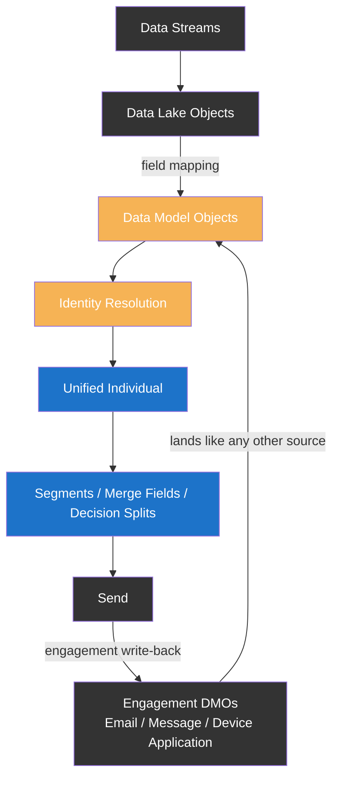

import { LeadText } from '/src/components/LeadText.js';

<LeadText content="Model behaviour. Marketing Cloud Next keeps almost no data of its own - one Data 360 model runs segments, personalisation and reporting, and breaks all three the same way." />

## MCN Data Architecture

If you spent years in Marketing Cloud Engagement (MCE), the first habit to drop is reaching for the database. Marketing Cloud Next (MCN, sold as the Marketing Cloud Growth and Advanced Editions) has no Data Extensions and no Contact Model. [Nearly everything it knows lives in Data 360](https://help.salesforce.com/s/articleView?id=data.c360_a_datacloud_mktgnext.htm&type=5) - Salesforce's customer data platform, rebranded from Data Cloud - and MCN reads it there. Marketing Cloud Next itself is an orchestration and channel layer: segmentation, flows, personalisation and reporting all work against Data 360's Data Model Objects (DMOs) rather than a marketing-local store.

That inversion has a practical consequence. Every "what data does MCN need" question decomposes into Data 360 questions: which DMOs, what ingestion path, what refresh latency. The design work sits on the data side, and the Marketing app consumes the result. Salesforce draws that boundary in the UI itself - the Marketing app ships with three Data 360 tabs by default (Identity Resolutions, Segments, Profile Explorer), while Data Streams, Data Graphs, DLOs and the Data Model stay in the Data 360 app. A default Data Space is created when Marketing Cloud Next is first enabled, and most marketing features come preconfigured against it.

The model itself is a hub-and-spoke around one object: everything hangs off the Individual. Four questions cover the whole graph:

| Verb | Question | Data 360 objects |
| -- | -- | -- |
| **Who** | Which person is this? | Individual, unified by Identity Resolution into Unified Individual |
| **Where** | How can I reach them? | Contact Point Email / Phone / App (plus Device and Software Application for push) |
| **What** | What happened? | Email Engagement, Message Engagement, Device Application Engagement |
| **Whether** | May I contact them? | Communication Subscription Consent, with Contact Point Consent above it |

Four verbs, one hub. Every section of this article is one of these verbs seen from the marketer's side.

__The detail that makes MCN behaviour predictable: the three consumers don't share one read path.__ Segments read DMOs directly, rooted on the Unified Individual. Personalisation mostly reads a data graph - a pre-joined snapshot of those same DMOs. Reporting reads the engagement DMOs that Marketing Cloud Next itself writes back after every send. One model, three read paths, one loop: ingest, map, unify, segment, send, measure - and the measurements land back in the model to drive the next segment. That single sentence is the whole Marketing Cloud Next data model; the rest of this article walks it in pipeline order. It also explains the platform's most frustrating failure mode: one missing DLO-to-DMO mapping quietly breaks segmentation, personalisation and reporting at once, because all three read the same model.

There are exactly two exceptions to "the data lives in Data 360", both shipped in the Summer '26 Release. [Marketing Objects](https://help.salesforce.com/s/articleView?id=mktg.mktg_data_objects.htm&type=5) are a native reference-data store: CSV-uploaded lookup tables (campaign copy, locale strings, reward balances) that content queries at send time - Salesforce's own docs describe them as "similar to data extensions", though strictly for non-customer reference data. [Actionable Lists](https://help.salesforce.com/s/articleView?id=mktg.mktg_audiences_actionable_lists.htm&type=5) are fixed lead-or-contact lists imported straight onto the CRM objects and sendable immediately - no Data 360 ingestion, no Identity Resolution, no data graph refresh. I covered how the two combine into a pipeline-free global send in the [Business Units article](/docs/salesforce/marketing-cloud/config/business-units.mdx#mc-next-global-bu-workaround); for this article they matter as the boundary line: reference data and quick CSV audiences can skip the pipeline below, customer data cannot.

---

## MCN Data Pipeline

Data reaches a send through a chain, and the chain is worth memorising - every timing and visibility problem in Marketing Cloud Next maps to one of its links:



Data Streams land raw source data in Data Lake Objects (DLOs). A field mapping promotes DLO columns into the shared Data Model Objects. Identity Resolution collapses duplicate Individuals into Unified Individuals. Segments, merge fields and decision splits read the result. Sends then generate engagement events that flow back in through the same front door - streams, DLOs, mappings - as rows in the engagement DMOs. That write-back loop is what makes "recent openers" a segment filter rather than a report export.

### Marketing Data Kits

Out of the box, [Basic Settings installs the Marketing Data Kits](https://help.salesforce.com/s/articleView?id=mktg.mktg_admin_data_kits_install_main.htm&type=5), which auto-deploy the CRM and ingestion data streams in Data 360. Stream names and field values are predefined by the package and can't be changed - treat them as managed infrastructure, not a starting template. A manual redeploy path exists for streams that fail to deploy. Two operational notes: installing needs the System Administrator, Data Cloud Architect and Marketing Cloud Admin permission sets (deploying needs only Data Cloud Architect), and the deployed streams consume Data 360 credits on batch volume like any other ingestion.

Custom data follows the same path the kit data took: a connector or Ingestion API stream into a DLO, a mapping into a standard or custom DMO, and a relationship back to Individual. Salesforce's own mapping principle is worth quoting directly: "use a unique identifier that relates to a primary key in each DMO... to map people data from CRM, map Lead ID to Individual ID."

### Mappings vs Relationships

__Mappings and relationships are both drawn as arrows in every architecture diagram, and they are completely different things.__

- **Mapping** connects a DLO to a DMO. It happens at ingestion, it is configured on the DLO, and it decides which source columns exist in the model at all.
- **Relationship** connects a DMO to another DMO. It applies after ingestion, it is configured on the DMO, and it decides what is reachable from where - relationships define the container paths segments traverse and the objects a data graph can include.

A field can be perfectly mapped yet unreachable because no relationship path leads to it, and a relationship can be perfect while the one field you need was never mapped. Check both before blaming the platform.

:::note You Should Know

The failure that wastes the most time in MCN is the **unmapped DMO field**. Data lands correctly in the DLO, but a field that isn't mapped through to the DMO is **invisible to segmentation, decision splits and merge fields** - all three consume the DMO, not the DLO. Nothing errors; the field never appears as an option. When Marketing Cloud Next "can't see" data that is demonstrably in Data 360, check the DLO-to-DMO mapping first, before touching segments or graphs.

:::

### People Records

Where do Individual rows come from in a plain MCN org? From [people records](https://help.salesforce.com/s/articleView?id=mktg.mktg_audiences_people_records.htm&type=5) syncing in from the CRM side. They come in three flavours:

| Record | Owned by | Qualification | Converts to |
| -- | -- | -- | -- |
| **Prospect** | Marketing - no assigned owner | Unqualified | Lead or Contact |
| **Lead** | Sales - has an owner | Qualifying | Contact or Opportunity |
| **Contact** | Sales | Qualified | - |

Each time you import or create a prospect, lead or contact, an Individual record is created in Data 360 during the next sync. Two rules follow. First, you can't create Individual or Unified Individual records manually - they exist only through syncing and harmonisation. Second, prospects are treated as unified individuals for segmentation, so a marketing-owned audience works before sales ever touches a record. The official doc's framing of the unified record is worth keeping in mind for the next section: it "isn't a static golden record but a collection of specialized IDs".

---

## MCN Identity Resolution

__Identity Resolution (IR) never merges your source records - it adds a layer on top.__ Every source Individual stays untouched. IR creates a Unified Individual plus a Unified Link Individual row that bridges each source record to its unified profile. That unified profile is the object segments stand on, which makes IR a hard prerequisite for everything downstream: no ruleset, no audience.

Marketing Cloud Next [generates the ruleset for you](https://help.salesforce.com/s/articleView?id=mktg.mktg_admin_data_identity_resolution.htm&type=5). For the Individual object it uses three match rules: **Normalized Email**, **Lead to Contact** and **Device to Known**. The last two are implemented as Exact matches on the **Identity Match DMO** (`Identity Match Type` = `lead-to-contact` / `device-to-known`) - Lead to Contact prevents duplication when a lead converts, Device to Known ties web visitors back to known profiles. Data 360 allows up to 5 rulesets per primary DMO per Data Space, but Salesforce recommends exactly one active ruleset per object - maintaining two increases your Identity Resolution billing. Account rulesets (and account scoring) are Advanced Edition only.

Timing is where the surprises live:

| Facet | Value |
| -- | -- |
| Processing frequency | every 60 minutes to 24 hours, per data source |
| Scheduled ruleset job | once per day, timing not controllable |
| All jobs per 24 hours | 4 per ruleset per Data Space |
| Match rule or mapping change | full reprocess of every source profile |

The honest answer to "how fresh is my unified profile" is 60 minutes to 24 hours. And the last row is a warning, not trivia: changing a match rule reprocesses the entire Data Space, which at production volume burns serious credits. Tune the ruleset early, on small data - not iteratively after go-live.

:::note You Should Know

**Contact points are never reconciled.** Reconciliation rules pick winning values for scalar attributes (name, city, a flag), but every email address and phone number from every source record stays on the unified profile. A send targets opted-in contact points, so one person with three retained addresses can receive the same email three times. That is not a consent bug - it is the data model working as designed. Spring '26 Activation Templates are the fix: send once per Unified Individual, to the primary contact point.

:::

---

## MCN Data Graphs

__A data graph is a pre-joined, read-only snapshot of the model - one nested JSON document per Unified Individual.__ Instead of joining DMOs live at send time, Data 360 materialises the graph on a schedule and personalisation reads the snapshot. Under the hood, merge fields are [Handlebars](https://developer.salesforce.com/docs/marketing/handlebars-for-marketing-cloud-next/guide/mcn-handlebars-guide-data-graph-understanding.html) expressions over that JSON - `{{@root.$dataGraph}}` returns the whole document - and the document's nesting (Unified Individual root, then `IndividualIdentityLink__dlm`, then the source `Individual__dlm` records with their contact points and custom DMOs) is the concrete reason the recommended traversal path looks the way it does.

For personalisation to work at all, [the graph must contain three paths](https://help.salesforce.com/s/articleView?id=mktg.mktg_data_graph_setup.htm&type=5):

| Related object path | Required field |
| -- | -- |
| Unified Individual > Unified Link Individual > Individual | Individual ID |
| ... > Individual > Contact Point Email | Email Address |
| ... > Individual > Contact Point Phone | Telephone Number |

Beyond that floor, add the DMOs you plan to merge on - and only those. The graph is the reachability boundary of personalisation: an attribute that isn't in the graph (never selected, too deep, or truncated by a cap) can't be merged, used in a variation rule, or read by a decision split. Full stop.

:::note You Should Know

The [caps per graph](https://help.salesforce.com/s/articleView?id=data.c360_a_considerations_and_guidelines.htm&type=5): **25 objects**, **50 fields per DMO**, **200 fields and measures total**, **5 nesting levels below the primary DMO**, and **1,000 records per related DMO** - with the Sort & Limit control defaulting to just **100**. Engagement DMOs cap tighter: **100 events within a 30-day window**. Records past a cap don't error - **they silently vanish from the snapshot**, so a merge field expecting the 101st order reads nothing. Set Sort & Limit deliberately (most recent first, highest value first) so the records that survive are the ones you personalise on.

:::

Two lifecycle rules complete the picture. First, a graph is add-only: while it is still a draft you can remove objects and fields, but once built you can only add - shrinking a graph means cloning and rebuilding it. Second, a standard graph refreshes on a schedule from 30 minutes to monthly (daily by default), so a daily graph can be a full day stale at send time; real-time data graphs exist for web and mobile session use cases but are a separate SKU. Align the refresh interval with your send schedule, not with what the default gives you.

Then there is the one-graph regime. Without a Salesforce Personalization licence, the Marketing app uses **one data graph at a time**. Editing or switching the graph applies only to future content and campaigns, and personalisation points created for one graph can't be reused with another. Since Summer '26 the default graph carries even more weight: SMS and WhatsApp messages can use only the default graph, a graph can't be removed from an email once dynamic content variations or a recommender data source depend on it, and deleting the default graph drops content back to the Unified Individual data provider - direct attributes only, no relationships. Choose the graph early and treat changing it as a small migration, not a settings toggle.

---

## MCN Consent Enforcement

__Consent is enforced at send time, not at segment time.__ A segment can contain opted-out people, and nothing filters them while you build the audience. When you send, you select a Communication Subscription, and Marketing Cloud Next [checks each recipient's consent](https://help.salesforce.com/s/articleView?id=mktg.mktg_consent_tools_ref.htm&type=5) for that subscription, on that channel, at that contact point. The governing object is **Communication Subscription Consent** (subscription x channel x address) - not the broader Contact Point Consent, which handles address-level reachability above it. A promotional email and any SMS, WhatsApp or RCS message goes through the check, so a preference centre or a consent debugging session should start at Communication Subscription Consent, not anywhere else.

If your MCE instinct says suppression is baked into the audience - that instinct is exactly what this section exists to correct.

:::note You Should Know

MCN is **implicit opt-out**: ["Marketing Cloud Next treats any prospect, lead, or contact without a consent value as opted out by default"](https://help.salesforce.com/s/articleView?id=mktg.mktg_consent_considerations.htm&type=5). No consent record doesn't mean "unknown" - it means suppressed, on every channel, latest record wins. This is the silent breaker of migrations: load a million contacts without their consent records and every send quietly suppresses them all, with a healthy-looking segment count right up to the moment of the send. Consent rows are data you must ingest, same as any other.

:::

Transactional messages sit outside the gate by default: consent checks for transactional emails are disabled unless you attach a Communication Subscription to the send. The MCN control is the subscription selection itself - there is no MCE-style Send Classification object here, so don't go looking for one. Two cautions come with that convenience. Reclassifying promotional sends as transactional to dodge suppression is a compliance problem, not a clever workaround. And for SMS, even a transactional one-time password still requires consent under the US Telephone Consumer Protection Act (TCPA) and carrier rules - transactional bypasses the subscription check, not the law.

Consent is also evaluated per contact point, and [Identity Resolution never reconciles contact points away](#mcn-identity-resolution) - an opted-in person with several retained addresses is reached at every one of them unless an Activation Template caps the send at the primary. And because a consent record is anchored to a contact point inside a specific Data Space, multi-Business-Unit orgs inherit a sharper problem: a person duplicated across Data Spaces has duplicated, independent consent records with no native opt-out propagation between them - covered in the [Business Units consent trade-offs](/docs/salesforce/marketing-cloud/config/business-units.mdx#consent).

Two migration-era notes. Since Summer '26, consent maps and synchronises between Marketing Cloud Engagement and Marketing Cloud Next - email consent from July 13, 2026, SMS and WhatsApp from August 17, 2026 - which retires the manual consent-export ritual for orgs running both platforms in parallel. And one send-time behaviour documented by the Agentic Marketer (2026-01, [consent deep dive](https://the-agentic-marketer.com/marketing-cloud-next-deep-dives/consent-management/); not in official docs, so verify on a live org): consent resolves through an address-keyed cache with a 90-day TTL, refreshed by preference-centre edits, unsubscribe links, CSV imports and Flow consent actions - but **not** by writing consent straight into the DMO via an ingestion pipeline. If you manage consent through data loads, test that path before trusting it; a freshly-ingested opt-in might not take effect until the cache expires.

---

## MCN Segmentation

__An MCN segment's base object is the Unified Individual - a hard requirement, not a default you can change.__ [Segment On = Unified Individual](https://help.salesforce.com/s/articleView?id=mktg.mktg_audiences_segment_create_manual.htm&type=5) is also why Identity Resolution is a prerequisite for segmentation at all: without a ruleset there is no unified profile to segment on. Any "why can't I build a segment" investigation starts at the IR ruleset, not at the segment canvas.

Filters split into two kinds. **Direct attributes** are 1:1 fields on the Unified Individual - name, country, a flag. **Related attributes** are 1:many data reached by traversing DMO relationships - engagement, orders, consent - and they group into **containers**. Three container mechanics do the real work:

| Rule | Detail |
| -- | -- |
| Container reach | base DMO plus up to **5 relationships away - 6 DMOs total** |
| Same container = same row | all attributes in one container must be satisfied by the **same related record** |
| Cross-container independence | attributes in different containers are evaluated independently |

The middle row is the subtle one. "Opened AND clicked" inside a single container demands one engagement row that is both an open and a click - which, in a model where [every action is a separate row](#mcn-reporting-data), matches nothing. Model "opened" and "clicked" as separate containers unless you mean one and the same event.

Freshness is a paid choice, made per segment:

| Type | Cadence | Engagement window | Cap |
| -- | -- | -- | -- |
| **Static** | one-time | fixed list | - |
| **Standard** | [12 or 24 h](https://help.salesforce.com/s/articleView?id=data.c360_a_publish_segment.htm&type=5), max 2 scheduled publishes/day | up to 24 months | 9,950 active segments org-wide |
| **Rapid** | 1 or 4 h, max 24/day | last **7 days only** | 20 per org |
| **Real-time** | milliseconds, via a real-time data graph | streaming | 35 per org |

Segmentation is typically the largest Data 360 credit consumer in an MCN org, and cost scales with rows processed x refresh frequency x lookback window - so the table above is a pricing menu as much as a feature list. Reserve Rapid Publish for time-sensitive audiences (the 20-segment cap enforces the discipline anyway), and mind its 7-day engagement window: an audience defined on 30-day behaviour can't become a rapid segment without changing its meaning.

One vocabulary difference from vanilla Data 360: __you publish, you don't activate__. Publishing refreshes membership, and a published MCN segment is directly consumable in campaigns and flows - no activation target, no push to an external platform. A flow can even request Publish Immediately before it runs, which is the cleanest way to force fresh membership ahead of a send.

:::note You Should Know

Send freshness is capped by the slowest link in the chain, not by the publish interval. The real path is ingestion, then Identity Resolution (60 minutes to 24 hours), then data graph refresh, then segment publish, then send. A source sync that lands at 11:48 can miss the day's IR run and the scheduled publish - and the send goes out on yesterday's membership with nothing reporting an error. Plan the whole chain backwards from send time, not forwards from ingestion.

:::

---

## MCN Personalisation Data Sources

Personalisation in Marketing Cloud Next is less "which field do I merge" and more "which source resolves this value". A content item takes [data sources](https://help.salesforce.com/s/articleView?id=mktg.mktg_content_personalization_data_sources.htm&type=5), and each source has its own read path into the model:

| Source | Resolves from | Reach for it when |
| -- | -- | -- |
| **Data graph** (the default) | the pre-joined Unified Individual snapshot | cross-object profile personalisation, Dynamic Content rules, decision splits |
| **Event data** | the payload of the flow-triggering event | order confirmations, form follow-ups - values that belong to the moment, not the profile |
| **Salesforce objects** | live CRM reads | `RetrieveSalesforceObjects()` (max 1,000 rows) or the Salesforce Record merge-field provider (org-level values, same for every recipient) |
| **Marketing Objects** | the native reference store | locale copy, campaign codes, reward tables - via AMPscript `Lookup()` or a Handlebars query |
| **Content variables** | values a flow assigns (`$content.X`) | flow-computed values injected into content without code |
| **Unified Individual provider** | direct attributes, no relationships | the floor: what Starter/Pro Suites get, and the fallback when the default graph is deleted |

The design question moved upstream compared to MCE: not "what do I write in the message" but "is this attribute in the graph, on the event, in CRM, or in a Marketing Object". Once it is reachable somewhere, the merge itself is the easy part.

The event path deserves its own paragraph, because it is the one graph-free route for per-recipient data. A message sent from an event-triggered flow can merge the triggering event's payload directly - order amount, shipping address - with no data graph traversal at all. Constraints: one event or activation data source per message, it can't be removed or replaced once the content is published, and it works in email, SMS and WhatsApp but not on landing pages. The catch sits in variations: **Dynamic Content targeting rules stay graph-bound**, so varying content on event data means branching the flow with a Decision element and sending a different message per path, not writing an event-based variation rule.

And yes, AMPscript. Summer '26 brought [a bounded AMPscript subset](https://developer.salesforce.com/docs/marketing/marketing-cloud-ampscript/references/mc-ampscript-references/mc-ampscript-references-index.html) to Marketing Cloud Next (Growth and Advanced): 41 documented functions, roughly 30% of MCE's inventory, strictly read-and-display - no data writes, no CloudPages, no HTTP, no encryption. For the data model, three functions carry all the weight: `Lookup()` reads Marketing Objects, `$dataGraph.<Field>` references read the data graph, and `RetrieveSalesforceObjects()` reads CRM objects. Three sources, three syntaxes - and the official Help example composes two of them in a single call:

```html title="One call, two data sources - a Marketing Object keyed by a data graph value"
%%[
SET @points = Lookup(
    CustomerRewardMembers__mo,
    RewardsPoints__c,
    EmailAddress__c,
    $dataGraph.Email__c)
]%%
<p>Your reward points balance is %%=v(@points)=%%!</p>
```

The `__mo` suffix is the tell that a [Marketing Object](https://help.salesforce.com/s/articleView?id=mktg.mktg_data_objects.htm&type=5) is not a DMO - it lives in the Marketing app's own Data Management tab, filled by CSV upload, three field types only (Text, Number, Decimal). If your MCE reflex is "just write a Lookup", it half-works now: the function exists, but the design work stays upstream in which source actually holds the attribute. The full function-by-function breakdown deserves its own article - here it is enough that the scripting layer reads the same model everything else does.

One more thing worth knowing when a merge field misbehaves: merge fields *are* [Handlebars](https://developer.salesforce.com/docs/marketing/handlebars-for-marketing-cloud-next/overview) over the graph JSON, and hand-written Handlebars is supported in the editors with validation. When a merge silently resolves to a default, the Handlebars guide's traversal documentation is the map of what the expression is walking through.

---

## MCN Reporting Data

__Reporting is not a separate warehouse - your sends write into the same model they read from.__ Marketing Cloud Next tracks email by rewriting links and inserting an open pixel; the resulting events flow through data streams into three [engagement DMOs](https://developer.salesforce.com/docs/platform/data-models/guide/engagement.html), all related to Individual:

| Channel | Backing DMO |
| -- | -- |
| Email | **Email Engagement** |
| SMS + WhatsApp | **Message Engagement** - one DMO, split by Engagement Channel Type |
| Push / in-app | **Device Application Engagement** - plus in-app telemetry: screens, dwell time, geofences |

There is no separate SMS DMO, so SMS-only reporting means filtering Message Engagement by channel type - never assume one exists.

:::note You Should Know

**There is no `IsOpened` column.** Engagement DMOs encode the action relationally: each row's `EngagementChannelActionId` points at an Engagement Channel Action (sent, open, click, bounce), with recency on `EngagementDateTime`. Counting opens means filtering on the action lookup, not summing a flag - the single most common thing people get wrong when they first query this model, concluding the data is missing when it is sitting in plain sight under a foreign key. Campaign-level rates (open %, click-through %, bounce counts) live one object up, in the **Email Publication** rollup - read them there instead of recomputing per event.

:::

Three reporting layers sit on top of those DMOs, and all three consume Data 360 credits:

1. **Standard Reports & Dashboards** - Data 360 report types (Email Engagement, SMS Engagement, Forms, Landing Pages); the customisable everyday layer.
2. **Marketing Performance** - Tableau Next-powered Campaign Performance dashboards; requires the Marketing Data Kit install.
3. **Marketing Intelligence** - the multi-source blending layer with its own marketer semantic model.

The part that makes this section belong in a data model article: engagement rows are ordinary DMO rows. "Opened in the last 7 days" is a related-attribute container in your next segment, engagement scores derive from the same events, and the write-back edge from the [pipeline diagram](#mcn-data-pipeline) is what closes the loop - the model your data team mapped is also the model your sends fill. When reporting looks empty, the diagnosis is the same as everywhere else in this article: follow the chain, check the mapping.

---

## Sum Up

1. Marketing Cloud Next stores almost nothing - the MCN data model is Data 360's model, and every "MCN data" question decomposes into DMOs, ingestion paths and latency. Marketing Objects and Actionable Lists are the only two exceptions, both Summer '26. [🔗](#mcn-data-architecture)
2. One model, three read paths, one loop: segments read DMOs, personalisation reads a data graph snapshot, reporting reads the engagement DMOs your sends write back. [🔗](#mcn-data-architecture)
3. The pipeline is Streams to DLO to mapping to DMO to Identity Resolution to Unified Individual - and the unmapped DMO field is the failure that wastes the most time: invisible to segments, splits and merge fields, with no error anywhere. [🔗](#mcn-data-pipeline)
4. Mapping (DLO to DMO, at ingestion) and relationship (DMO to DMO, after it) are different arrows: one decides what exists in the model, the other what is reachable from where. [🔗](#mappings-vs-relationships)
5. Individual rows come only from syncing prospects, leads and contacts - never manual creation - and prospects segment like unified individuals before sales ever touches them. [🔗](#people-records)
6. Identity Resolution never merges source records; it layers a Unified Individual on top, refreshes every 60 minutes to 24 hours, and reprocesses the whole Data Space when you change a rule. One active ruleset per object keeps billing sane. [🔗](#mcn-identity-resolution)
7. Contact points are never reconciled, so a person with several retained addresses receives the send at each one - Activation Templates cap it at the primary. [🔗](#mcn-identity-resolution)
8. A data graph is personalisation's reachability boundary: 25 objects, 200 fields, 5 levels below primary, 1,000 records per DMO (Sort & Limit defaults to 100) - truncation is silent, and a built graph is add-only. [🔗](#mcn-data-graphs)
9. Without Salesforce Personalization you run one data graph at a time, switches apply only to future content, and SMS/WhatsApp read only the default graph - choose it early. [🔗](#mcn-data-graphs)
10. Consent is a send-time gate on Communication Subscription Consent with implicit opt-out: no record means suppressed, and transactional sends skip the check by carrying no subscription - there is no MCE-style Send Classification. [🔗](#mcn-consent-enforcement)
11. Segments stand on the Unified Individual, same-container filters must match the same related row, and freshness is a paid tier (standard 12/24 h, rapid 1/4 h with a 7-day window, real-time for 35 segments) - published, never activated. [🔗](#mcn-segmentation)
12. Send freshness is capped by the slowest chain link - ingestion plus IR plus graph refresh plus publish - so plan backwards from send time. [🔗](#mcn-segmentation)
13. Personalisation routes across six sources (graph, event, Salesforce data, Marketing Objects, content variables, Unified Individual floor), and the Summer '26 AMPscript subset - 41 read-only functions - reads the same sources, never writes them. [🔗](#mcn-personalisation-data-sources)
14. Sends write back into Email, Message and Device Application Engagement DMOs with relational actions - no `IsOpened` flag, rates in the Publication rollup - and those rows feed the next segment, closing the loop. [🔗](#mcn-reporting-data)