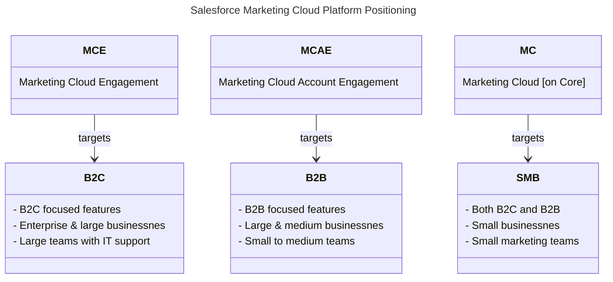

import { LeadText } from '/src/components/LeadText.js';

<LeadText content="The past, the present and the future of Marketing Automation platforms from Salesforce. Learn about positioning, strengths, weaknesses and what's Next for Marketing Cloud products." />

## Salesforce Marketing Cloud Landscape

We are living in interesting times. Also when it comes to the Salesforce Marketing Cloud. The platform landscape is rapidly evolving, with new products being launched, old ones being retired, and all of them being renamed (multiple times). It can be hard to keep up with the changes and understand the differences between the various products. In this article, I will try to explain the current state of the Salesforce Marketing Cloud ecosystem, its main products, and their positioning and guesstimate the future.

Salesforce currently offers three different Marketing Automation products under the Marketing Cloud umbrella, each targeting different audiences and use cases:

### Salesforce Marketing Cloud Engagement

Marketing Cloud Engagement (formerly known as ExactTarget) is the oldest and most established of the three products. It is a robust and feature-rich platform that has been around for 25 years. It is designed for large enterprises and B2C companies with complex marketing needs. And, as the only of the three, it can work as a __standalone__ Marketing Automation platform, without the need for Salesforce CRM.

Its main unqiue selling point - not only among the Salesforce Marketing Automation products, but also in the broader Marketing Automation landscape - is its __flexibility__ and __customisability__. It can be tailored to fit the specific needs of any business, no matter how complex.

This flexibility comes at a cost - it can be __challenging__ to set up and use to its fullest, especially for non-technical users, and there are tons of (first party and third party) add-ons that bring various features and capabilities to the platform. It's not IT driven tool like Adobe Campaign Classic, but definitely not a no-code tool like Oracle Eloqua. To make the full use of its capabilities, you need a mixed team of skilled marketers, developers and administrators.

However, you are not left alone with that complexity - Salesforce has one of the strongest __communities__ and broadest pool of easily available resources in the Marketing Automation space. It's easy to find help when you need it - both in form of free materials and paid people.

### Salesforce Marketing Cloud Account Engagement

Marketing Cloud Account Engagement (formerly known as Pardot) is the second Marketing Automation Platform owned by Salesforce. It is 20-year-old B2B focused solution that few years ago has been tightly integrated with Salesforce CRM. It's no longer available as a standalone product, and you need Salesforce CRM licence to use it.

It is designed for medium to large B2B companies with relatively straightforward marketing needs. Lead scoring and grading, prospect tracking, lead nurturing and connection to Salesforce Sales Cloud are key strengths of the platform. It is user-friendly and easy to set up, making it a good choice for small to medium marketing teams without dedicated IT support.

It offers many drag-and-drop features that either require or at least greadly beneift from pro-code approach in Marketing Cloud Engagement. However, it is not as flexible or customisable as Marketing Cloud Engagement, and it lacks some advanced features.

Just like Marketing Cloud Engagement, it has a strong community and a broad pool of resources available. Being available directly on the Salesforce Lightning Platform, you can even leverage your existing Salesforce CRM people to support it.

:::note You Should Know

WIP

:::

### Salesforce Marketing Cloud

- Next generation Marketing Automation platform
- Built from scratch on Data Cloud
- Rapidly evolving with new features but still very limited
- Drag & drop focused interface with minimal customization
- Agentic AI built-in
- Not yet fully production ready

- Small businessnes
- Small marketing teams
- Both B2C and B2B

## Marketing Clouds Comparison

| Feature/Aspect | Marketing Cloud Engagement (MCE) | Marketing Cloud Account Engagement (MCAE) | Marketing Cloud (SFMC) |
|--|--|--|--|
| **Target Audience** | Large & Enterprise B2C | Medium & Large B2B | Small B2C & B2B |
| **Use Case** | Complex and business-specific marketing | Lead focused and sales aligned marketing | Agentic supported simple marketing |
| **Salesforce CRM** | Optional | Required | Required |
| **Flexibility & Customisability** | High | Moderate | Low |
| **Ease of Use** | Moderate | High |  High |
| **Setup Complexity** | High | Low | Moderate |
| **Key Features** | Advanced segmentation, complex journeys, and heavy customization | Lead scoring, grading and prospect tracking | Drag & drop interface, agentic support and newest features |
| **Community & Resources** | Strong | Strong | Growing |
| **Pricing** | Higher | Moderate | Lower |
| **Ideal For** | Businesses with complex needs and IT support | B2B companies with straightforward needs | Small businesses with basic needs |
| **State** | Well established product | Looming end of life | Publicly available beta |

## Salesforce Marketing Cloud Glossary

Three things in life are certain; death, taxes, and Salesforce changing product names. To help you with this mess, I gathered here the most common names used in the Salesforce Marketing Cloud ecosystem, their shortcuts and how they relate to each other on the timeline.

### Salesforce Marketing Cloud (SFMC)

The original use of Salesforce Marketing Cloud name, between 2012 and 2014, was for Salesforce's social media management platform created from the merge of two acquired products - Radian6 and Buddy Media.

With the acquisition of [ExactTarget](#exacttarget) in 2013, Salesforce reused the Marketing Cloud name for this new flagship Marketing Automation product. Previous social media platform became just part of this new solution as a [Social Studio](#salesforce-marketing-cloud-social-studio). This naming convention held till 2022, when that flagship product was renamed to [Marketing Cloud Engagement](#salesforce-marketing-cloud-engagement-mce).

Salesforce did it to once more reuse the Marketing Cloud name, this time for their new Marketing Automation solution created from the ground up on the [Data Cloud](#salesforce-data-cloud) platform, known also as [Marketing Cloud on Core](#salesforce-marketing-cloud), [Marketing Cloud Growth](#salesforce-marketing-cloud-growth) and [Marketing Cloud Advanced](#salesforce-marketing-cloud-advanced).

Currently the Marketing Cloud name is used frequently for both products (especially in the community), which frequently leads to confusion.

### Salesforce Marketing Cloud Growth (MCG)

### Salesforce Marketing Cloud Advanced (MCA)

### Salesforce Marketing Cloud Next (MCN)

### Salesforce Marketing Cloud Engagement (MCE)

### ExactTarget

Original name of the [Marketing Cloud Engagement](#salesforce-marketing-cloud-engagement-mce) product. Created in 2000 and acquired by Salesforce in 2013. The name is still used in some API endpoints and internal references.

### Salesforce Marketing Cloud Account Engagement (MCAE)

__Name changes__: [Pardot](#pardot) » [Marketing Cloud Account Engagement](#salesforce-marketing-cloud-account-engagement-mcae)

Created in 2007 and moved into Lightning App in 2018

### Pardot

__Name changes__: [Pardot](#pardot) » [Marketing Cloud Account Engagement](#salesforce-marketing-cloud-account-engagement-mcae)

Launched in 2007 as a standalone B2B Marketing Automation platform, bought by [ExactTarget](#exacttarget) in 2012 and acquired along with it by Salesforce in 2013. In 2022 it was renamed to [Marketing Cloud Account Engagement](#salesforce-marketing-cloud-account-engagement-mcae) to align with the rest of the Marketing Cloud products.

The name is still used broadly by the community and can be found in some internal references.

### Salesforce Personalization (SF)

### Salesforce Marketing Cloud Personalization (MCP)

__Name changes__: [Evergage](#evergage) » [Interaction Studio](#interaction-studio) » [Marketing Cloud Personalization](#salesforce-marketing-cloud-personalization-mcp)

Marketing Cloud Personalization is the current name for the product formerly known as [Interaction Studio](#interaction-studio) and [Evergage](#evergage). It is a paid add-on to the [Marketing Cloud Engagement](#salesforce-marketing-cloud-engagement-mce) licence providing real-time personalization capabilities across web, email, mobile and other channels. It uses AI and Machine Learning models to deliver individualized experiences and recomendations based on customer behaviour, preferences, and interactions.

Learn more about Marketing Cloud Personalization in [my MCP Docs](/docs/category/salesforce/marketing-cloud-personalization/).

Since 2023 it is not actively developed further as Salesforce is focusing on recreating its capabilities in the new [Salesforce Personalization](#salesforce-personalization) product built on the [Data Cloud](#salesforce-data-cloud) as a replacement.

### Interaction Studio

__Name changes__: [Evergage](#evergage) » [Interaction Studio](#interaction-studio) » [Marketing Cloud Personalization](#salesforce-marketing-cloud-personalization-mcp)

Name used between 2016 and 2020 for the first standalone real-time personalization product - Thunderhead. After [Evergage](#evergage) acquisition by Salesforce in 2020, Thunderhead Interaction Studio was retired and replaced by Evergage-driven Interaction Studio. In 2022 it was renamed once more to the current [Marketing Cloud Personalization](#salesforce-marketing-cloud-personalization-mcp).

Still in use by some of the community. Might see resurgance due to the MCP acronym being now widely used in the agentic space for Model Context Protocol - including Salesforce.

### Evergage

__Name changes__: [Evergage](#evergage) » [Interaction Studio](#interaction-studio) » [Marketing Cloud Personalization](#salesforce-marketing-cloud-personalization-mcp)

Launched in 2010 as a standalone real-time personalization platform, acquired by Salesforce in 2020 and renamed to [Interaction Studio](#interaction-studio) in 2021. In 2022 it was renamed to [Marketing Cloud Personalization](#salesforce-marketing-cloud-personalization-mcp) to align with the rest of the Marketing Cloud products.

The name is still used in technical areas - endpoints, urls, one of the sitemap namespaces and internal references.

### Salesforce Marketing Intelligence (MI)

### Salesforce Marketing Cloud Intelligence (MCI)

### Salesforce Marketing Cloud Intelligence Reports

### Datorama

### Salesforce Marketing Cloud Advertising (MCA)

Marketing Cloud Advertising is the current name for the product formerly known as [Advertising Studio](#advertising-studio). It is a paid add-on to the [Marketing Cloud Engagement](#salesforce-marketing-cloud-engagement-mce) licence providing integration with major ad platforms like Google Ads, Facebook, Instagram, LinkedIn, Twitter, Pinterest and Snapchat. It provides advertising and lead capturing capabilities.

Currently being retired with end of renewals: 15 August 2026.

Salesforce recommends moving to [Data Cloud](#data-cloud) Ad Audiences product as a replacement, but (for now?) there is neither migration path nor feature parity between the two products.

### Salesforce Marketing Cloud Advertising Studio

Original name of the [Marketing Cloud Advertising](#salesforce-marketing-cloud-advertising-mca) product launched in 2013. Renamed in 2022 but still used in some internal references.

### Salesforce Marketing Cloud Social Studio

Social Studio was a paid add-on to the [Marketing Cloud Engagement](#salesforce-marketing-cloud-engagement-mce) licence providing social media management capabilities.

It was retired on 18 November 2024.

Salesforce doesn't provide any direct replacement, but recommends using a third-party solution they partnered with: Sprout Social.

### Salesforce Data Cloud (DC)

### Salesforce Data Cloud Ad Audiences

