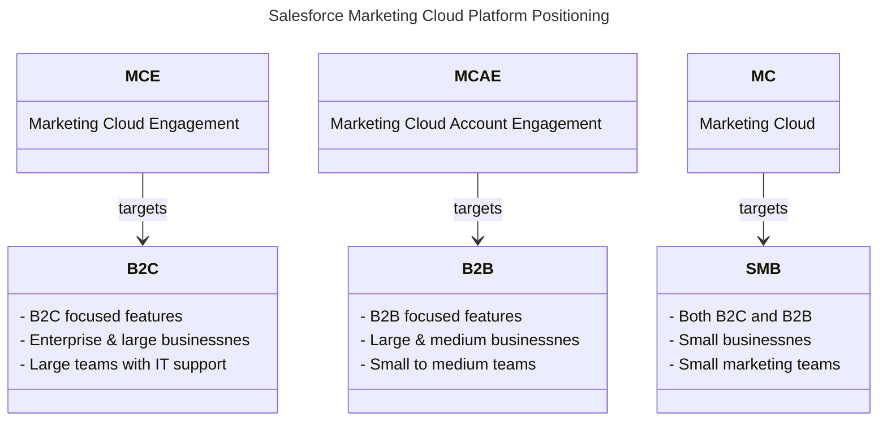

import { LeadText } from '/src/components/LeadText.js';
import { Button } from '/src/components/Buttons.js';
import Image from '@theme/IdealImage';
import landscape from '/static/img/article/article-image-salesforce-marketing-landscape.png';

<LeadText content="The past, the present and the future of Marketing Automation platforms from Salesforce. Learn about positioning, strengths, weaknesses and what's Next for Marketing Cloud products." />

## Salesforce Marketing Landscape

We are living in interesting times. Also when it comes to the Salesforce Marketing Cloud. The platform landscape is rapidly evolving, with new products being launched, old ones being retired, and all of them being renamed (multiple times). It can be hard to keep up with the changes and understand the differences between the various products. In this article, I will try to explain the current state of the Salesforce Marketing Cloud ecosystem, its main products (or Editions as they are called by Salesforce), and their positioning and guesstimate the future.

<Image img={landscape} alt='Salesforce Marketing Product Landscape' />

First thing to cover is the difference between solutions, products and licences in the Salesforce ecosystem. From the marketing perspective, the broadest solution is Salesforce Marketing - it's an umbrella term for all marketing-related products offered by Salesforce (and frequently, apart from marketing automation, real-time personalization and marketing intelligence, it also includes loyalty management through Salesforce Loyalty Cloud).

Next solution area is Agentforce Marketing introduced on Dreamforce 2025 - it encompasses all marketing-related products that leverage Agentforce AI capabilities to assist marketers in their daily tasks. The new Marketing Cloud product (more on that later) is part of this solution, but it includes also old Marketing Cloud Engagement and Marketing Cloud Account Engagement products once they get access to Agentforce features through new licences called Marketing Cloud Engagement Plus and Marketing Cloud Account Engagement Plus.

Final solution is Marketing Cloud Next - it includes only the new Marketing Cloud products (across marketing automation, real-time personalization and marketing intelligence) built on Data 360 platform.

Within those solutions there are multiple products (or Editions) available, each targeting different audiences and use cases. On the diagram above you could see that two of those - Agentforce 360 and Data 360 got renamed to join the 360 team along with the classic Customer 360. This change highlights how those two products evolved from standard function-oriented products to platform-wide technology supporting every facet of Salesforce ecosystem.

The rest of the products are Marketing Automation platforms (Marketing Cloud Engagement, Marketing Cloud Account Engagement and the new Marketing Cloud), Real-Time Personalization platforms (Marketing Cloud Personalization and Salesforce Personalization) and Marketing Intelligence platforms (Marketing Cloud Intelligence and Salesforce Marketing Intelligence). Let's dive deeper into each of those categories.

:::note You Should Know

Salesforce is introducing new product names more frequently than ever before (and the bar was already set high). To keep up to speed with all the renames, check [Renameforce](https://renameforce.com/) - community-driven sanity check for Salesforce product names.

:::

### Marketing Automation Platforms

Salesforce currently offers three different Marketing Automation products under the Marketing Cloud umbrella, each targeting different audiences and use cases:

#### Salesforce Marketing Cloud Engagement

__Name history__: ExactTarget (ET) » Marketing Cloud (SFMC) » Marketing Cloud Engagement (MCE)

Marketing Cloud Engagement (acquired by Salesforce in 2013) is the oldest and most established of the three products. It is a robust and feature-rich platform that has been around for 25 years. It is designed for large enterprises and B2C companies with complex marketing needs. And, as the only of the three, it can work as a __standalone__ Marketing Automation platform, without the need for Salesforce CRM.

Its main unqiue selling point - not only among the Salesforce Marketing Automation products, but also in the broader Marketing Automation landscape - is its __flexibility__ and __customisability__. It can be tailored to fit the specific needs of any business, no matter how complex.

This flexibility comes at a cost - it can be __challenging__ to set up and use to its fullest, especially for non-technical users, and there are tons of (first party and third party) add-ons that bring various features and capabilities to the platform. It's not IT driven tool like Adobe Campaign Classic, but definitely not a no-code tool like Oracle Eloqua. To make the full use of its capabilities, you need a mixed team of skilled marketers, developers and administrators.

However, you are not left alone with that complexity - Salesforce has one of the strongest __communities__ and broadest pool of easily available resources in the Marketing Automation space. It's easy to find help when you need it - both in form of free materials and paid people.

:::note You Should Know

I don't see Marketing Cloud Engagement being replaced or retired anytime soon. It is a mature and well-established product with a large customer base and a strong community. Salesforce is definitely slowing down investment in it, focusing more on integrations rather than net new features, but it is still being actively developed and supported.

This is also proven by the new Marketing Cloud Engagment Plus licences offering synergy between MCE and the new Marketing Cloud product.

:::

<Button
 link='/docs/category/salesforce/marketing-cloud-engagement/'
 text='Read my MCE Docs'
 newTab='true'
/>

#### Salesforce Marketing Cloud Account Engagement

__Name history__: Pardot » Marketing Cloud Account Engagement (MCAE)

Marketing Cloud Account Engagement (acquired by Salesforce in 2013) is the second Marketing Automation Platform owned by Salesforce. It is 20-year-old B2B focused solution that few years ago has been tightly integrated with Salesforce CRM. It's no longer available as a standalone product, and you need Salesforce CRM licence to use it.

It is designed for medium to large B2B companies with relatively straightforward marketing needs. Lead scoring and grading, prospect tracking, lead nurturing and connection to Salesforce Sales Cloud are key strengths of the platform. It is user-friendly and easy to set up, making it a good choice for small to medium marketing teams without dedicated IT support.

It offers many drag-and-drop features that either require or at least greadly beneift from pro-code approach in Marketing Cloud Engagement. However, it is not as flexible or customisable as Marketing Cloud Engagement, and it lacks some advanced features.

Just like Marketing Cloud Engagement, it has a strong community and a broad pool of resources available. Being available directly on the Salesforce Lightning Platform, you can even leverage your existing Salesforce CRM people to support it.

:::note You Should Know

While there is no official end-of-life annoucement for Marketing Cloud Account Engagement available yet, Salesforce Account Executives are already mentioning it to new customers as one of the arguments to go for the new Marketing Cloud product instead. Feature parity between the two products is not there yet, but Salesforce is rapidly adding new features to the new platform. I expect end of sales for MCAE to be announced by Connections 2027.

All Marketing Cloud Account Engagement customers already receive access to the new Marketing Cloud product as well, so you can start experimenting with it and gradually move your marketing activities there.

:::

#### Salesforce Marketing Cloud

__Name history__: Marketing Cloud Growth (MCG) » Marketing Cloud Advanced (MCA) » Marketing Cloud [on Core] (MCoC)» Marketing Cloud Next (MCN) » Marketing Cloud (MC)

The newest of the three products, Marketing Cloud, is a fresh take on Marketing Automation. Announced in 2024, it is built from scratch on the Data 360 (now Data 360) platform, leveraging its capabilities and integrations with other Salesforce products (especially the new hype champion - Agentforce).

Based on it's current features, it is designed for small businesses and small marketing teams, both B2C and B2B, with basic marketing needs. It's not that clear however, when you consider the pre-requisite of having at least Enterprise tier Salesforce CRM licence to use it. It is not a standalone Marketing Automation platform like Marketing Cloud Engagement, but rather a complementary product.

 Marketing Cloud focuses a drag-and-drop interface, rich segmentation with Data 360 and automated marketing operations with Agentforce for Marketing that can automatically create briefs, emails and customer journeys in Flows. On the other hand the tool currently offers limited features and minimal customization options. It's heavily developed and rapidly catching up to Marketing Cloud Account Engagement with B2B focused features, but still not a perfect match and not even close in terms of stability.

:::note You Should Know

Salesforce Marketing Cloud is definitely the future of Marketing Automation on the Salesforce platform. It has great ideas and massive potential - definitely needed to compete with other modern Marketing Automation platforms on the market.

However, right now it's a very immature product with numerous bugs, limited features and heavily layered usage-based pricing. It's great as a complimentary product for existing MCE & MCAE customers to experiment with new features, but not ready yet to confidently stand on its own (unless you are existing Data 360 customer with very basic email needs).

:::

#### Marketing Automation Platforms Comparison

| Feature/Aspect | Marketing Cloud Engagement (MCE) | Marketing Cloud Account Engagement (MCAE) | Marketing Cloud (MC) |
|--|--|--|--|
| **Target Audience** | Large & Enterprise B2C | Medium & Large B2B | Small B2C & B2B |
| **Use Case** | Complex and business-specific marketing | Lead focused and sales aligned marketing | Agentic supported simple marketing |
| **Salesforce CRM** | Optional | Required | Required |
| **Flexibility & Customisability** | High | Moderate | Low |
| **Ease of Use** | Moderate | High |  High |
| **Setup Complexity** | High | Low | Moderate |
| **Key Features** | Advanced segmentation, complex journeys, and heavy customization | Lead scoring, grading and prospect tracking | Drag & drop interface, agentic support and newest features |
| **Community & Resources** | Strong | Strong | Growing |
| **Pricing** | Higher | Moderate | It's complicated |
| **Ideal For** | Businesses with complex needs and IT support | B2B companies with straightforward needs | Small businesses with basic needs |
| **State** | Well established product | Looming end of life | Publicly available beta |

### Real-Time Personalization Platforms

Salesforce currently offers two different Real-Time Personalization products, each targeting different audiences and use cases - the legacy-but-still-best Marketing Cloud Personalization and the new Salesforce Personalization.

#### Marketing Cloud Personalization

__Name history__: Evergage (EVG) » Interaction Studio (IS) » Marketing Cloud Personalization (MCP)

Marketing Cloud Personalization (acquired by Salesforce in 2020) is mature and powerful real-time personalization platform. Multichannel-enabled, drag-and-drop-focused, AI-driven, MCP has it all.

Before the acquisition by Salesforce, Evergage was a standalone platform, but since then it has been integrated with Marketing Cloud Engagement and cannot be purchased separately (unless you smile to your Account Executive really hard to get it for your Marketing Cloud Account Engagement).

It is designed for medium to large B2C companies with complex personalization needs. It offers a wide range of features, including web, app, email and API-based personalization, product recommendations, A/B testing, and analytics. It is highly flexible and customizable, allowing businesses to tailor the platform to their specific needs.

:::note You Should Know

While there is no official end-of-life annoucement for Marketing Cloud Personalization available yet, Salesforce is not investing in it anymore and focusing on the new Salesforce Personalization product instead. The product hasn't seen any major updates in the last two years, and there is no roadmap for future development. What's more, Salesforce is quitely introducing new limits and restrictions to the existing MCP customers through documentation, making it less attractive.

However, if you are using Marketing Cloud Engagement, it is still the best option for real-time personalization. It is a mature and powerful platform with strightforward pricing that can deliver results.

:::

<Button
 link='/docs/category/salesforce/marketing-cloud-personalization/'
 text='Read my MCP Docs'
 newTab='true'
/>

#### Salesforce Personalization

__Name history__: Einstein Personalization (EP) » Salesforce Personalization (SP)

Salesforce Personalization is one of the newest products in the Salesforce Marketing Cloud ecosystem. Announced in 2024, it is built from scratch on the Data 360 (now Data 360) platform, leveraging its capabilities and integrations with other Salesforce products.

It is designed to work in tandem with Marketing Cloud and other Salesforce products, providing real-time personalization capabilities that utilize your entire Salesforce ecosystem. It also leverages Agentforce and Lightning Platform to provide a no-code, drag-and-drop interface that is easy to use and set up.

:::note You Should Know

Similarly to Marketing Cloud, Salesforce Personalization seems to be the future of real-time personalization on the Salesforce platform. However, it's only selling point is the tight integration with Data 360 and easy usage in the new suite of Salesforce Products.

On the other hand:
1. It is a very immature product with limited features, nowhere near the capabilities of Marketing Cloud Personalization. 2. There is no migration path from MCP to SP.
3. There is no clear indication if SP will ever reach feature parity with MCP.
4. Due to it being built on Data 360, it is using Sub-Second Real-Time Event Credits - second most expensive credit type after Profile Unification Credits (that are also required) - making it a very costly alternative to more powerful MCP.

:::

#### Real-Time Personalization Platforms Comparison

| Feature/Aspect | Marketing Cloud Personalization (MCP) | Salesforce Personalization (SP) |
|--|--|--|
| **Target Audience** | Medium & Large | Small & Medium |
| **Use Case** | Complex and business-specific personalization | Basic personalization leveraging Data 360 information |
| **Salesforce CRM** | Optional | Required |
| **Flexibility & Customisability** | High | Low |
| **Ease of Use** | Moderate | Low |
| **Setup Complexity** | Moderate | High |
| **Key Features** | Multichannel personalization, AI-driven recommendations, and heavy customization | Drag & drop interface, agentic support and Data 360 integration |
| **Community & Resources** | Strong | Growing |
| **Pricing** | Moderate | It's complicated |
| **Ideal For** | Businesses with personalization and recommendation needs | Businesses with small volumes and huge margins |
| **State** | Well established product | Publicly available beta |

### Marketing Intelligence Platforms

Salesforce currently offers also two Marketing Intelligence product. The legacy Marketing Cloud Intelligence (previously called Datorama) and the new Salesforce Marketing Intelligence.

Similarly to the Real-Time Personalization products, the old one is a mature and powerful platform acquired by Salesforce and currently being left to rot without updates, while the new one is part of the new built-on-data-cloud batch of products still in its infancy.

As I don't have much experience with neither of them, I won't go into details here.

## Salesforce Marketing Future

As you can see, Salesforce Marketing Cloud product (and naming) landscape is changing a lot now. We are currently going through a stretched transition period where the old and new products are co-existing side by side. What does it mean for you?

### For Implementation Partners

If you are implementation partner, the current landscape is both a challenge and an opportunity.

On one hand, the transition period means that there will be a lot new business for you, as customers will need help with migrating from old products to new ones, and with setting up and using the new products. The best part? You don't even have to go through full sales funnel to get new leads for it - your past successfull implementations are the best leads for introducing the new features. Additionally, if you are focused on Salesforce it also means that you can target new audiences covered by the fresh offerings and extend your pripieline.

On the other hand it means that you will need to invest in learning the new products and staying up-to-date with the latest developments. The new products are still evolving, and there will be a lot of changes and updates in the coming months and years. You will need to be flexible and adaptable to keep up with the changes. And it won't be easy - new products are built on new platforms (Data 360, Agentforce 360) that are different from the old ones, and you will need to learn new skills and technologies to work with them.

The next few years will be balancing act between leveraging your existing expertise for ongoing implementations of old tools and investing in new skills to unlock the new opportunities. But if you can do it, you will be well-positioned to take advantage of the transition and position yourself as a leader for the Next Marketing Cloud.

### For Specialists

If you are Marketing Automation specialist, you will have challenging times ahead.

One thing is clear - Data 360 will be the fundament of Salesforce Marketing going forward. If you want to stay relevant in the Salesforce Marketing Automation space, you will need to learn how to work with Data 360, and how to leverage its capabilities for marketing purposes. This includes understanding data modelling, segmentation, audience building, and data governance on Data 360 platform. Don't stop at certification - go deeper and understand the platform capabilities and limitations. Every single new Marketing Cloud product will leverage this knowledge.

If your specialty was Marketing Cloud Account Engagement, you have advatage of already being familiar with Salesforce CRM platform. However, as the new Marketing Cloud is soon to replace MCAE (and already is offered for free to existing customers to facilitate this move) you don't have much time to learn the new tool and its capabilities. Dive into Data 360 Agentforce 360 to be ready for the change.

If you were Marketing Cloud Engagement specialist, you have more time on your hands. MCE is not going anywhere soon, and there will be need for skilled people to support existing customers for years to come. However, you should start learning the new Marketing Cloud as well, as Marketing Cloud Engagement Plus licences are already here. They not only provide existing customers with the ne product licence, but also bring synergy between the two products. It means that even if your MCE platform is still a safe harbour for years to come, the need for MC Next skills on top of it to deliver full value of the product. Data 360 and Agentforce 360 knowledge will be key here as well.

In both scenarios, you should also start getting familiar with Salesforce CRM platform. Flows, Apex, LWC, Sandboxes, DevOps - those are the skills that will help you work effectively with the new Marketing Cloud products.

### For Customers

A lot depends on whether you are already using any of the existing Marketing Cloud products or not.

#### Looking for Marketing Automation Platform

If you are looking for Marketing Automation Platform and Salesforce offering looks interesting to you (for example because you are already using their CRM or needs extremly flexible and powerful platform), the [Marketing Automation Platforms](#marketing-automation-platforms) section should help you choose the right product for your needs.

The rule of thumb is:
- If you need complex and highly customisable solution, go for Marketing Cloud Engagement.
- If you need something simpler, B2B focused, with good support and maturity, go for Marketing Cloud Account Engagement.
- If you are Salesforce CRM (and - even better - Data 360) user and just need basic marketing capabilities with agentic support to minimise the effort, go for Marketing Cloud.

However, this will need an update in a year or two.

#### With Marketing Cloud Account Engagement

If you are using Marketing Cloud Account Engagement, you already have access to the new Marketing Cloud product (if you don't know anything about it, contact your Salesforce Account Executive). Start experimenting with it and gradually move your marketing activities there. Keep an eye on the new features being added, and plan your migration accordingly. The winter for MCAE is coming.

#### With Marketing Cloud Engagement

If you are using Marketing Cloud Engagement, you are in a safe (for now). However, your team should start getting familiar with the Data 360 and new Marketing Cloud product as well, as Marketing Cloud Engagement Plus licences are already here (if you don't yet have it, you will get it during the next renewal).

MCE+ will not only provide you with the new Marketing Cloud product licence, but also bring synergy between the two products through new features (Multi-Journey management through Flows, Digital Wallet for consumption, etc.). You don't have to worry about your existing implementation, it will be perfectly fine for years to come. But to deliver full value of the Salesforce Marketing Cloud ecosystem, your team will need to master the new tool as well.

{/*
## Salesforce Marketing Cloud Glossary

Three things in life are certain; death, taxes, and Salesforce changing product names. To help you with this mess, I gathered here the most common names used in the Salesforce Marketing Cloud ecosystem, their shortcuts and how they relate to each other on the timeline.

### Salesforce Marketing Cloud (SFMC)

The original use of Salesforce Marketing Cloud name, between 2012 and 2014, was for Salesforce's social media management platform created from the merge of two acquired products - Radian6 and Buddy Media.

With the acquisition of [ExactTarget](#exacttarget) in 2013, Salesforce reused the Marketing Cloud name for this new flagship Marketing Automation product. Previous social media platform became just part of this new solution as a [Social Studio](#salesforce-marketing-cloud-social-studio). This naming convention held till 2022, when that flagship product was renamed to [Marketing Cloud Engagement](#salesforce-marketing-cloud-engagement-mce).

Salesforce did it to once more reuse the Marketing Cloud name, this time for their new Marketing Automation solution created from the ground up on the [Data 360](#salesforce-data-cloud) platform, known also as [Marketing Cloud on Core](#salesforce-marketing-cloud), [Marketing Cloud Growth](#salesforce-marketing-cloud-growth) and [Marketing Cloud Advanced](#salesforce-marketing-cloud-advanced).

Currently the Marketing Cloud name is used frequently for both products (especially in the community), which frequently leads to confusion.

### Salesforce Marketing Cloud Growth (MCG)

### Salesforce Marketing Cloud Advanced (MCA)

### Salesforce Marketing Cloud Next (MCN)

### Salesforce Marketing Cloud Engagement (MCE)

### ExactTarget

Original name of the [Marketing Cloud Engagement](#salesforce-marketing-cloud-engagement-mce) product. Created in 2000 and acquired by Salesforce in 2013. The name is still used in some API endpoints and internal references.

### Salesforce Marketing Cloud Account Engagement (MCAE)

__Name changes__: [Pardot](#pardot) » [Marketing Cloud Account Engagement](#salesforce-marketing-cloud-account-engagement-mcae)

Created in 2007 and moved into Lightning App in 2018

### Pardot

__Name changes__: [Pardot](#pardot) » [Marketing Cloud Account Engagement](#salesforce-marketing-cloud-account-engagement-mcae)

Launched in 2007 as a standalone B2B Marketing Automation platform, bought by [ExactTarget](#exacttarget) in 2012 and acquired along with it by Salesforce in 2013. In 2022 it was renamed to [Marketing Cloud Account Engagement](#salesforce-marketing-cloud-account-engagement-mcae) to align with the rest of the Marketing Cloud products.

The name is still used broadly by the community and can be found in some internal references.

### Salesforce Personalization (SF)

### Salesforce Marketing Cloud Personalization (MCP)

__Name changes__: [Evergage](#evergage) » [Interaction Studio](#interaction-studio) » [Marketing Cloud Personalization](#salesforce-marketing-cloud-personalization-mcp)

Marketing Cloud Personalization is the current name for the product formerly known as [Interaction Studio](#interaction-studio) and [Evergage](#evergage). It is a paid add-on to the [Marketing Cloud Engagement](#salesforce-marketing-cloud-engagement-mce) licence providing real-time personalization capabilities across web, email, mobile and other channels. It uses AI and Machine Learning models to deliver individualized experiences and recomendations based on customer behaviour, preferences, and interactions.

Learn more about Marketing Cloud Personalization in [my MCP Docs](/docs/category/salesforce/marketing-cloud-personalization/).

Since 2023 it is not actively developed further as Salesforce is focusing on recreating its capabilities in the new [Salesforce Personalization](#salesforce-personalization) product built on the [Data 360](#salesforce-data-cloud) as a replacement.

### Interaction Studio

__Name changes__: [Evergage](#evergage) » [Interaction Studio](#interaction-studio) » [Marketing Cloud Personalization](#salesforce-marketing-cloud-personalization-mcp)

Name used between 2016 and 2020 for the first standalone real-time personalization product - Thunderhead. After [Evergage](#evergage) acquisition by Salesforce in 2020, Thunderhead Interaction Studio was retired and replaced by Evergage-driven Interaction Studio. In 2022 it was renamed once more to the current [Marketing Cloud Personalization](#salesforce-marketing-cloud-personalization-mcp).

Still in use by some of the community. Might see resurgance due to the MCP acronym being now widely used in the agentic space for Model Context Protocol - including Salesforce.

### Evergage

__Name changes__: [Evergage](#evergage) » [Interaction Studio](#interaction-studio) » [Marketing Cloud Personalization](#salesforce-marketing-cloud-personalization-mcp)

Launched in 2010 as a standalone real-time personalization platform, acquired by Salesforce in 2020 and renamed to [Interaction Studio](#interaction-studio) in 2021. In 2022 it was renamed to [Marketing Cloud Personalization](#salesforce-marketing-cloud-personalization-mcp) to align with the rest of the Marketing Cloud products.

The name is still used in technical areas - endpoints, urls, one of the sitemap namespaces and internal references.

### Salesforce Marketing Intelligence (MI)

### Salesforce Marketing Cloud Intelligence (MCI)

### Salesforce Marketing Cloud Intelligence Reports

### Datorama

### Salesforce Marketing Cloud Advertising (MCA)

Marketing Cloud Advertising is the current name for the product formerly known as [Advertising Studio](#advertising-studio). It is a paid add-on to the [Marketing Cloud Engagement](#salesforce-marketing-cloud-engagement-mce) licence providing integration with major ad platforms like Google Ads, Facebook, Instagram, LinkedIn, Twitter, Pinterest and Snapchat. It provides advertising and lead capturing capabilities.

Currently being retired with end of renewals: 15 August 2026.

Salesforce recommends moving to [Data 360](#data-cloud) Ad Audiences product as a replacement, but (for now?) there is neither migration path nor feature parity between the two products.

### Salesforce Marketing Cloud Advertising Studio

Original name of the [Marketing Cloud Advertising](#salesforce-marketing-cloud-advertising-mca) product launched in 2013. Renamed in 2022 but still used in some internal references.

### Salesforce Marketing Cloud Social Studio

Social Studio was a paid add-on to the [Marketing Cloud Engagement](#salesforce-marketing-cloud-engagement-mce) licence providing social media management capabilities.

It was retired on 18 November 2024.

Salesforce doesn't provide any direct replacement, but recommends using a third-party solution they partnered with: Sprout Social.

### Salesforce Data 360 (DC)

### Salesforce Data 360 Ad Audiences */}

