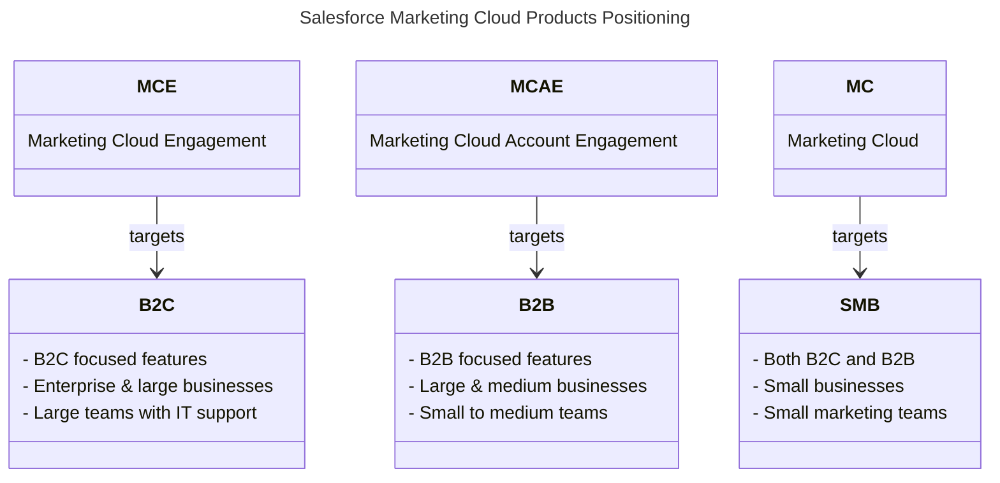

import { LeadText } from '/src/components/LeadText.js';
import { Button } from '/src/components/Buttons.js';
import Image from '@theme/IdealImage';
import landscape from '/static/img/article/article-image-salesforce-marketing-landscape.png';

<LeadText content="The past, the present and the future of Marketing Automation platforms from Salesforce. Learn about positioning, strengths, weaknesses and what's Next for Marketing Cloud products." />

## Salesforce Marketing Landscape

We are living in interesting times. Also when it comes to the Salesforce Marketing Cloud. The platform landscape is rapidly evolving, with new products being launched, old ones being retired, and all of them being renamed (more than once). It can be hard to keep up with all the changes and understand the differences between the various products.

In this article, I will explain the current state of the Salesforce Marketing Cloud ecosystem, its main products (or Editions as they are called by Salesforce), positioning, and try to guesstimate the future a bit.

:::note You Should Know

This article covers late 2025 state of Salesforce Marketing Cloud products. The new solutions are rapidly evolving, and my opionions on them will change as they mature. I will be updating this article regularly to keep it up to date with the latest updates.

:::

<Image img={landscape} alt='Salesforce Marketing Product Landscape' />

The first thing to cover is the difference between solutions, products and licences in the Salesforce ecosystem. Solutions are areas that cover multiple products fulfilling a similar purpose. Each of those products have multiple licences with different feature sets and pricing levels.

For marketing, the broadest solution is Salesforce Marketing - it's an umbrella term for all marketing-related products offered by Salesforce covering marketing automation, real-time personalization, marketing intelligence, and frequently also loyalty management (through Salesforce Loyalty Cloud).

Inside of it is another solution area - Agentforce Marketing introduced at Dreamforce 2025. It encompasses all marketing-related products that leverage Agentforce AI capabilities to assist marketers in their daily tasks. The new Marketing Cloud product (more on that later) is part of this solution, but it also includes the old Marketing Cloud Engagement and Marketing Cloud Account Engagement products once they get access to Agentforce features through new licences called Marketing Cloud Engagement Plus and Marketing Cloud Account Engagement Plus.

The final solution is Marketing Cloud Next - it includes only the new Marketing Cloud products (across marketing automation, real-time personalization and marketing intelligence) built on the Data 360 platform.

Within those solutions, there are multiple products (or Editions) available, each targeting different audiences and use cases. On the diagram above you can see that two of those - Agentforce 360 and Data 360 - are cross-solution and cross-purpose (that's why they have the 360 suffix along with the classic Customer 360 that encompases whole Salesforce ecosystem). Those two products evolved from standard function-oriented products to platform-wide technology supporting every facet of the Salesforce ecosystem.

The rest of the products are Marketing Automation platforms (Marketing Cloud Engagement, Marketing Cloud Account Engagement and the new Marketing Cloud), Real-Time Personalization platforms (Marketing Cloud Personalization and Salesforce Personalization) and Marketing Intelligence platforms (Marketing Cloud Intelligence and Salesforce Marketing Intelligence).

Each of those products have various licences available, each with different feature sets and pricing levels. I highlighted the new Marketing Cloud licences specifically, becauase in the past their names were used interchangeably with the product names, causing a lot of confusion.

:::note You Should Know

Salesforce is introducing new product names more frequently than ever before (and the bar was already set high). To keep up to speed with all the renames, check [Renameforce](https://renameforce.com/) - a community-driven sanity check for Salesforce product names.

:::

Let's dive deeper into products supporting marketing automation, real-time personalization and marketing intelligence use cases.

### Marketing Automation Platforms

Salesforce currently offers three different marketing automation products under the Marketing Cloud umbrella, each targeting different audiences and use cases:

#### Salesforce Marketing Cloud Engagement

__Name history__: ExactTarget (ET) » Marketing Cloud (SFMC) » Marketing Cloud Engagement (MCE)

Marketing Cloud Engagement (acquired by Salesforce in 2013) is the oldest and most established of the three products. It is a robust and feature-rich platform that has been around for 25 years. It is designed for large enterprises and B2C companies with complex marketing needs.

And, as the only one of the three, it can work as a __standalone__ Marketing Automation platform, without the need for Salesforce CRM. Its main unique selling point - not only among the Salesforce Marketing Automation products but also in the broader Marketing Automation landscape - is its __flexibility__ and __customisability__. It can be tailored to fit the specific needs of any business, no matter how complex.

This flexibility comes at a cost - it can be __challenging__ to set up and use to its fullest (especially for non-technical users), and there are tons of (first and third party) add-ons that add various features and capabilities to the platform. It's not an IT-driven tool like Adobe Campaign Classic, but definitely not a no-code tool like Oracle Eloqua. To make full use of its capabilities, you need a mixed team of skilled marketers, developers and administrators.

However, you are not left alone with that complexity - Salesforce has one of the strongest __communities__ and the broadest pool of easily available resources in the Marketing Automation space. It's easy to find help when you need it - both in the form of free materials and paid people.

:::note You Should Know

I don't see Marketing Cloud Engagement being replaced or retired anytime soon. It is a mature and well-established product with a large customer base and a strong community. Salesforce is definitely slowing down investment in it, focusing more on integrations rather than net new features, but it is still being actively developed and supported. This is also proven by the new Marketing Cloud Engagement Plus licences providing synergy between MCE and the new Marketing Cloud product.

:::

<Button
 link='/docs/category/salesforce/marketing-cloud-engagement/'
 text='Read my MCE Docs'
 newTab='true'
/>

#### Salesforce Marketing Cloud Account Engagement

__Name history__: Pardot » Marketing Cloud Account Engagement (MCAE)

Marketing Cloud Account Engagement (acquired by Salesforce in 2013) is the second Marketing Automation Platform owned by Salesforce. It is a 20-year-old B2B focused solution that, a few years ago, became tightly integrated with Salesforce CRM. It's no longer available as a standalone product, and you need a Salesforce CRM licence to use it.

It is designed for medium to large B2B companies with relatively straightforward marketing needs. Lead scoring and grading, prospect tracking, lead nurturing and connection to Salesforce Sales Cloud are key strengths of the platform. It is user-friendly and fairly easy to set up, making it a good choice for small to medium marketing teams without dedicated IT support. It offers many drag-and-drop features (that in MCE either require or at least greatly benefit from a pro-code approach).

However, it is not as flexible or customisable as Marketing Cloud Engagement, and it lacks some advanced features. Just like Marketing Cloud Engagement, it has a strong community and a broad pool of resources available. Being available directly on the Salesforce Lightning Platform, you can even leverage your existing Salesforce CRM team to support it.

:::note You Should Know

While there is no official end-of-life announcement for Marketing Cloud Account Engagement available yet, Salesforce Account Executives are already mentioning it to new customers as one of the arguments to go for the new Marketing Cloud product instead. Feature parity between the two products is not there yet, but Salesforce is rapidly adding new features to the new platform. I expect the end of sales for MCAE to be announced by Connections 2027.

All Marketing Cloud Account Engagement customers already receive access to the new Marketing Cloud product as well, so you can start experimenting with it and gradually move your marketing activities there.

:::

#### Salesforce Marketing Cloud

__Name history__: Marketing Cloud Growth (MCG) » Marketing Cloud Advanced (MCA) » Marketing Cloud [on Core] (MCoC)» Marketing Cloud Next (MCN) » Marketing Cloud (MC)

The newest of the three products, Marketing Cloud, is a fresh take on Marketing Automation. Announced in 2024, it is built from scratch on the Data 360 (also known as Data Cloud in the ancient early 2025 days) platform, and leverages capabilities and integrations of other Salesforce products (especially the new hype champion - Agentforce 360).

Based on its current features, it is designed for small businesses and small marketing teams, both B2C and B2B, with basic marketing needs. At the same time, Enterprise (or higher) Salesforce CRM licence is a prerequisite to use it. It is not a standalone Marketing Automation platform like Marketing Cloud Engagement, but rather a complementary product for CRM.

Marketing Cloud focuses on a drag-and-drop interface, rich segmentation with Data 360 and automated marketing operations with Agentforce for Marketing that can automatically create briefs, emails and customer journeys in Flows. On the other hand, the tool currently offers limited features and minimal customization options. It's heavily developed and rapidly catching up to Marketing Cloud Account Engagement with B2B focused features, but still not a perfect match and not even close in terms of stability.

:::note You Should Know

Salesforce Marketing Cloud is definitely the future of Marketing Automation on the Salesforce platform. It has great ideas and massive potential - definitely needed to compete with other modern Marketing Automation platforms on the market. However, right now it's a very immature product with numerous bugs, limited features and heavily layered usage-based pricing. It's great as a complementary product for existing MCE & MCAE customers to experiment with new features, but not ready yet to confidently stand on its own (unless you are an existing Data 360 customer with very basic email needs).

:::

#### Marketing Automation Platforms Comparison

| Feature/Aspect | Marketing Cloud Engagement (MCE) | Marketing Cloud Account Engagement (MCAE) | Marketing Cloud (MC) |
|--|--|--|--|
| **Target Audience** | Large & Enterprise B2C | Medium & Large B2B | Small B2C & B2B |
| **Use Case** | Complex and business-specific marketing | Lead focused and sales aligned marketing | Agentic supported simple marketing |
| **Salesforce CRM** | Optional | Required | Required |
| **Flexibility & Customisability** | High | Moderate | Low |
| **Ease of Use** | Moderate | High | High |
| **Setup Complexity** | High | Low | Moderate |
| **Key Features** | Advanced segmentation, complex journeys, and heavy customization | Lead scoring, grading and prospect tracking | Drag & drop interface, agentic support and newest features |
| **Community & Resources** | Strong | Strong | Growing |
| **Pricing** | High | Moderate | It's complicated |
| **Ideal For** | Businesses with complex needs and IT support | B2B companies with straightforward needs | Small businesses with basic needs |
| **State** | Well established product | Looming end of life | Publicly available beta |

### Real-Time Personalization Platforms

Salesforce currently offers two different real-time personalization products, each targeting different audiences and use cases - the legacy-but-still-best Marketing Cloud Personalization and the new-but-not-so-best Salesforce Personalization.

#### Marketing Cloud Personalization

__Name history__: Evergage (EVG) » Interaction Studio (IS) » Marketing Cloud Personalization (MCP)

Marketing Cloud Personalization (acquired by Salesforce in 2020) is a mature and powerful real-time personalization platform. Multichannel-enabled, drag-and-drop-focused, AI-driven, MCP has it all.

Before the acquisition by Salesforce, Evergage was a standalone platform, but since then it has been integrated with Marketing Cloud Engagement and cannot be purchased separately (unless you smile to your Account Executive really hard to get it for your Marketing Cloud Account Engagement). It is designed for medium to large B2C companies with complex personalization needs. It offers a wide range of features, including web, app, email and API-based personalization, product recommendations, A/B testing, and analytics. It is highly flexible and customizable, allowing businesses to tailor the platform to their specific needs.

:::note You Should Know

While there is no official end-of-life announcement for Marketing Cloud Personalization available yet, Salesforce is not investing in it anymore and focusing on the new Salesforce Personalization product instead. The product hasn't seen any major updates in the last two years, and there is no roadmap for future development. What's more, Salesforce is quietly introducing new limits and restrictions to the existing MCP customers through documentation, making it less attractive. However, if you are using Marketing Cloud Engagement, it is still the best option for real-time personalization. It is a mature and powerful platform with straightforward pricing that can deliver powerful results.

:::

<Button
 link='/docs/category/salesforce/marketing-cloud-personalization/'
 text='Read my MCP Docs'
 newTab='true'
/>

#### Salesforce Personalization

__Name history__: Einstein Personalization (EP) » Salesforce Personalization (SP)

Salesforce Personalization is one of the newest products in the Salesforce Marketing Cloud ecosystem. Announced in 2024, it is built from scratch on the Data 360 platform, leveraging its capabilities and integrations with other Salesforce products. It is designed to work in tandem with Marketing Cloud and other Salesforce products, providing real-time personalization capabilities that utilize your entire Salesforce ecosystem. It also leverages Agentforce and the Lightning Platform to provide a no-code, drag-and-drop interface that is easy to use and set up.

:::note You Should Know

Similarly to the new Marketing Cloud, Salesforce Personalization seems to be the future of real-time personalization on the Salesforce platform. However, its only selling point is the tight integration with Data 360 and easy usage in the new suite of Salesforce Products. On the other hand:
1. It is a very immature product with limited features, nowhere near the capabilities of Marketing Cloud Personalization.
2. There is no migration path from MCP to SP.
3. There is no clear indication if SP will ever reach feature parity with MCP.
4. Due to it being built on Data 360, it is using Sub-Second Real-Time Event Credits - the second most expensive credit type after Profile Unification Credits (that are also required) - making it a very costly alternative to more powerful MCP.

:::

#### Real-Time Personalization Platforms Comparison

| Feature/Aspect | Marketing Cloud Personalization (MCP) | Salesforce Personalization (SP) |
|--|--|--|
| **Target Audience** | Medium & Large | Small & Medium |
| **Use Case** | Complex and business-specific personalization | Basic personalization leveraging Data 360 information |
| **Salesforce CRM** | Optional | Required |
| **Flexibility & Customisability** | High | Low |
| **Ease of Use** | Moderate | Low |
| **Setup Complexity** | Moderate | High |
| **Key Features** | Multichannel personalization, AI-driven recommendations, and heavy customization | Drag & drop interface, agentic support and Data 360 integration |
| **Community & Resources** | Strong | Growing |
| **Pricing** | Moderate | It's complicated |
| **Ideal For** | Businesses with personalization and recommendation needs | Businesses with small volumes and huge margins |
| **State** | Well established product | Publicly available beta |

### Marketing Intelligence Platforms

Salesforce currently also offers two marketing intelligence products (on top of the basic out-of-the-box reporting solutions available in each previously mentioned tool). The legacy Marketing Cloud Intelligence (previously called Datorama) and the new Salesforce Marketing Intelligence.

Similarly to the real-time personalization products, the old one is a mature and powerful platform acquired by Salesforce and currently being left to rot without updates, while the new one is part of the new built-on-data-cloud batch of products, still in its infancy.

As I don't have much experience with either of them, I won't go into details here.

## Salesforce Marketing Future

As you can see, the Salesforce Marketing Cloud product (and naming) landscape is changing a lot. We are currently in a stretched transition period where old and new products coexist. What does it mean for you?

### For Implementation Partners

If you are an implementation partner, the current landscape is both a challenge and an opportunity.

#### Partner Opportunities

On one hand, the transition period means that there will be a lot of new business for you. Customers will need help with migrating from old products to new ones and setting up the new features.

- **Easy Leads**: You don't have to go through the full sales funnel. Your past successful implementations of MCE & MCAE are the best leads for introducing the Next features.
- **New Audiences**: If you are focused only on Salesforce Marketing solutions, you can now tap new SMB & AI-hype-driven audiences that the fresh offerings target and extend your pipeline.

#### Partner Challenges

On the other hand, it means that you will need to invest in learning.

- **Continuous Evolution**: The new products are still evolving. There will be a lot of changes and updates in the coming months and years - not just to the Marketing Cloud products, but also to Data 360 and Agentforce 360 platforms. There will be a lot of relearning and replanning along with a constant feed of new features and approaches requiring constant effort to keep up with.
- **New Stack**: It won't be easy for your team. New products are built on Data 360 and Agentforce 360 within the Lightning platform. Too marketingy for your CRM people, too CRMy for your marketing people. Your implementation teams will need to learn completely new skills to delvier the projects.

The next few years will be a balancing act between leveraging your existing expertise for ongoing implementations and investing in building new skills. But if you can do it, you will position yourself as a leader for the Next Marketing Cloud era.

### For Specialists

If you are a Marketing Automation specialist, you will have challenging times ahead.

#### Data 360 Foundation

One thing is clear - Data 360 will be the foundation of Salesforce Marketing going forward. If you want to stay relevant, you need to learn how to work with Data 360 and leverage its capabilities. This includes understanding data modelling, segmentation, audience building, and data governance.

Don't stop at certification - go deeper and focus on data. Every single new Marketing Cloud product will leverage this knowledge.

#### MCAE Specialists

If your specialty is Marketing Cloud Account Engagement, you have the advantage of already being familiar with the Salesforce CRM platform. However, the new Marketing Cloud is (somewhere) soon to replace MCAE (and is already offered for free to existing customers to facilitate this move). You don't have much time to learn the new tool.

Dive into Data 360 and Agentforce 360 to be ready for the change. Explore the new Marketing Cloud product, experiment with its features, and start building your expertise leveraging the free licence existing MCAE customers already have (or SDO if you work for a Partner).

#### MCE Specialists

If you are a Marketing Cloud Engagement specialist, you have more time on your hands. MCE is not going anywhere soon, and there will be a need for skilled people to support existing customers for years to come.

However, you should start learning the new Marketing Cloud quickly as well. Marketing Cloud Engagement Plus licence is already here. It not only provides existing customers with access to the new product but also bring unique features based on the synergy between the two products.

With it even if your MCE platform is safe for years to come, you still need MC Next (and Data 360, and Agentforce 360) skills to deliver full value of the tool.

:::note You Should Know

In all scenarios, you should start getting familiar with the Salesforce CRM platform. Flows, Apex, LWC, Sandboxes, DevOps - those are the skills that will help you work effectively with the new Marketing Cloud products.

:::

### For Customers

A lot depends on whether you are already using any of the existing Marketing Cloud products or not.

#### Looking for Marketing Automation Platform

If you are looking for a Marketing Automation Platform and the Salesforce offering looks interesting to you (for example, because you are already using their CRM or need an extremely flexible and powerful platform), the [Marketing Automation Landscape](#salesforce-marketing-landscape) section should help you choose the right product for your needs. The rule of thumb is:

- If you need a complex and highly customisable solution, go for __Marketing Cloud Engagement__.
- If you use Salesforce CRM and need something simpler, B2B focused, with good support and maturity, go for __Marketing Cloud Account Engagement__.
- If you are a Salesforce CRM (and - even better - Data 360) user and just need basic marketing capabilities with agentic support to minimise the effort, go for the new __Marketing Cloud__.

:::note You Should Know

This advice is valid for now, but I will need to update it in a year, max two, with how fast the new Marketing Cloud product is evolving.

:::

#### With Marketing Cloud Account Engagement

If you are using Marketing Cloud Account Engagement, you likely already have access to the new Marketing Cloud product. If you don't know anything about it, contact your Salesforce Account Executive.

Start experimenting with it and gradually move your marketing activities there. Keep an eye on the new features being added, and plan your migration accordingly. The winter for MCAE is coming.

:::note You Should Know

There is no MCAE to MC migration solution as of now. You will need to plan and execute the move on your own. However, having both products available at the same time and cost gives you the opportunity to do it gradually, testing and learning along the way. Don't wait for the added pressure of a deadline - start checking it now and consider using it for new use cases to limit technical debt.

:::

#### With Marketing Cloud Engagement

If you are using Marketing Cloud Engagement, you are safe (for now). However, your team should start getting familiar with Data 360 and the new Marketing Cloud product. Marketing Cloud Engagement Plus licences are already here (and you will have them by the next renewal period at the latest).

MCE+ will not only provide you with the new Marketing Cloud product licence but also bring synergy between the two products (Multi-Journey management through Flows, Digital Wallet, etc.). You don't have to worry about your existing implementation. But to deliver the full value of the Salesforce Marketing Cloud ecosystem, your team will need to master the new tool as well.

:::note You Should Know

Before jumping on the new Marketing Cloud Engagement Plus licence make sure you understand its pricing model well. Moving to plus means you are no longer using SuperMessages - even for MCE - but rather shared credits across both MCE & MC. Most of the new features also require Data 360 credits. Make sure you understand the new pricing model well to avoid unpleasant surprises.

:::